# CrewAI Router-Based Review System

## 🎉 What's New?

This is the **next-generation** CrewAI review system with intelligent routing, faster default reviews, and label-based customization.

### Key Improvements

| Feature | Old System | New Router System |
|---------|------------|-------------------|
| **Default Review Time** | 3-5 minutes | **1.5-2 minutes** (⚡ 50% faster) |
| **Default Cost** | $0.21 (or $0.00 free) | **$0.13** (or $0.00 free) | 
| **Customization** | One size fits all | **Label-based workflows** |
| **CI Integration** | No CI context | **Analyzes CI logs** |
| **Commit History** | Single commit only | **Last 10 commits** |
| **Suggestions** | None | **Smart label recommendations** |
| **Trace** | Logs only | **Full workspace artifacts** |
| **Output Location** | PR comments | **GitHub Actions summary** |

---

## 🏛️ Architecture

### Execution Flow

```mermaid
graph TD
    A["🔀 Router Agent (20s)"] --> B["Default Workflow"]
    A --> C["Conditional Workflows"]
    
    B --> B1["📊 CI Log Analysis (30s)"]
    B --> B2["⚡ Quick Review (1min)"]
    
    C --> C1["🔍 Full Technical Review (4min)"]
    C --> C2["⚖️ Legal Review (2min)"]
    
    B1 --> D["📝 Final Summary (30s)"]
    B2 --> D
    C1 --> D
    C2 --> D
    
    D --> E["Post to GitHub Actions Summary"]
    E --> F["Upload Trace Artifacts"]
    
    A -."Analyzes labels".-> A1["PR Metadata"]
    A -."Fetches once".-> A2["Commit Diff"]
    A -."Reads history".-> A3["Last 10 Commits"]
    
    C1 -."Triggered by".-> L1["crewai:full-review label"]
    C2 -."Triggered by".-> L2["crewai:legal label"]
    
    style A fill:#e1f5ff
    style B fill:#c8e6c9
    style C fill:#fff3e0
    style D fill:#f3e5f5
    style E fill:#fce4ec
    style F fill:#fce4ec
```



### Detailed Flow


---

## 📊 Where to Find Results

### GitHub Actions Summary Tab

All review results are posted to the **GitHub Actions summary page** for the workflow run:

1. Go to your PR page
2. Click on the **"Actions"** tab at the top
3. Find the workflow run for your PR
4. Click on the run to see details
5. Scroll down to the **"Summary"** section
6. Review results appear in markdown format

**Why Actions summary instead of PR comments?**
- ✅ Cleaner PR conversation (no bot spam)
- ✅ Organized in one place with CI results
- ✅ Easy to find and reference
- ✅ Automatic cleanup when workflow is rerun
- ✅ Integrated with GitHub's native Actions UI

---

## 🏷️ Label-Based Review System

### How It Works

1. **No labels** (default): Router + CI Analysis + Quick Review (~2 min)
2. **With `crewai:full-review`**: All above + Full Technical Review (~6 min)
3. **With `crewai:legal`**: All above + Legal Compliance Review (future)

### When to Use Labels

#### 🔍 `crewai:full-review`

**Use when:**
- Large changeset (20+ files or 500+ LOC)
- Security-sensitive changes (auth, encryption, API keys)
- Architecture refactoring
- Performance-critical code
- Third-party dependency updates

**Provides:**
- Security vulnerability scanning
- Related files impact analysis (imports)
- Architecture pattern evaluation
- Performance bottleneck detection
- Comprehensive executive summary

#### ⚖️ `crewai:legal` (Future)

**Use when:**
- License file changes
- Terms of Service updates
- Privacy Policy modifications
- Copyright notices
- Third-party attribution

**Provides:**
- License compatibility checks
- Copyright compliance review
- Terms consistency analysis

---

## 📊 Cost & Performance

### Execution Time

| Scenario | Workflows | Time | vs Old |
|----------|-----------|------|--------|
| **Simple commit** (90% of PRs) | Router + CI + Quick | **1.5-2 min** | ⚡ **50% faster** |
| **Large commit** | + Full Review | **6-7 min** | 🔽 20% slower |
| **Legal changes** | + Legal (stub) | **6.5-7 min** | New capability |

### Cost (with free models)

| Scenario | API Calls | Tokens | Cost |
|----------|-----------|--------|------|
| **Simple commit** | ~8 | ~50K | **$0.00** |
| **Large commit** | ~20 | ~200K | **$0.00** |

### Cost (with GPT-4o)

| Scenario | API Calls | Tokens | Cost | vs Old |
|----------|-----------|--------|------|--------|
| **Simple commit** | ~8 | ~50K | **$0.13** | 💰 38% cheaper |
| **Large commit** | ~20 | ~200K | **$0.34** | 🔽 62% more |

**ROI**: 90% of PRs use simple review → **massive savings**

---

## 🛠️ Workspace System

### Architecture


### How It Works

All crews share a workspace directory (`.crewai/workspace/`) to minimize API calls:

```
.crewai/workspace/
├── diff.txt                  # Commit diff (fetched once by router)
├── commits.json              # Last 10 commits
├── router_decision.json      # Router output
├── ci_summary.json           # CI analysis
├── quick_review.json         # Quick review findings
├── full_review.json          # Full review (if run)
├── legal_review.json         # Legal review (if run)
├── final_summary.md          # Final markdown report
└── trace/                    # Execution logs (uploaded to artifacts)
    ├── router_decision.json
    ├── ci_summary.json
    ├── quick_review.json
    └── full_review.json
```

### Benefits

1. **No duplicate API calls**: Diff fetched once, reused by all crews
2. **Transparent**: All intermediate outputs saved for debugging
3. **Traceable**: Full execution trace uploaded to GitHub Actions artifacts
4. **Composable**: New crews can read existing outputs

---

## 🐞 Debugging

### View Execution Trace

1. Go to GitHub Actions run
2. Scroll to "Artifacts" section
3. Download `crewai-review-trace-pr-{number}`
4. Open JSON files to see each crew's output

### View Review Results

1. Go to the PR page
2. Click **Actions** tab
3. Find the workflow run
4. Click on the run
5. Scroll to **Summary** section
6. Review appears in markdown

### Common Issues

#### Router suggests wrong workflows

**Symptom**: Router suggests `crewai:full-review` for small commits

**Fix**: Adjust thresholds in `.crewai/config/tasks/router_tasks.yaml`

```yaml
# Current thresholds
files_changed > 20 OR lines_changed > 500 → suggest full review

# Adjust to:
files_changed > 50 OR lines_changed > 1000
```

#### CI analysis fails

**Symptom**: `ci_summary.json` contains error

**Fix**: Check `CORE_CI_RESULT` is passed correctly in `.github/workflows/ci.yml`

```yaml
core_ci_result: ${{ needs.core-ci.result }}  # Must be 'success' or 'failure'
```

#### Quick review too slow

**Symptom**: Quick review takes >2 minutes

**Fix**: Check if RAG is enabled for file content (should be minimal context)

---

## 🚀 Migration from Old System

### What Changed?

| Component | Old | New |
|-----------|-----|-----|
| **Entry point** | `crew.py` + `main.py` | `main.py` (orchestrator) |
| **Crew structure** | Single `CodeReviewCrew` | Multiple crews in `crews/` |
| **Tasks** | Single `tasks.yaml` | Split into `config/tasks/*.yaml` |
| **Workflow** | Always 6 tasks | Router decides (2-6 tasks) |
| **CI integration** | None | Reads `CORE_CI_RESULT` |
| **Commit history** | Single commit | Last 10 commits |
| **Output location** | PR comments | **GitHub Actions summary** |

### Migration Steps

1. **Update workflow** (already done)
   - `.github/workflows/ci.yml` passes `core_ci_result`
   - `.github/workflows/crewai-review-reusable.yml` updated

2. **Create labels** (manual)
   ```bash
   # In your repo settings → Labels
   gh label create "crewai:full-review" --color "0366d6" --description "Trigger full technical review"
   gh label create "crewai:legal" --color "fbca04" --description "Trigger legal compliance review"
   ```

3. **Test**
   - Open a small PR → Should get quick review only
   - Add `crewai:full-review` label → Should get full review
   - Check Actions summary for results

---

## 💡 Smart Suggestions

### Router Intelligence

The router analyzes your PR and suggests labels even if you forgot:

**Example 1: Large Changeset**
```markdown
## 🤖 Router Suggestions

💡 **Large changeset detected** (35 files, 850 LOC)
→ Consider adding `crewai:full-review` label for comprehensive analysis
```

**Example 2: Legal Files**
```markdown
## 🤖 Router Suggestions

⚠️ **Legal files detected** (LICENSE, TERMS.md)
→ Consider adding `crewai:legal` label for compliance review
```

**Example 3: Security Files**
```markdown
## 🤖 Router Suggestions

🚨 **Security-sensitive files modified** (.env.example, auth.ts)
→ Strongly recommend `crewai:full-review` label
```

---

## 📚 API Reference

### Environment Variables

```bash
# Required
OPENROUTER_API_KEY=sk-or-xxx        # OpenRouter API key
GITHUB_TOKEN=ghp_xxx                # GitHub API token
PR_NUMBER=42                        # Pull request number
COMMIT_SHA=abc123                   # Commit SHA
GITHUB_REPOSITORY=owner/repo        # Repository

# Optional
CORE_CI_RESULT=success              # Core CI result (success/failure)
GITHUB_EVENT_PATH=/path/event.json  # GitHub event payload
GITHUB_STEP_SUMMARY=/path/summary   # Actions summary file
```

### Workspace Tool API

```python
from tools.workspace_tool import WorkspaceTool

workspace = WorkspaceTool()

# Read/write text
workspace.write("diff.txt", diff_content)
content = workspace.read("diff.txt")

# Read/write JSON
workspace.write_json("data.json", {"key": "value"})
data = workspace.read_json("data.json")

# Check existence
if workspace.exists("diff.txt"):
    # File exists
```

---

## 🔮 Future Enhancements

### Planned Features

1. **📈 Performance Review Crew**
   - Benchmark analysis
   - Memory profiling
   - Database query optimization
   - Trigger: `crewai:performance` label

2. **📚 Documentation Review Crew**
   - README completeness check
   - API doc coverage
   - Code comment quality
   - Trigger: `crewai:docs` label

3. **🔄 Breaking Change Detection**
   - Semantic versioning analysis
   - API compatibility check
   - Migration guide generation
   - Auto-triggered for major versions

4. **🛡️ Dependency Review Crew**
   - CVE scanning
   - License compatibility
   - Outdated package detection
   - Trigger: `crewai:dependencies` label

5. **🎯 Custom Workflows**
   - User-defined label mappings
   - Configurable task sequences
   - Custom agent definitions

---

## 📞 Support

### Questions?

- **Architecture**: See `ARCHITECTURE.md`
- **Contributing**: See `CONTRIBUTING.md`
- **Issues**: Open a GitHub issue
- **Cost optimization**: See `.crewai/cost_tracker.py`

### Useful Commands

```bash
# Test locally
cd .crewai
uv run main.py

# View workspace
ls -la workspace/
cat workspace/router_decision.json

# Check costs
grep "Total Cost" workspace/trace/*.log

# View trace
open workspace/trace/
```

---

**Last Updated**: 2026-01-20  
**Version**: 2.0 (Router Architecture)  
**Previous Version**: See `README.md` (single-crew system)
