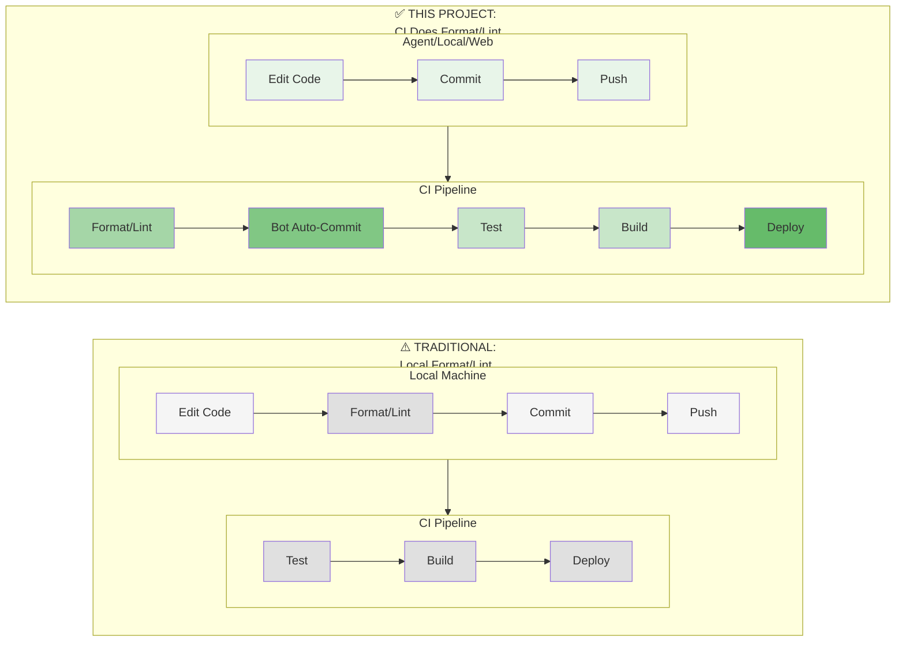
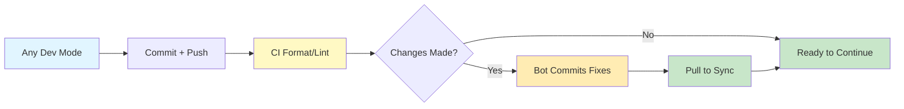
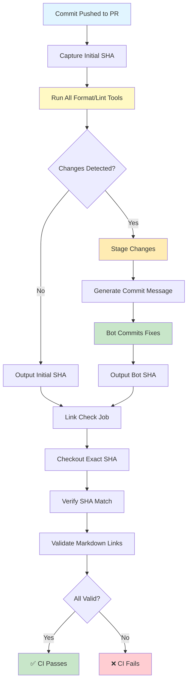
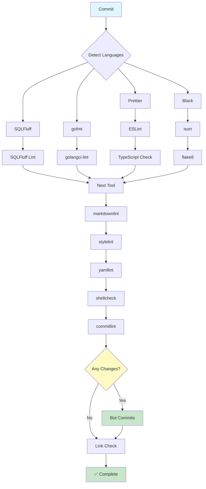
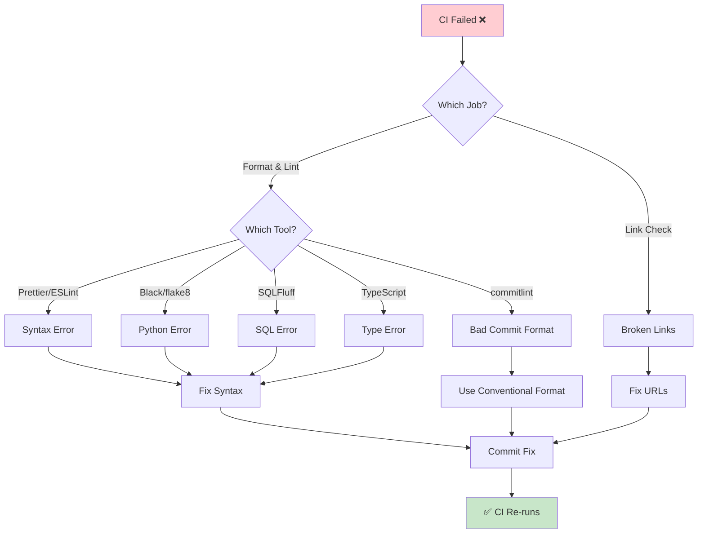
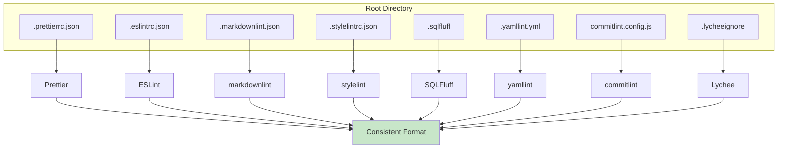

# CI/CD Guide: Code Quality Pipeline

## 🔑 Understanding This Workflow

**This CI/CD pipeline differs from traditional local development workflows.**

### The Key Difference

In most projects, developers format and lint code **locally before pushing**. This project does it **in CI after you commit**.



**Key difference:** Format/Lint happens in CI (green) with automatic bot commits, not on your machine. ✅ = our approach, ⚠️ = traditional.

### Why This Approach?

This enables **3 different development modes** with consistent results:

1. **🤖 AI Agents (Perplexity MCP, Claude, Cursor)** — Agents commit directly via Git tools, CI handles all formatting
2. **🌐 GitHub Web Editor** — Edit files in browser, commit, CI formats automatically
3. **💻 Local Development** — Edit locally, commit, push, **then pull after CI completes** to get formatted code

**The Universal Flow:**



### If You're Developing Locally

**Important:** After pushing, wait for GitHub Actions to complete, then:

```bash
git pull
```

This brings down any formatting/linting commits the CI bot made. Then continue your work.

---

## 📚 Table of Contents

- [Understanding This Workflow](#-understanding-this-workflow)
- [How the Pipeline Works](#how-the-pipeline-works)
- [Tools Reference](#tools-run)
- [Troubleshooting](#troubleshooting)
- [Configuration Files](#configuration-files-reference)
- [Development Mode Tips](#development-mode-tips)

---

## How the Pipeline Works

### The Complete Flow

Every commit to a pull request triggers this workflow:



### Step-by-Step Breakdown

1. **Commit Pushed** — You push a commit via Perplexity, GitHub web editor, or local Git
2. **SHA Capture** — CI records the exact commit SHA at the start
3. **Format & Lint** — 15 tools run automatically:
   - Prettier (JS/TS/JSON/MD/YAML/CSS)
   - ESLint (JS/TS)
   - Black, isort, flake8 (Python)
   - SQLFluff (SQL)
   - markdownlint, yamllint (Docs)
   - gofmt, golangci-lint (Go)
   - TypeScript type checking
   - commitlint (commit messages)
4. **Changes Detected** — If any tool modified files, bot stages them
5. **Bot Commits** — Automatic commit with detailed message listing changed files
6. **SHA Output** — Job outputs either original SHA (no changes) or bot SHA (changes applied)
7. **Link Check** — Receives exact SHA, checks out that specific commit
8. **Verification** — Confirms correct commit is checked out
9. **Link Validation** — All Markdown links checked for validity
10. **Result** — ✅ Pass or ❌ Fail

### Key Features

✅ **Race-condition safe** — Exact SHA passed between jobs  
✅ **No re-runs needed** — Single linear workflow per push  
✅ **Bot commits excluded** — GitHub Actions bot doesn't trigger new runs  
✅ **Multi-language** — JavaScript/TypeScript, Python, SQL, Go, CSS, Markdown, YAML, Bash  
✅ **Auto-fixes** — Bot commits formatting/linting fixes automatically

---

## Tools Run

### Tool Execution Order



### Formatting Tools (Auto-fix)

| Tool         | Languages                               | Purpose                        |
| ------------ | --------------------------------------- | ------------------------------ |
| **Prettier** | JS, TS, JSON, MD, YAML, CSS, SCSS, HTML | Universal code formatter       |
| **Black**    | Python                                  | PEP 8 compliant formatting     |
| **isort**    | Python                                  | Sort and organize imports      |
| **SQLFluff** | SQL                                     | Format SQL (PostgreSQL/DuckDB) |
| **gofmt**    | Go                                      | Official Go formatter          |

### Linting Tools (Check + Auto-fix)

| Tool              | Languages       | Purpose                         |
| ----------------- | --------------- | ------------------------------- |
| **ESLint**        | JS, TS          | Catch errors, enforce style     |
| **flake8**        | Python          | PEP 8 style guide enforcement   |
| **SQLFluff**      | SQL             | SQL syntax and style linting    |
| **stylelint**     | CSS, SCSS       | CSS/SCSS linting                |
| **markdownlint**  | Markdown        | Markdown style enforcement      |
| **yamllint**      | YAML            | YAML syntax validation          |
| **shellcheck**    | Bash            | Shell script linting            |
| **golangci-lint** | Go              | Comprehensive Go linting        |
| **TypeScript**    | TS              | Type error checking             |
| **commitlint**    | Commit messages | Conventional Commits validation |

### Link Validation

| Tool       | Purpose                                    |
| ---------- | ------------------------------------------ |
| **Lychee** | Validate all Markdown links (with caching) |

---

## Troubleshooting

### Quick Diagnosis



### Common Issues

#### 1. Format/Lint Tool Failed

**Problem:** Red X on "Format & Lint" job

**Solution:**

1. Click the failed job in GitHub Actions
2. Find the tool that failed (e.g., "Run ESLint")
3. Read the error message
4. Fix the issue:
   - **Syntax errors:** Missing brackets, quotes, semicolons
   - **Type errors:** Add proper TypeScript types
   - **Line too long:** Break into multiple lines
   - **Unused imports:** Remove them
5. Commit the fix
6. CI re-runs automatically

#### 2. Commit Message Failed

**Problem:** "commitlint" check failed

**Solution:** Use Conventional Commits format:

```text
type(scope): description

Valid types: feat, fix, docs, style, refactor, perf, test, chore, ci, build, revert
Scope: optional, kebab-case
Description: no period at end, lowercase start
```

**Examples:**

```bash
feat: add new feature
fix(ci): correct workflow
docs: update guide
chore: update deps
```

#### 3. Link Check Failed

**Problem:** "Check Documentation Links" job failed

**Solution:**

1. Check CI logs for broken URLs
2. Common issues:
   - `404`: Update to working URL
   - `429`: Rate limited, add to `.lycheeignore`
   - `Timeout`: Slow server, consider exclusion
   - Relative path broken: Fix file path
3. Fix or exclude URLs
4. Commit and push

#### 4. Bot Committed Changes

**This is normal!** The bot auto-fixed formatting issues.

**What to do:**

- **Web/agent users:** Nothing, continue as usual
- **Local developers:** Run `git pull` to get bot's changes

---

## Configuration Files Reference

### Config File Architecture



### Key Configuration Files

#### Formatting

- `.prettierrc.json` — 80 char width, single quotes, trailing commas
- `.prettierignore` — Exclude patterns

#### Linting

- `.eslintrc.json` — JS/TS rules
- `.markdownlint.json` — Markdown rules (relaxed for docs)
- `.stylelintrc.json` — CSS/SCSS rules
- `.sqlfluff` — SQL rules (PostgreSQL dialect)
- `.yamllint.yml` — YAML validation
- `commitlint.config.js` — Commit format validation

#### Link Checking

- `.lycheeignore` — URLs to exclude (bot-protected, known issues)

#### Python (via CLI args)

- **Black:** Line length 88
- **isort:** Profile `black`
- **flake8:** Max line 88, ignore E203/W503

---

## Development Mode Tips

### 🤖 AI Agent Development (Perplexity, Claude, Cursor)

**How it works:**

1. Agent commits via Git MCP/CLI tool
2. CI formats and lints automatically
3. Agent sees results in PR checks
4. Agent makes fixes if needed

**Best practices:**

- Use Conventional Commit format
- Wait for CI before next commit
- Review bot commits (they're part of your PR)

### 🌐 GitHub Web Editor

**How it works:**

1. Edit files directly in GitHub UI
2. Commit with proper message format
3. CI formats automatically
4. Continue editing as needed

**Best practices:**

- Use "feat:", "fix:", "docs:" prefixes
- Wait for green checkmark before merging

### 💻 Local Development

**How it works:**

1. Edit files locally
2. Commit and push
3. CI runs format/lint
4. **Pull to get bot's formatting commits**
5. Continue working

**Best practices:**

```bash
# Your normal workflow
git checkout -b feat/my-feature
vim some-file.ts
git add some-file.ts
git commit -m "feat: add new feature"
git push

# Wait for GitHub Actions to complete (30-60 seconds)
# Check https://github.com/your-repo/actions

# Pull bot's formatting changes
git pull

# Now continue working
vim another-file.ts
# ...
```

**Why pull after CI?**

- Bot may have reformatted your code
- Keeps your local branch in sync
- Prevents merge conflicts

---

## Support

If you encounter issues:

1. **Check CI logs** — Click failed job in GitHub Actions
2. **Review this guide** — Common issues documented above
3. **Check workflow** — [`.github/workflows/ci.yml`](.github/workflows/ci.yml)
4. **Open an issue** — Include:
   - Workflow run link
   - Error message
   - What you were trying to do

---

**Last updated:** 2026-01-18  
**Maintainer:** @borealBytes  
**Workflow:** Universal CI-first format/lint for web agents, GitHub editor, and local dev
