# CI/CD Guide: Format-Lint Loop Workflow

## 📚 Table of Contents

- [Overview](#overview)
- [How It Works](#how-it-works)
- [Troubleshooting](#troubleshooting)
- [Configuration Files Reference](#configuration-files-reference)
- [Perplexity Workflow Tips](#perplexity-workflow-tips)

---

## Overview

Our CI/CD pipeline uses a **format-lint loop** that automatically fixes code formatting and linting issues before validating links. This ensures consistent code quality for every commit made through Perplexity Spaces.

### Key Features

✅ **Auto-fixes issues** - Bot commits fixes automatically
✅ **Comprehensive tooling** - Prettier, ESLint, Black, SQLFluff, markdownlint, stylelint, commitlint, TypeScript
✅ **Multi-language** - JavaScript/TypeScript, Python, SQL, Go, CSS/SCSS, Markdown, YAML, Bash
✅ **Works with Perplexity** - Designed for MCP/Git tool commits
✅ **Link checking** - Validates all Markdown links

### Single Linear Process

Every commit follows this flow:
1. 📝 **Perplexity commits code** via Git MCP tool
2. ⚙️ **Format & Lint runs**, bot may commit fixes
3. 🔗 **Link Check validates** the final formatted code

---

## How It Works

### Workflow Chain

```mermaid
flowchart TD
    A[Perplexity Git Tool Commits] --> B[Format & Lint Job Runs]
    B --> C{Has Changes?}
    C -->|Yes| D[Bot Commits Fixes]
    C -->|No| E[Job Completes]
    D --> F[Job Completes]
    E --> G[Link Check Job Starts]
    F --> G
    G --> H[Checkout Latest Commit]
    H --> I[Validate Markdown Links]
    I --> J{Links Valid?}
    J -->|Yes| K[✅ All Checks Pass]
    J -->|No| L[❌ Job Fails]
    
    style A fill:#e1f5ff
    style K fill:#c8e6c9
    style L fill:#ffcdd2
    style D fill:#fff9c4
    style H fill:#e1f5ff
```



**How This Works:**

1. **You commit via Perplexity** - Using the Git MCP tool, your changes are committed to the branch
2. **Format & Lint job runs** - All formatting and linting tools execute
3. **Bot commits fixes (if needed)** - If formatting changes are detected, the bot commits them automatically
4. **Job completes** - Format & Lint job finishes (with or without bot commit)
5. **Link Check waits** - Uses `needs: [format-and-lint]` to wait for completion
6. **Link Check runs on latest commit** - Checks out the most recent commit (bot's fix or your original)
7. **Links validated** - All Markdown links are checked

**Key Points:**
- ✅ Single linear workflow - no CI re-runs
- ✅ Bot commits don't trigger new CI runs (GitHub Actions bot is ignored)
- ✅ Link Check always validates the final, formatted code
- ✅ Everything happens automatically after your commit

### Tool Execution Flow by Language

```mermaid
flowchart LR
    A[Code Push] --> B{Detect Languages}

    B --> C[JavaScript/TypeScript]
    B --> D[Python]
    B --> E[SQL]
    B --> F[Go]
    B --> G[CSS/SCSS]
    B --> H[Other]

    C --> C1[Prettier]
    C1 --> C2[ESLint]
    C2 --> C3[TypeScript]

    D --> D1[Black]
    D1 --> D2[isort]
    D2 --> D3[flake8]

    E --> E1[SQLFluff Format]
    E1 --> E2[SQLFluff Lint]

    F --> F1[gofmt]
    F1 --> F2[golangci-lint]

    G --> G1[Prettier]
    G1 --> G2[stylelint]

    H --> H1[markdownlint]
    H1 --> H2[yamllint]
    H2 --> H3[shellcheck]

    C3 --> I[Commit Check]
    D3 --> I
    E2 --> I
    F2 --> I
    G2 --> I
    H3 --> I

    I --> J[commitlint]
    J --> K[✅ Complete]

    style A fill:#e1f5ff
    style K fill:#c8e6c9
```



### Tools Run

**Formatting (Auto-fix):**

1. **Prettier** - Format JS/TS/JSON/MD/YAML/CSS/SCSS
2. **Black** - Format Python code (PEP 8 compliant)
3. **isort** - Sort Python imports
4. **SQLFluff** - Format SQL files (PostgreSQL/DuckDB)
5. **gofmt** - Format Go code (when Go projects exist)

**Linting (Auto-fix where possible):**

6. **ESLint** - Lint JavaScript/TypeScript with auto-fix
7. **flake8** - Lint Python code (PEP 8 style guide)
8. **SQLFluff** - Lint SQL syntax and style (PostgreSQL/DuckDB)
9. **stylelint** - Lint CSS/SCSS with auto-fix
10. **markdownlint** - Lint Markdown files
11. **yamllint** - Check YAML syntax
12. **shellcheck** - Lint Bash scripts
13. **golangci-lint** - Lint Go code (when Go projects exist)
14. **commitlint** - Validate commit message format
15. **TypeScript** - Check type errors

**Link Validation:**

16. **Lychee** - Check Markdown links

---

## Troubleshooting

### Troubleshooting Decision Tree


### Problem: CI fails on format/lint checks

**Symptoms:** Red X on PR, "Format & Lint" job failed

**Cause:** A tool detected an issue it cannot auto-fix, or a linting rule was violated

**Solution:**

1. **Check the CI logs** to see which tool failed and what the error message is

2. **Common issues:**

   **Prettier/ESLint Syntax Errors:**
   - Check for missing brackets, parentheses, or semicolons
   - Look for invalid JavaScript/TypeScript syntax
   - Fix in Perplexity and commit again

   **Python Issues:**
   - `E501`: Line too long (Black should auto-fix, but may fail on comments)
   - `F401`: Imported but unused (remove unused imports)
   - `E402`: Module level import not at top (move imports to top)

   **SQL Issues:**
   - Missing semicolons at end of statements
   - Invalid PostgreSQL syntax
   - Keywords not uppercase (SELECT, FROM, WHERE)

   **TypeScript Errors:**
   - Type mismatches
   - Missing type definitions
   - Incompatible types

3. **Fix the issue in Perplexity** and commit the corrected code

4. **CI will re-run automatically** on your new commit

### Problem: Commit message validation fails

**Error:** "commitlint" check failed

**Cause:** Commit message doesn't follow Conventional Commits format

**Fix:** Use this format when committing:

```
type(scope): description

Valid types: feat, fix, docs, style, refactor, perf, test, chore, ci, build, revert
Scope: optional, kebab-case
Description: required, no period at end
```

**Examples:**

```bash
feat: add new CI workflow
fix(ci): correct prettier config
docs: update CI guide
chore: update dependencies
```

**When using Perplexity Git tool:**
- Ensure your commit message follows the format above
- The tool will validate the format before committing

### Problem: TypeScript type errors

**Error:** "TypeScript" check failed

**Cause:** Type mismatches, missing types, or invalid TypeScript code

**Fix:**

1. **Review the error in CI logs** - Look for the specific file and line number

2. **Common type errors:**
   - Using `any` type (not recommended)
   - Missing return type annotations
   - Property does not exist on type
   - Type 'X' is not assignable to type 'Y'

3. **Fix the types in Perplexity** - Add proper type annotations or fix type mismatches

4. **Commit the fix** - CI will re-run and validate types again

### Problem: Broken Markdown links

**Error:** "Check Documentation Links" job failed

**Cause:** Links in Markdown files are broken, unreachable, or return errors

**Fix:**

1. **Check the CI logs** - Lychee will list all broken links with status codes

2. **Common link issues:**
   - `404 Not Found` - Page doesn't exist, update URL
   - `429 Too Many Requests` - Add URL to `.lycheeignore` if it's a false positive
   - `Timeout` - Server is slow, may need exclusion
   - Relative link broken - Check file path is correct

3. **Fix the links in Perplexity:**
   - Update broken URLs to working ones
   - Fix relative paths to correct locations
   - Remove links to deleted pages
   - Add persistent bot-protected URLs to `.lycheeignore`

4. **Commit the fixes** - Link Check will re-run on your new commit

### Problem: Bot committed formatting fixes, what now?

**Situation:** CI shows bot committed formatting changes to your PR

**This is normal!** The bot automatically fixes formatting issues.

**What to do:**

1. **Nothing** - The CI will complete and Link Check will run on the bot's commit
2. **Continue working** - Make your next commit via Perplexity as usual
3. **The bot commit will be included** in the PR when merged

**Note:** You don't need to pull the bot's changes since you're working entirely through Perplexity.

---

## Configuration Files Reference

### Configuration Architecture

```mermaid
flowchart TD
    A[Root Config Files] --> B[.prettierrc.json]
    A --> C[.eslintrc.json]
    A --> D[.markdownlint.json]
    A --> E[.stylelintrc.json]
    A --> F[.sqlfluff]
    A --> G[.yamllint.yml]
    A --> H[commitlint.config.js]
    A --> I[.lycheeignore]
    
    B --> J[Prettier Engine]
    C --> K[ESLint Engine]
    D --> L[markdownlint Engine]
    E --> M[stylelint Engine]
    F --> N[SQLFluff Engine]
    G --> O[yamllint Engine]
    H --> P[commitlint Engine]
    I --> Q[Lychee Engine]
    
    J --> R[Format JS/TS/JSON/MD/YAML/CSS]
    K --> S[Lint JS/TS]
    L --> T[Lint Markdown]
    M --> U[Lint CSS/SCSS]
    N --> V[Format & Lint SQL]
    O --> W[Validate YAML]
    P --> X[Validate Commits]
    Q --> Y[Validate Links]
    
    R --> Z[✅ Consistent Code]
    S --> Z
    T --> Z
    U --> Z
    V --> Z
    W --> Z
    X --> Z
    Y --> Z
    
    style A fill:#e1f5ff
    style Z fill:#c8e6c9
```



### Key Configuration Files

**Formatting:**
- `.prettierrc.json` - Code formatting rules (80 char width, single quotes, LF endings)
- `.prettierignore` - Files to skip formatting

**Linting:**
- `.eslintrc.json` - JavaScript/TypeScript linting rules
- `.markdownlint.json` - Markdown linting rules (relaxed for docs)
- `.stylelintrc.json` - CSS/SCSS linting rules
- `.sqlfluff` - SQL formatting/linting (PostgreSQL dialect)
- `.yamllint.yml` - YAML syntax validation
- `commitlint.config.js` - Commit message format validation

**Link Checking:**
- `.lycheeignore` - URLs to exclude from link checking (bot-protected, etc.)

**Python Configuration** (via command-line args in CI):
- Black: Line length 88, Python 3.13+
- isort: Profile `black` (compatible formatting)
- flake8: Max line 88, ignore E203/W503 (Black-compatible)

**SQL Configuration** (`.sqlfluff`):
- Dialect: PostgreSQL (change to `duckdb` if needed)
- Keywords: UPPERCASE (SELECT, FROM, WHERE)
- Identifiers: lowercase (table_name, column_name)
- Max line: 200 characters

---

## Perplexity Workflow Tips

### Making Commits

When using Perplexity's Git MCP tool:

1. **Use Conventional Commit format** - CI will validate your message
   ```
   feat: add new feature
   fix: resolve bug
   docs: update documentation
   chore: routine task
   ```

2. **Check CI status** - Wait for CI to complete before making another commit
3. **Review bot commits** - If the bot commits formatting fixes, those will be included in your PR
4. **Fix CI failures** - If CI fails, review logs, fix issues, and commit again

### Best Practices

✅ **Commit frequently** - Smaller commits are easier to debug if CI fails
✅ **Use descriptive messages** - Helps with PR reviews and history
✅ **Wait for CI** - Let CI complete before merging
✅ **Review summaries** - CI provides detailed job summaries in GitHub Actions

### Understanding the Flow

**When you commit via Perplexity:**

```
Your Commit → Format & Lint → Bot Commit (if needed) → Link Check → ✅ Done
```

- **Format & Lint**: Runs all 15 tools, may commit fixes
- **Bot Commit**: Only if formatting changes needed
- **Link Check**: Validates final code on latest commit
- **No re-runs**: Single linear process per push

---

## Support

If you encounter issues with the CI/CD pipeline:

1. **Check CI logs** - Click on the failed job in GitHub Actions
2. **Review this guide** - Common issues are documented above
3. **Check the [workflow file](.github/workflows/ci.yml)** - See exact tool configuration
4. **Open an issue** - If you find a bug or need help:
   - Include workflow run link
   - Copy error message
   - Describe what you were trying to do

---

**Last updated:** 2026-01-17
**Maintainer:** @borealBytes
**Workflow:** Optimized for Perplexity Spaces
