# CI/CD Guide: Format-Lint Loop Workflow

## 📚 Table of Contents

- [Overview](#overview)
- [How It Works](#how-it-works)
- [Local Development Setup](#local-development-setup)
- [Troubleshooting](#troubleshooting)
- [Configuration Files Reference](#configuration-files-reference)

---

## Overview

Our CI/CD pipeline uses a **format-lint loop** that automatically fixes code formatting and linting issues before running any tests. This ensures consistent code quality across all commits, whether from humans or AI agents.

### Key Features

✅ **Auto-fixes issues** - Bot commits fixes automatically
✅ **Comprehensive tooling** - Prettier, ESLint, Black, SQLFluff, markdownlint, stylelint, commitlint, TypeScript
✅ **Multi-language** - JavaScript/TypeScript, Python, SQL, Go, CSS/SCSS, Markdown, YAML, Bash
✅ **Works for all** - Humans, AI agents, web UI commits
✅ **Link checking** - Validates all Markdown links

---

## How It Works

### Workflow Chain

```mermaid
flowchart TD
    A[Push Commit] --> B[Format & Lint Job]
    B --> C{Has Changes?}
    C -->|Yes| D[Bot Commits Fixes]
    C -->|No| E[Link Check Job]
    D --> F[CI Re-runs on New Commit]
    F --> B
    E --> G[Validate Markdown Links]
    G --> H{Links Valid?}
    H -->|Yes| I[✅ All Checks Pass]
    H -->|No| J[❌ Job Fails]

    style A fill:#e1f5ff
    style I fill:#c8e6c9
    style J fill:#ffcdd2
    style D fill:#fff9c4
    style F fill:#fff9c4
```



**Key Points:**

- If formatting changes are needed, the bot commits them and the entire CI re-runs
- Link check only runs when format & lint pass with no changes
- This ensures link check always validates the final, formatted code

### Tool Execution Flow by Language

```mermaid
flowchart LR
    A[Code Push] --> B{Detect Languages}

    B --> C[JavaScript/TypeScript]
    B --> D[Python]
    B --> E[SQL]
    B --> F[Go]
    B --> G[CSS/SCSS]
    B --> H[Other]

    C --> C1[Prettier]
    C1 --> C2[ESLint]
    C2 --> C3[TypeScript]

    D --> D1[Black]
    D1 --> D2[isort]
    D2 --> D3[flake8]

    E --> E1[SQLFluff Format]
    E1 --> E2[SQLFluff Lint]

    F --> F1[gofmt]
    F1 --> F2[golangci-lint]

    G --> G1[Prettier]
    G1 --> G2[stylelint]

    H --> H1[markdownlint]
    H1 --> H2[yamllint]
    H2 --> H3[shellcheck]

    C3 --> I[Commit Check]
    D3 --> I
    E2 --> I
    F2 --> I
    G2 --> I
    H3 --> I

    I --> J[commitlint]
    J --> K[✅ Complete]

    style A fill:#e1f5ff
    style K fill:#c8e6c9
```



### Tools Run

**Formatting:**

1. **Prettier** - Format JS/TS/JSON/MD/YAML/CSS/SCSS
2. **Black** - Format Python code (PEP 8 compliant)
3. **isort** - Sort Python imports
4. **SQLFluff** - Format SQL files (PostgreSQL/DuckDB)
5. **gofmt** - Format Go code (when Go projects exist)

**Linting:**

6. **ESLint** - Lint JavaScript/TypeScript with auto-fix
7. **flake8** - Lint Python code (PEP 8 style guide)
8. **SQLFluff** - Lint SQL syntax and style (PostgreSQL/DuckDB)
9. **stylelint** - Lint CSS/SCSS with auto-fix
10. **markdownlint** - Lint Markdown files
11. **yamllint** - Check YAML syntax
12. **shellcheck** - Lint Bash scripts
13. **golangci-lint** - Lint Go code (when Go projects exist)
14. **commitlint** - Validate commit message format
15. **TypeScript** - Check types (no emit)

**Link Validation:**

16. **Lychee** - Check Markdown links

---

## Local Development Setup

### Development Workflow

```mermaid
flowchart TD
    A[Start Development] --> B{Have Dependencies?}
    B -->|No| C[Install Node.js & pnpm]
    B -->|Yes| D[Write Code]
    C --> D

    D --> E[Before Commit]
    E --> F[Run pnpm format]
    F --> G[Run pnpm lint:all]
    G --> H{Errors?}

    H -->|Yes| I[Fix Issues]
    I --> F
    H -->|No| J[git add & commit]

    J --> K{Using Python?}
    K -->|Yes| L[Run black & isort]
    K -->|No| M{Using SQL?}
    L --> M

    M -->|Yes| N[Run sqlfluff fix]
    M -->|No| O[Push to GitHub]
    N --> O

    O --> P[CI Runs Automatically]
    P --> Q{✅ CI Pass?}
    Q -->|Yes| R[Ready for Review]
    Q -->|No| S[Check CI Logs]
    S --> I

    style A fill:#e1f5ff
    style R fill:#c8e6c9
    style I fill:#fff9c4
```



### Prerequisites

**Node.js & pnpm:**

```bash
# Install pnpm (if not already installed)
npm install -g pnpm@8

# Install dependencies
pnpm install
```

**Python (optional, for Python/SQL projects):**

```bash
# Install Python 3.13+ (if not already installed)
# On macOS:
brew install python@3.13

# On Ubuntu/Debian:
sudo apt-get install python3.13 python3-pip

# Install Python formatting/linting tools
pip install black isort flake8

# Install SQL formatting/linting tools (optional)
pip install sqlfluff
```

### Running Format/Lint Locally

**Before committing, always run:**

```bash
# Format all files
pnpm format

# Fix all linting issues
pnpm lint:all

# Or individually:
pnpm prettier --write "**/*.{js,ts,json,md,yml,yaml,css,scss}"
pnpm eslint --fix "**/*.{js,ts,jsx,tsx}"
pnpm markdownlint-cli2 "**/*.md" --fix
```

**For Python projects:**

```bash
# Format Python code
black .

# Sort imports
isort .

# Lint Python code
flake8 . --max-line-length=88 --extend-ignore=E203,W503
```

**For SQL projects:**

```bash
# Format SQL files (auto-fix)
sqlfluff fix --dialect postgres .

# Lint SQL files
sqlfluff lint --dialect postgres .

# For DuckDB projects:
sqlfluff fix --dialect duckdb .
sqlfluff lint --dialect duckdb .
```

### Editor Integration

```mermaid
flowchart LR
    A[VS Code] --> B[Install Extensions]
    B --> C[Prettier]
    B --> D[ESLint]
    B --> E[Black Formatter]
    B --> F[SQLFluff]
    B --> G[markdownlint]

    C --> H[Configure settings.json]
    D --> H
    E --> H
    F --> H
    G --> H

    H --> I[Enable Format on Save]
    I --> J[Enable Auto-fix on Save]
    J --> K[✅ Automatic Formatting]

    style A fill:#007acc
    style K fill:#c8e6c9
```



#### VS Code (Recommended)

**Install Extensions:**

- [Prettier - Code formatter](https://marketplace.visualstudio.com/items?itemName=esbenp.prettier-vscode)
- [ESLint](https://marketplace.visualstudio.com/items?itemName=dbaeumer.vscode-eslint)
- [markdownlint](https://marketplace.visualstudio.com/items?itemName=DavidAnson.vscode-markdownlint)
- [stylelint](https://marketplace.visualstudio.com/items?itemName=stylelint.vscode-stylelint)
- [Python](https://marketplace.visualstudio.com/items?itemName=ms-python.python) (for Python projects)
- [Black Formatter](https://marketplace.visualstudio.com/items?itemName=ms-python.black-formatter) (for Python projects)
- [isort](https://marketplace.visualstudio.com/items?itemName=ms-python.isort) (for Python projects)
- [SQLFluff](https://marketplace.visualstudio.com/items?itemName=dorzey.vscode-sqlfluff) (for SQL projects)

**Enable Format on Save:**

Add to `.vscode/settings.json`:

```json
{
  "editor.formatOnSave": true,
  "editor.defaultFormatter": "esbenp.prettier-vscode",
  "editor.codeActionsOnSave": {
    "source.fixAll.eslint": true,
    "source.fixAll.stylelint": true,
    "source.organizeImports": true
  },
  "[markdown]": {
    "editor.defaultFormatter": "esbenp.prettier-vscode"
  },
  "[typescript]": {
    "editor.defaultFormatter": "esbenp.prettier-vscode"
  },
  "[javascript]": {
    "editor.defaultFormatter": "esbenp.prettier-vscode"
  },
  "[python]": {
    "editor.defaultFormatter": "ms-python.black-formatter",
    "editor.codeActionsOnSave": {
      "source.organizeImports": true
    }
  },
  "[sql]": {
    "editor.defaultFormatter": "dorzey.vscode-sqlfluff"
  },
  "black-formatter.args": ["--line-length=88"],
  "isort.args": ["--profile", "black"],
  "sqlfluff.dialect": "postgres"
}
```

---

## Troubleshooting

### Troubleshooting Decision Tree

```mermaid
flowchart TD
    A[CI Failed ❌] --> B{Which Job Failed?}

    B -->|Format & Lint| C{Which Tool?}
    B -->|Link Check| D[Broken Links]
    B -->|commitlint| E[Bad Commit Message]

    C -->|Prettier/ESLint| F[Run pnpm format]
    C -->|Black/isort| G[Run black & isort]
    C -->|SQLFluff| H[Run sqlfluff fix]
    C -->|TypeScript| I[Run pnpm typecheck]

    F --> J[git add & commit]
    G --> J
    H --> J
    I --> K[Fix Type Errors]
    K --> J

    D --> L[Check CI Logs]
    L --> M[Fix Broken URLs]
    M --> J

    E --> N[Use Conventional Format]
    N --> O[feat/fix/docs/etc]
    O --> J

    J --> P[git push]
    P --> Q[✅ CI Passes]

    style A fill:#ffcdd2
    style Q fill:#c8e6c9
    style J fill:#fff9c4
```



### Problem: CI fails on format/lint checks

**Symptoms:** Red X on PR, "Format & Lint" job failed

**Solutions:**

1. **Pull latest changes:**

   ```bash
   git pull origin <branch-name>
   ```

2. **Run format/lint locally:**

   ```bash
   # For JS/TS/Markdown/etc:
   pnpm format
   pnpm lint:all

   # For Python (if applicable):
   black .
   isort .
   flake8 . --max-line-length=88 --extend-ignore=E203,W503

   # For SQL (if applicable):
   sqlfluff fix --dialect postgres .
   sqlfluff lint --dialect postgres .
   ```

3. **Check what changed:**

   ```bash
   git diff
   ```

4. **Commit fixes:**
   ```bash
   git add -A
   git commit -m "style: fix formatting issues"
   git push
   ```

### Problem: Commit message validation fails

**Error:** "commitlint" check failed

**Cause:** Commit message doesn't follow Conventional Commits format

**Fix:** Use this format:

```
type(scope): description

Valid types: feat, fix, docs, style, refactor, perf, test, chore, ci, build, revert
Scope: optional, kebab-case
Description: required, no period at end
```

**Examples:**

```bash
git commit -m "feat: add new CI workflow"
git commit -m "fix(ci): correct prettier config"
git commit -m "docs: update CI guide"
```

### Problem: TypeScript errors

**Error:** "TypeScript" check failed

**Fix:**

1. **Check types locally:**

   ```bash
   pnpm typecheck
   ```

2. **Fix type errors in your code**

3. **Push fixes:**
   ```bash
   git add -A
   git commit -m "fix: resolve TypeScript errors"
   git push
   ```

### Problem: Python linting errors

**Error:** "Black", "isort", or "flake8" check failed

**Fix:**

1. **Format Python code:**

   ```bash
   black .
   ```

2. **Sort imports:**

   ```bash
   isort .
   ```

3. **Check for remaining issues:**

   ```bash
   flake8 . --max-line-length=88 --extend-ignore=E203,W503
   ```

4. **Fix any remaining issues manually**

5. **Push fixes:**
   ```bash
   git add -A
   git commit -m "style: fix Python formatting"
   git push
   ```

**Common flake8 issues:**

- `E501`: Line too long (Black should fix this)
- `F401`: Imported but unused (remove unused imports)
- `E402`: Module level import not at top (move imports to top)
- `W503`: Line break before binary operator (ignored by our config)

### Problem: SQL linting errors

**Error:** "SQLFluff" check failed

**Fix:**

1. **Format SQL files:**

   ```bash
   sqlfluff fix --dialect postgres .
   ```

2. **Check for remaining issues:**

   ```bash
   sqlfluff lint --dialect postgres .
   ```

3. **Fix any remaining issues manually**

4. **Push fixes:**
   ```bash
   git add -A
   git commit -m "style: fix SQL formatting"
   git push
   ```

**Common SQLFluff issues:**

- `L001`: Unnecessary trailing whitespace
- `L003`: Indentation not consistent
- `L010`: Keywords must be uppercase (SELECT, FROM, WHERE)
- `L014`: Unquoted identifiers must be lowercase (table/column names)
- `L016`: Line too long (relaxed to 200 chars in our config)

**Tip:** If you need to use DuckDB dialect instead of PostgreSQL, update `.sqlfluff`:

```ini
[sqlfluff]
dialect = duckdb
```

### Problem: Broken Markdown links

**Error:** "Check Documentation Links" job failed

**Fix:**

1. **Check the workflow output** to see which links are broken

2. **Fix links in your Markdown files**

3. **Test links locally** (optional):

   ```bash
   npx lychee --offline '**/*.md'
   ```

4. **Push fixes:**
   ```bash
   git add -A
   git commit -m "docs: fix broken links"
   git push
   ```

---

## Configuration Files Reference

### Configuration Architecture


### `.prettierrc.json`

**Key settings:**

- `printWidth: 80` for code, `120` for Markdown/JSON
- `singleQuote: true` (consistent with most JS projects)
- `semi: true` (explicit semicolons)
- `trailingComma: "es5"` (IE11 compatible)
- `endOfLine: "lf"` (Unix line endings)

### `.eslintrc.json`

**Key settings:**

- Extends `plugin:@typescript-eslint/recommended`
- Extends `plugin:prettier/recommended`
- `@typescript-eslint/no-unused-vars: error` with `argsIgnorePattern: "^_"`

### `.markdownlint.json`

**Key settings:**

- `MD013: false` (no line length limit, Prettier handles this)
- `MD033: { allowed_elements: [...] }` (allow some HTML tags)
- `MD041: false` (don't require H1 at top)

### `.stylelintrc.json`

**Key settings:**

- Extends `stylelint-config-standard`
- Extends `stylelint-config-prettier`
- `selector-class-pattern: null` (allow any class naming)

### `.sqlfluff`

**Key settings:**

- `dialect: postgres` (PostgreSQL by default, change to `duckdb` if needed)
- `templater: raw` (plain SQL, no templating)
- `max_line_length: 200` (relaxed for complex queries)
- `indent_unit: space`, `tab_space_size: 2` (2-space indentation)
- **Keywords:** UPPERCASE (SELECT, FROM, WHERE)
- **Identifiers:** lowercase (table_name, column_name)
- **Functions:** UPPERCASE (COUNT, SUM, AVG)
- **Types:** UPPERCASE (INTEGER, VARCHAR)

### Python Configuration

**Black** (via command-line args):

- Line length: 88 (Black's default, optimal for readability)
- Target: Python 3.13+

**isort** (via command-line args):

- Profile: `black` (compatible with Black's formatting)

**flake8** (via command-line args):

- `--max-line-length=88` (match Black)
- `--extend-ignore=E203,W503` (ignore Black-incompatible rules)
  - `E203`: Whitespace before ':' (Black's style)
  - `W503`: Line break before binary operator (PEP 8 updated)

---

## Support

If you encounter issues with the CI/CD pipeline:

1. **Check this guide first** for common issues
2. **Check the [workflow file](../.github/workflows/ci.yml)** for details
3. **Open an issue** with:
   - Workflow run link
   - Error message
   - Steps to reproduce

---

**Last updated:** 2026-01-17
**Maintainer:** @borealBytes
