# Mermaid Diagram Style Guide

> **Standards for creating clear, accessible, and theme-compatible Mermaid diagrams**

---

## Core Principles

### 1. Theme Compatibility

**DO**: Let GitHub auto-detect theme (omit theme specification)

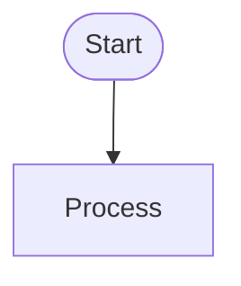

**DO**: Use neutral theme when explicit theme needed

```mermaid
%%{init: {'theme':'neutral'}}%%
flowchart TB
    accTitle: Example Diagram
```

**DON'T**: Use custom fill colors that break in dark mode

```mermaid
# ❌ Avoid this
flowchart TB
    A[Node] --> B[Other]
    style A fill:#e8f5e9  # Breaks dark mode
```

### 2. Accessibility (Required)

Every diagram must include:

```mermaid
flowchart TB
    accTitle: Concise diagram title (40 chars max)
    accDescr: {
        Detailed description explaining what this diagram
        shows and its purpose. 2-3 sentences for screen readers.
    }
```

**Benefits**:

- Screen reader compatibility
- Better SEO and documentation indexing
- Clear diagram purpose for all users

### 3. Semantic Node IDs

**DO**: Use descriptive snake_case IDs

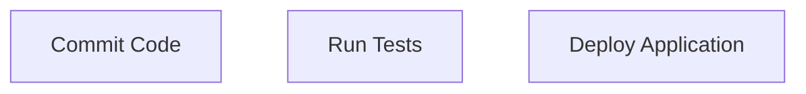

**DON'T**: Use single-letter or numbered IDs

```mermaid
# ❌ Avoid this
flowchart TB
    A[Commit Code]
    B[Run Tests]
    C[Deploy Application]
```

### 4. Visual Hierarchy Through Shapes

Use shapes to convey meaning, not colors:

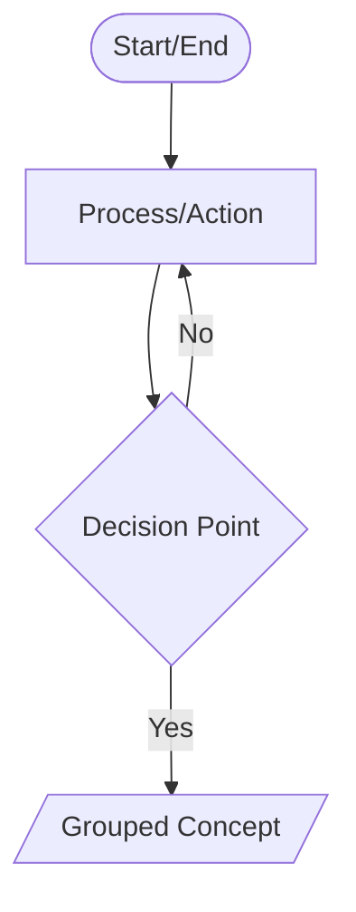

**Shape Guide**:

- `([...])` — Start/End points
- `[...]` — Process/Action
- `{...}` — Decision point
- `[/...\]` — Input/Output
- `[(...)]` — Database/Storage
- `{{...}}` — Subprocess

### 5. Complexity Limits

**Target**: 5-10 nodes per diagram
**Maximum**: 12 nodes (beyond this, split into multiple diagrams)
**Decision points**: Maximum 3 per diagram

**Why**: Cognitive load — diagrams with >10 nodes become hard to scan

### 6. Text Guidelines

**Node labels**: 3-6 words maximum

```mermaid
flowchart TB
    good[Run All Tests]  # ✅ Clear and concise
    bad[Run the comprehensive test suite including unit and integration tests]  # ❌ Too verbose
```

**Edge labels**: 1-4 words

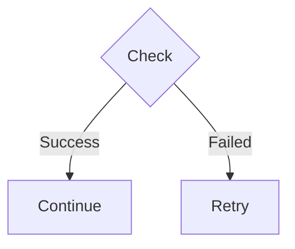

**Voice**: Use active voice

- ✅ "Format Code"
- ❌ "Code is Formatted"

---

## Diagram Type Standards

### Flowcharts

**Use for**: Processes, workflows, decision trees

**Template**:

```mermaid
flowchart TB
    accTitle: Workflow Name
    accDescr: {
        Description of what this workflow accomplishes
        and when it runs.
    }

    start([Start]) --> first_step[First Action]
    first_step --> decision{Check Condition}
    decision -->|Yes| success_path[Success Action]
    decision -->|No| failure_path[Failure Action]
    success_path --> end_point([Complete])
    failure_path --> end_point
```

**Direction**: Use `TB` (top-to-bottom) or `LR` (left-to-right) consistently

### Sequence Diagrams

**Use for**: API calls, inter-service communication

**Template**:

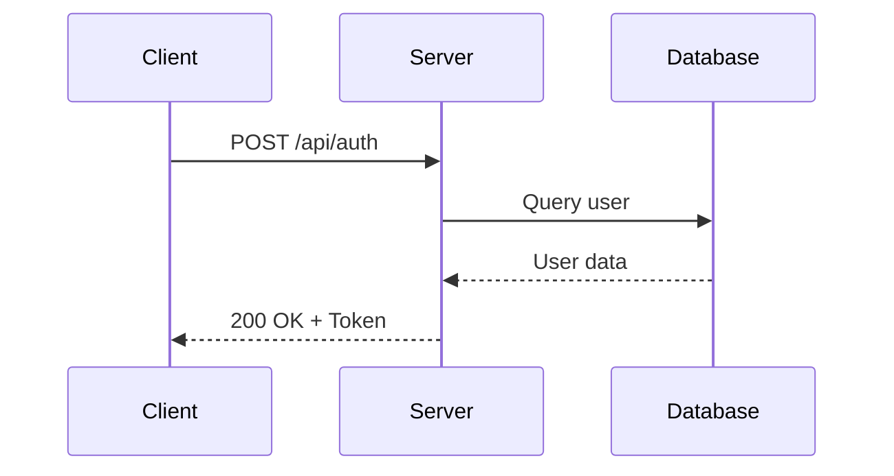

### Architecture Diagrams

**Use for**: System components, dependencies

**Template**:

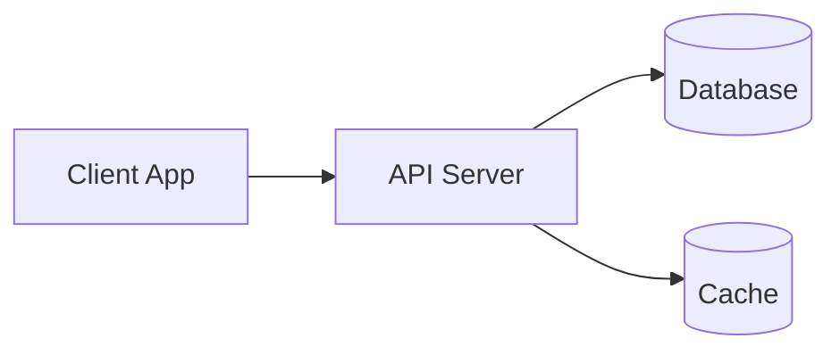

---

## Common Patterns

### Pattern: Before/After Comparison

**Split into subgraphs**:

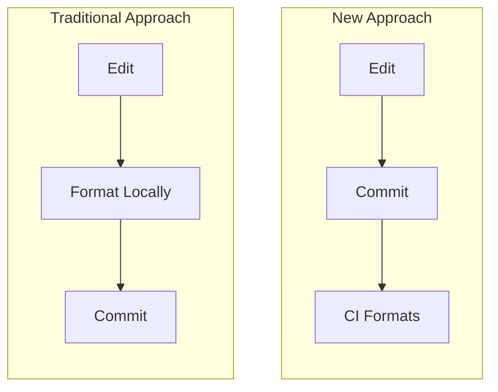

### Pattern: Error Handling

**Use decision diamonds**:

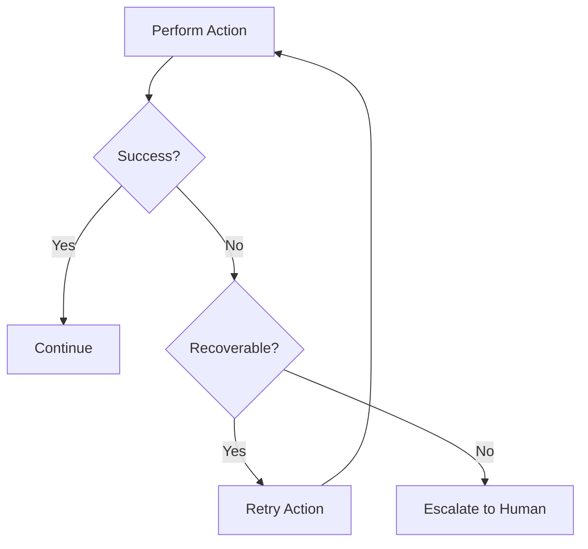

### Pattern: Pipeline Stages

**Show sequential stages**:

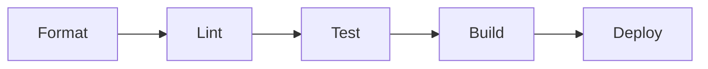

---

## Tools and Validation

### Testing Your Diagrams

1. **GitHub Preview**: View in GitHub's Markdown preview (checks light mode)
2. **Dark Mode Test**: Switch GitHub to dark mode and verify readability
3. **Mermaid Live Editor**: [mermaid.live](https://mermaid.live) for syntax validation
4. **Screen Reader Test**: Use browser dev tools to inspect accessibility attributes

### Linting

Your diagrams will be validated by:

- `markdownlint` (Markdown syntax)
- Manual review (accessibility and clarity)

---

## Quick Reference Checklist

Before committing a new diagram, verify:

- [ ] No custom `fill` or `stroke` colors (or theme explicitly set to `neutral`)
- [ ] `accTitle` present (concise, 40 chars max)
- [ ] `accDescr` present (2-3 sentences)
- [ ] Node IDs are semantic (descriptive names, not A/B/C)
- [ ] 5-10 nodes (12 max)
- [ ] Node labels are 3-6 words
- [ ] Edge labels are 1-4 words
- [ ] Active voice used ("Run Tests" not "Tests Are Run")
- [ ] Tested in both light and dark mode
- [ ] Flow direction is clear (TB or LR, used consistently)

---

## Examples of Good vs Bad

### ❌ Bad Example

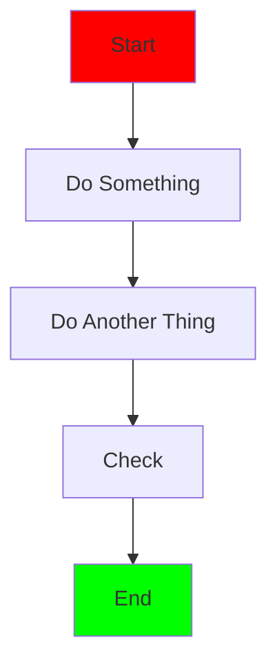

**Problems**:

- No accessibility attributes
- Generic node IDs (A, B, C...)
- Custom colors break dark mode
- Vague labels ("Do Something")

### ✅ Good Example

```mermaid
flowchart TB
    accTitle: User Authentication Flow
    accDescr: {
        Shows the steps a user takes to authenticate,
        from entering credentials to receiving a token.
    }

    start([User Visits Login]) --> enter_creds[Enter Credentials]
    enter_creds --> validate{Valid?}
    validate -->|Yes| generate_token[Generate JWT Token]
    validate -->|No| show_error[Show Error Message]
    generate_token --> complete([Logged In])
    show_error --> enter_creds
```

**Strengths**:

- Accessibility metadata
- Semantic IDs
- No custom colors
- Clear, concise labels
- Proper shapes for start/end

---

## FAQ

### Q: When should I use subgraphs?

**A**: When you need to group related nodes logically. Common uses:

- Before/after comparisons
- Different system components
- Parallel workflows

Keep subgraph labels concise (3-4 words max).

### Q: Can I use emojis in diagrams?

**A**: Use sparingly. Emojis can:

- Break in some renderers
- Confuse screen readers
- Look unprofessional in technical docs

Prefer clear text labels.

### Q: What if my process has 15+ steps?

**A**: Split into multiple diagrams:

1. High-level overview (5-7 main stages)
2. Detailed diagrams per stage (5-10 nodes each)

Link between diagrams in documentation.

### Q: Should I use colors for status (red=error, green=success)?

**A**: No. Use shapes instead:

- Decision diamond + edge labels: `{Check?} -->|Error| retry`
- Node shapes: Rectangle for process, circle for endpoints

Colors break accessibility and dark mode.

### Q: How do I show optional steps?

**A**: Use dashed lines:

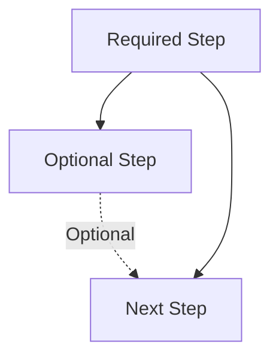

---

## Resources

### Official Documentation

- [Mermaid Official Docs](https://mermaid.js.org/)
- [Mermaid Flowchart Syntax](https://mermaid.js.org/syntax/flowchart.html)
- [GitHub Mermaid Support](https://github.blog/2022-02-14-include-diagrams-markdown-files-mermaid/)

### Accessibility

- [Mermaid Accessibility Options](https://mermaid.js.org/config/accessibility.html)
- [WCAG 2.1 Guidelines](https://www.w3.org/WAI/WCAG21/quickref/)

### Tools

- [Mermaid Live Editor](https://mermaid.live) — Test and preview diagrams
- [Mermaid CLI](https://github.com/mermaid-js/mermaid-cli) — Generate images locally

---

**Last updated**: 2026-01-18  
**Maintained by**: @borealBytes  
**Version**: 1.0.0
