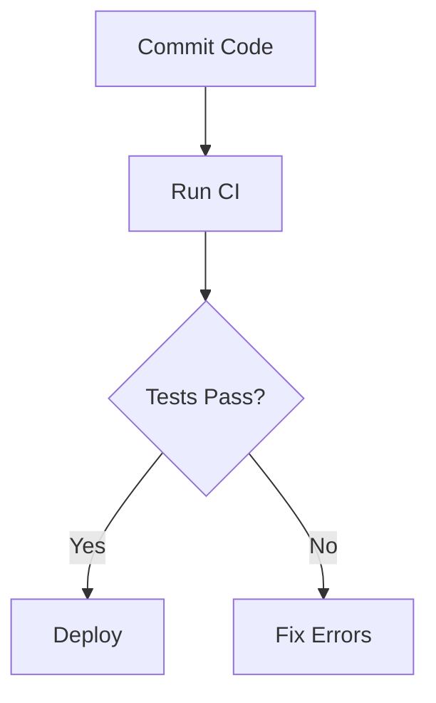
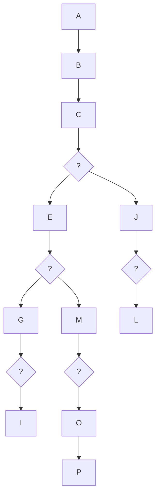
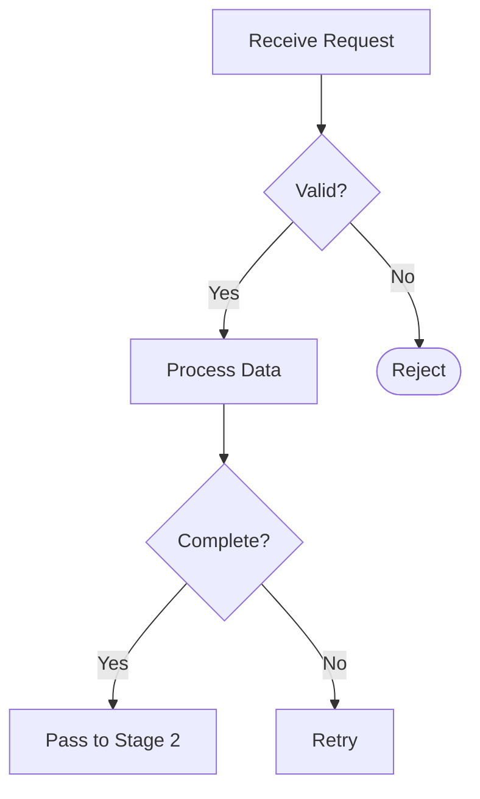
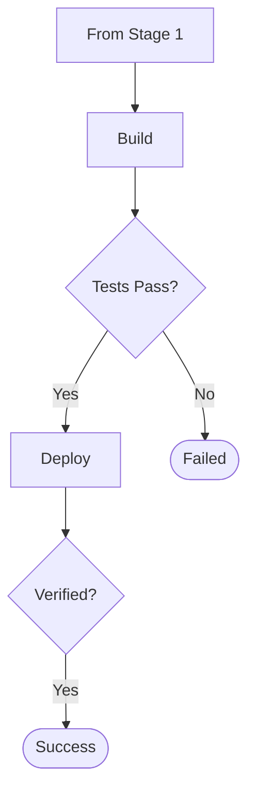

# Mermaid Diagram Style Guide

**Purpose:** Ensure all Mermaid diagrams render consistently across GitHub (light/dark modes), VS Code, documentation sites, and assistive technologies.

**Last Updated:** 2026-01-18

---

## Core Principles

1. **Simplicity First** — Break complex diagrams into focused pieces
2. **Accessibility Always** — Every diagram must be screen-reader friendly
3. **Theme Neutral** — No custom colors that break dark mode
4. **Semantic Clarity** — Use meaningful node IDs and concise labels
5. **Consistency** — Uniform patterns across all documentation

---

## Theme Configuration

### ✅ Recommended: Default (No Theme)

**Best for GitHub rendering** — Let GitHub auto-detect light/dark mode:

```mermaid
flowchart TB
    accTitle: Example Diagram
    accDescr: {
        This diagram demonstrates proper structure.
    }
    
    start([Start]) --> process[Do Something]
    process --> end_node([End])
```

### ✅ Alternative: Explicit Neutral Theme

**For non-GitHub platforms** that need explicit theme:

```mermaid
%%{init: {'theme':'neutral'}}%%
flowchart TB
    accTitle: Example Diagram
    accDescr: {
        Description here.
    }
    
    start([Start]) --> end_node([End])
```

### ❌ Never: Custom Colors

**Breaks dark mode detection:**

```mermaid
# ❌ DON'T DO THIS
flowchart TB
    A[Node] --> B[Another]
    style A fill:#e8f5e9  # Breaks in dark mode!
    style B fill:#ffcdd2  # Hard to read!
```

**Why it fails:**
- Light-mode optimized colors are invisible/illegible in dark mode
- GitHub can't auto-adjust styled nodes
- Reduces accessibility

---

## Accessibility Requirements

**Every diagram MUST include:**

### 1. Accessible Title (`accTitle`)

Short, descriptive title for screen readers:

```mermaid
flowchart TB
    accTitle: CI/CD Pipeline Workflow
```

**Rules:**
- 3-8 words maximum
- Describes what the diagram shows
- Plain text, no Markdown

### 2. Accessible Description (`accDescr`)

Detailed explanation of diagram purpose:

```mermaid
flowchart TB
    accTitle: Error Recovery Process
    accDescr: {
        This flowchart shows the step-by-step decision tree
        for diagnosing and recovering from CI/CD failures,
        including common error types and their solutions.
    }
```

**Rules:**
- 2-4 sentences
- Explains purpose and what user learns
- Use curly braces `{ }` for multi-line
- Describes flow direction and key decision points

### 3. Complete Template

```mermaid
flowchart TB
    accTitle: [Diagram Title 3-8 words]
    accDescr: {
        [Purpose statement. What this shows.]
        [Key insights or flow description.]
        [2-4 sentences total.]
    }
    
    %% Your diagram content here
    start([Start]) --> end_node([End])
```

---

## Node Naming Conventions

### ✅ Use Semantic IDs

**Descriptive, snake_case identifiers:**



**Benefits:**
- Self-documenting
- Easier maintenance
- Clear purpose at a glance

### ❌ Avoid Generic IDs

**Single letters lack context:**

```mermaid
# ❌ DON'T DO THIS
flowchart TB
    A[Commit Code] --> B[Run CI]
    B --> C{Tests Pass?}
    C -->|Yes| D[Deploy]
    C -->|No| E[Fix Errors]
```

**Problems:**
- Hard to reference in documentation
- Unclear when updating
- No semantic meaning

### Naming Rules

1. **snake_case** for multi-word IDs: `run_tests`, `deploy_prod`
2. **Match labels** when possible: ID `commit_code` → Label "Commit Code"
3. **Be specific**: `check_unit_tests` not `check`
4. **Use verbs** for actions: `run_lint`, `deploy_app`
5. **Use nouns** for states: `ci_pipeline`, `error_state`

---

## Visual Hierarchy with Shapes

**Use node shapes to indicate purpose** (not colors):

### Standard Shape Meanings

```mermaid
flowchart TB
    accTitle: Node Shape Reference
    accDescr: {
        Visual reference for standard node shapes and their
        semantic meanings in flowcharts.
    }
    
    start_end([Start/End]) --> process[Process/Action]
    process --> decision{Decision Point}
    decision -->|Yes| subprocess[[Subprocess/Group]]
    decision -->|No| state[(State/Data)]
    subprocess --> event>Event/Trigger]
```

| Shape | Syntax | Use For |
|-------|--------|----------|
| **Rounded Rectangle** | `([text])` | Start/End points |
| **Rectangle** | `[text]` | Processes, actions, steps |
| **Diamond** | `{text}` | Decision points, conditions |
| **Subroutine** | `[[text]]` | Subprocesses, grouped actions |
| **Cylinder** | `[(text)]` | Database, state, data store |
| **Asymmetric** | `>text]` | Events, triggers, external |
| **Hexagon** | `{{text}}` | Preparation, initialization |

### Example: Shape-Based Hierarchy

```mermaid
flowchart TB
    accTitle: CI Pipeline Stages
    accDescr: {
        Demonstrates using different shapes to indicate
        different types of operations in a CI pipeline.
    }
    
    start([Commit Pushed]) --> prepare{{Setup Environment}}
    prepare --> lint[Run Linters]
    lint --> test[Run Tests]
    test --> check{All Passed?}
    check -->|Yes| build[Build Artifacts]
    check -->|No| fail([Pipeline Failed])
    build --> deploy[Deploy to Staging]
    deploy --> success([Complete])
```

---

## Complexity Limits

### Maximum Nodes Per Diagram

**Guideline: 10 nodes or fewer**

**Why?**
- Easier to understand at a glance
- Better mobile rendering
- Clearer purpose

**If diagram exceeds 10 nodes:**

1. **Split into phases**: "Phase 1: Setup" → "Phase 2: Execution" → "Phase 3: Cleanup"
2. **Create overview + detail**: High-level flow + detailed subprocess diagrams
3. **Group by domain**: Separate diagrams for different concerns

### Maximum Decision Points

**Guideline: 3 decision points or fewer**

**If more decisions needed:**
- Create a decision tree diagram instead
- Split into sequential diagrams
- Use a table for multiple conditions

### Example: Complex Diagram Split

**❌ Too Complex (16 nodes, 5 decisions):**



**✅ Split into Two Focused Diagrams:**

**Diagram 1: Request Processing (8 nodes)**


**Diagram 2: Deployment (8 nodes)**


---

## Text Guidelines

### Node Labels

**Length: 3-6 words maximum**

```mermaid
# ✅ GOOD
flowchart TB
    commit[Commit Code] --> push[Push to Remote]

# ❌ TOO LONG
flowchart TB
    commit[Developer commits code changes to local repository]
    push[Code is pushed to the remote GitHub repository]
```

**Voice: Active, imperative**

```mermaid
# ✅ GOOD (Active)
flowchart TB
    run_tests[Run Tests] --> deploy[Deploy App]

# ❌ PASSIVE
flowchart TB
    tests_run[Tests Are Run] --> app_deployed[App Is Deployed]
```

### Edge Labels

**Length: 1-4 words**

```mermaid
flowchart TB
    check{Status?}
    check -->|Success| next
    check -->|Failed| retry
    check -->|Pending| wait

    # Not: "The operation was successful"
    # Not: "An error occurred during processing"
```

### Capitalization

**Use sentence case for labels:**

```mermaid
# ✅ GOOD
flowchart TB
    start[Start pipeline] --> check{Tests pass?}

# ❌ TITLE CASE
flowchart TB
    start[Start Pipeline] --> check{Tests Pass?}
```

---

## Subgraph Usage

**Use subgraphs to group related nodes:**

```mermaid
flowchart TB
    accTitle: Multi-Stage Pipeline
    accDescr: {
        Shows a pipeline with distinct stages grouped
        by responsibility using subgraphs.
    }
    
    start([Start])
    
    subgraph format ["Format & Lint"]
        prettier[Prettier] --> eslint[ESLint]
    end
    
    subgraph test ["Testing"]
        unit[Unit Tests] --> integration[Integration Tests]
    end
    
    start --> format
    format --> test
    test --> deploy[Deploy]
```

### Subgraph Rules

1. **Descriptive titles**: Use quotes for titles with spaces: `["Format & Lint"]`
2. **2-4 nodes per subgraph**: Don't overgroup
3. **Consistent grouping**: Group by stage, domain, or responsibility
4. **No nested subgraphs**: Keep flat for clarity

---

## Flow Direction

**Choose ONE direction per diagram:**

- `TB` (Top to Bottom) — Default, best for processes
- `LR` (Left to Right) — Good for timelines, stages
- `BT` (Bottom to Top) — Rare, use for bottom-up flows
- `RL` (Right to Left) — Avoid unless cultural requirement

**Be consistent across related diagrams.**

```mermaid
# ✅ Top to Bottom (Process Flow)
flowchart TB
    start --> middle --> end_node

# ✅ Left to Right (Timeline)
flowchart LR
    jan[January] --> feb[February] --> mar[March]
```

---

## Common Diagram Types

### 1. Process Flow

**Best for:** Sequential steps, workflows

```mermaid
flowchart TB
    accTitle: Deployment Process
    accDescr: {
        Sequential steps for deploying application
        from code commit to production.
    }
    
    commit([Commit]) --> build[Build]
    build --> test[Test]
    test --> deploy[Deploy]
    deploy --> verify[Verify]
    verify --> done([Complete])
```

### 2. Decision Tree

**Best for:** Troubleshooting, diagnostics

```mermaid
flowchart TB
    accTitle: Error Diagnosis
    accDescr: {
        Decision tree for diagnosing common CI errors
        and identifying appropriate solutions.
    }
    
    error{Error Type?}
    error -->|Build| build_fix[Fix Build Script]
    error -->|Test| test_fix[Fix Failing Tests]
    error -->|Lint| lint_fix[Fix Code Style]
```

### 3. State Diagram

**Best for:** Status transitions, lifecycle

```mermaid
flowchart LR
    accTitle: PR Lifecycle States
    accDescr: {
        State transitions for a pull request from
        draft creation through merge or closure.
    }
    
    draft[(Draft)] --> open[(Open)]
    open --> review[(In Review)]
    review --> approved[(Approved)]
    approved --> merged([Merged])
    review --> changes[(Changes Requested)]
    changes --> open
```

### 4. Comparison Diagram

**Best for:** Before/after, A vs B

```mermaid
flowchart TB
    accTitle: Workflow Comparison
    accDescr: {
        Compares traditional local linting workflow
        with automated CI-based linting approach.
    }
    
    subgraph traditional ["Traditional"]
        t1[Edit] --> t2[Lint Locally] --> t3[Commit]
    end
    
    subgraph automated ["Automated CI"]
        a1[Edit] --> a2[Commit] --> a3[CI Lints]
    end
```

---

## Templates

### Basic Flowchart Template

```mermaid
flowchart TB
    accTitle: [Your Title Here]
    accDescr: {
        [Explain what this diagram shows and its purpose.]
        [Add context about the flow and key decisions.]
    }
    
    start([Start]) --> step1[First Step]
    step1 --> decision{Check Something?}
    decision -->|Yes| step2[Action A]
    decision -->|No| step3[Action B]
    step2 --> end_success([Success])
    step3 --> end_success
```

### Decision Tree Template

```mermaid
flowchart TB
    accTitle: [Decision Tree Title]
    accDescr: {
        [Describe the decision process and outcomes.]
    }
    
    root{Main Question?}
    root -->|Option 1| branch1{Sub-question 1?}
    root -->|Option 2| branch2{Sub-question 2?}
    branch1 -->|Yes| result1[Outcome A]
    branch1 -->|No| result2[Outcome B]
    branch2 -->|Yes| result3[Outcome C]
    branch2 -->|No| result4[Outcome D]
```

### Multi-Stage Process Template

```mermaid
flowchart TB
    accTitle: [Multi-Stage Process]
    accDescr: {
        [Describe the stages and their relationships.]
    }
    
    start([Start])
    
    subgraph stage1 ["Stage 1: Preparation"]
        s1_step1[Setup] --> s1_step2[Validate]
    end
    
    subgraph stage2 ["Stage 2: Execution"]
        s2_step1[Process] --> s2_step2[Transform]
    end
    
    subgraph stage3 ["Stage 3: Finalization"]
        s3_step1[Verify] --> s3_step2[Complete]
    end
    
    start --> stage1
    stage1 --> stage2
    stage2 --> stage3
    stage3 --> end_node([End])
```

---

## Quality Checklist

**Before committing a diagram, verify:**

- [ ] **Accessibility:** Has `accTitle` and `accDescr`
- [ ] **Theme:** No custom `fill` or `stroke` colors
- [ ] **Complexity:** 10 or fewer nodes
- [ ] **Decisions:** 3 or fewer decision points
- [ ] **Node IDs:** Semantic snake_case IDs
- [ ] **Labels:** 3-6 words, active voice, sentence case
- [ ] **Edge labels:** 1-4 words maximum
- [ ] **Shapes:** Consistent shape usage for similar concepts
- [ ] **Flow direction:** Single direction (TB or LR)
- [ ] **Renders:** Test in both light and dark mode on GitHub

---

## Testing Your Diagrams

### 1. GitHub Light/Dark Mode

**Test both modes:**

1. View your PR/file on GitHub
2. Toggle theme: Profile → Appearance → Theme
3. Verify diagram is readable in both modes

### 2. Local Preview

**VS Code:**

1. Install "Markdown Preview Mermaid Support" extension
2. Open Markdown file
3. `Cmd/Ctrl + Shift + V` to preview

### 3. Accessibility

**Screen reader test:**

1. Use browser screen reader (macOS VoiceOver, NVDA, JAWS)
2. Navigate to diagram
3. Verify `accTitle` and `accDescr` are read correctly

---

## Common Mistakes

### ❌ Mistake: Over-styling

```mermaid
flowchart TB
    A[Node 1]
    B[Node 2]
    style A fill:#ff0000,stroke:#333,stroke-width:4px,color:#fff
    style B fill:#00ff00,stroke:#333,stroke-width:4px,color:#000
```

**Problem:** Breaks in dark mode, reduces accessibility

**✅ Fix:** Remove all styling, use shapes

```mermaid
flowchart TB
    error_node{Error Node}
    success_node([Success Node])
```

### ❌ Mistake: Generic IDs

```mermaid
flowchart TB
    A --> B --> C --> D
```

**Problem:** No semantic meaning, hard to maintain

**✅ Fix:** Use descriptive IDs

```mermaid
flowchart TB
    receive_request --> validate_data --> process_data --> send_response
```

### ❌ Mistake: Too Complex

```mermaid
flowchart TB
    A --> B --> C --> D --> E --> F --> G --> H --> I --> J --> K --> L --> M --> N --> O
```

**Problem:** Overwhelming, unclear purpose

**✅ Fix:** Split into focused diagrams

```mermaid
# Diagram 1: Input Processing
flowchart TB
    receive --> validate --> process

# Diagram 2: Output Generation  
flowchart TB
    format --> send --> complete
```

### ❌ Mistake: Missing Accessibility

```mermaid
flowchart TB
    start --> end_node
```

**Problem:** Not accessible to screen readers

**✅ Fix:** Add accessibility metadata

```mermaid
flowchart TB
    accTitle: Simple Process Flow
    accDescr: {
        Basic two-step process from start to completion.
    }
    
    start([Start]) --> end_node([Complete])
```

---

## Resources

- **Official Mermaid Docs:** [mermaid.js.org](https://mermaid.js.org/)
- **Accessibility Guide:** [Mermaid Accessibility](https://mermaid.js.org/config/accessibility.html)
- **Theme Configuration:** [Mermaid Theming](https://mermaid.js.org/config/theming.html)
- **GitHub Mermaid Support:** [GitHub Docs](https://github.blog/2022-02-14-include-diagrams-markdown-files-mermaid/)

---

## Version History

- **2026-01-18:** Initial style guide creation
  - Established core principles
  - Defined accessibility requirements
  - Created templates and examples
  - Added quality checklist

---

**Maintainer:** @borealBytes  
**Status:** Active  
**Applies to:** All Mermaid diagrams in startup-blueprint repository
