# Mermaid Diagram Style Guide

**Purpose:** Ensure all Mermaid diagrams render consistently across GitHub (light/dark modes), VS Code, documentation sites, and assistive technologies.

**Last Updated:** 2026-01-18

---

## Core Principles

1. **Simplicity First** — Break complex diagrams into focused pieces
2. **Accessibility Always** — Every diagram must be screen-reader friendly
3. **Theme Neutral** — No custom colors that break dark mode
4. **Semantic Clarity** — Use meaningful node IDs and concise labels
5. **Consistency** — Uniform patterns across all documentation

---

## Theme Configuration

### ✅ Recommended: Default (No Theme)

**Best for GitHub rendering** — Let GitHub auto-detect light/dark mode:

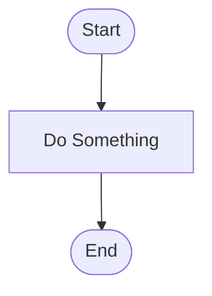

### ✅ Alternative: Explicit Neutral Theme

**For non-GitHub platforms** that need explicit theme:

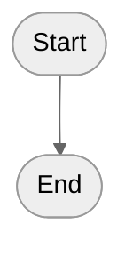

### ❌ Never: Custom Colors

**Breaks dark mode detection:**

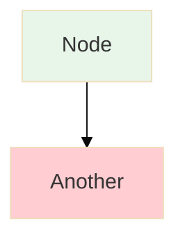

**Why it fails:**

- Light-mode optimized colors are invisible/illegible in dark mode
- GitHub can't auto-adjust styled nodes
- Reduces accessibility

---

## Accessibility Requirements

**Every diagram MUST include:**

### 1. Accessible Title (`accTitle`)

Short, descriptive title for screen readers:


**Rules:**

- 3-8 words maximum
- Describes what the diagram shows
- Plain text, no Markdown

### 2. Accessible Description (`accDescr`)

Detailed explanation of diagram purpose:

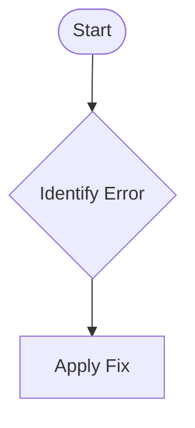

**Rules:**

- Single line (GitHub limitation)
- 1-2 sentences
- Explains purpose and what user learns
- Describes flow direction and key decision points

### 3. Complete Template

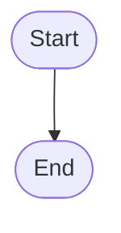

---

## Node Naming Conventions

### ✅ Use Semantic IDs

**Descriptive, snake_case identifiers:**


**Benefits:**

- Self-documenting
- Easier maintenance
- Clear purpose at a glance

### ❌ Avoid Generic IDs

**Single letters lack context:**

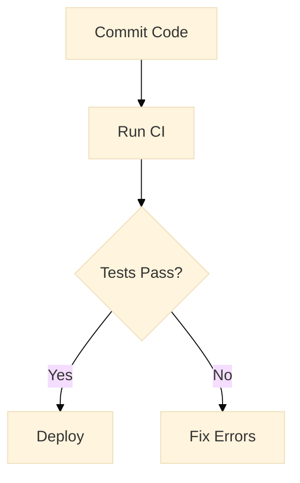

**Problems:**

- Hard to reference in documentation
- Unclear when updating
- No semantic meaning

### Naming Rules

1. **snake_case** for multi-word IDs: `run_tests`, `deploy_prod`
2. **Match labels** when possible: ID `commit_code` → Label "Commit Code"
3. **Be specific**: `check_unit_tests` not `check`
4. **Use verbs** for actions: `run_lint`, `deploy_app`
5. **Use nouns** for states: `ci_pipeline`, `error_state`

---

## Visual Hierarchy with Shapes

**Use node shapes to indicate purpose** (not colors):

### Standard Shape Meanings

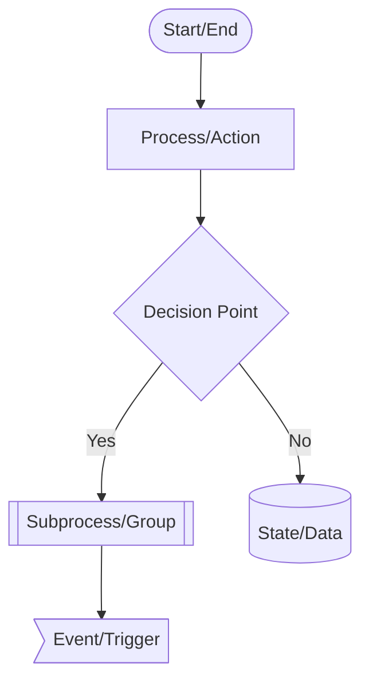

| Shape                 | Syntax     | Use For                       |
| --------------------- | ---------- | ----------------------------- |
| **Rounded Rectangle** | `([text])` | Start/End points              |
| **Rectangle**         | `[text]`   | Processes, actions, steps     |
| **Diamond**           | `{text}`   | Decision points, conditions   |
| **Subroutine**        | `[[text]]` | Subprocesses, grouped actions |
| **Cylinder**          | `[(text)]` | Database, state, data store   |
| **Asymmetric**        | `>text]`   | Events, triggers, external    |
| **Hexagon**           | `{{text}}` | Preparation, initialization   |

### Example: Shape-Based Hierarchy

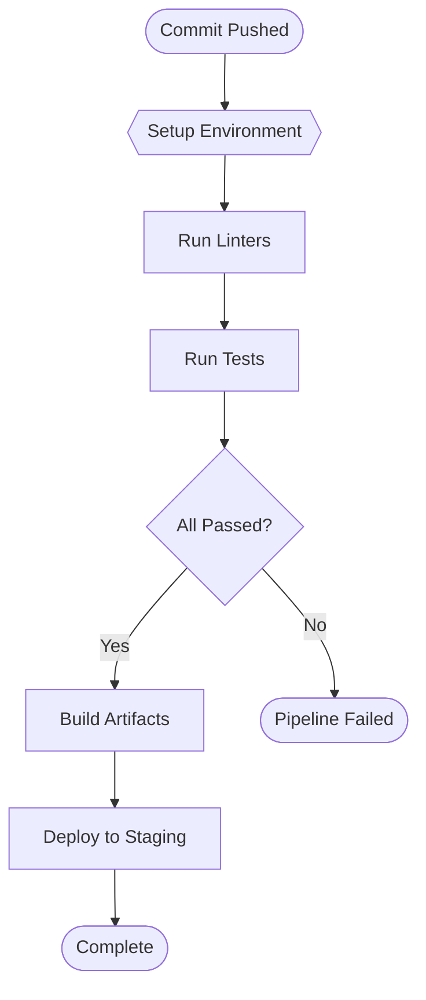

---

## Complexity Limits

### Maximum Nodes Per Diagram

**Guideline: 10 nodes or fewer**

**Why?**

- Easier to understand at a glance
- Better mobile rendering
- Clearer purpose

**If diagram exceeds 10 nodes:**

1. **Split into phases**: "Phase 1: Setup" → "Phase 2: Execution" → "Phase 3: Cleanup"
2. **Create overview + detail**: High-level flow + detailed subprocess diagrams
3. **Group by domain**: Separate diagrams for different concerns

### Maximum Decision Points

**Guideline: 3 decision points or fewer**

**If more decisions needed:**

- Create a decision tree diagram instead
- Split into sequential diagrams
- Use a table for multiple conditions

### Example: Complex Diagram Split

**Diagram 1: Request Processing (8 nodes)**


**Diagram 2: Deployment Stage (8 nodes)**

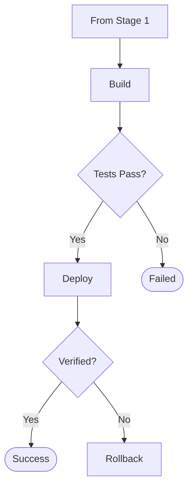

---

## Text Guidelines

### Node Labels

**Length: 3-6 words maximum**

**✅ Good:**

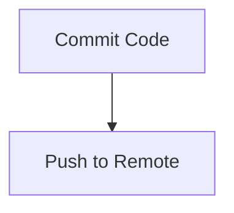

**❌ Too Long:**

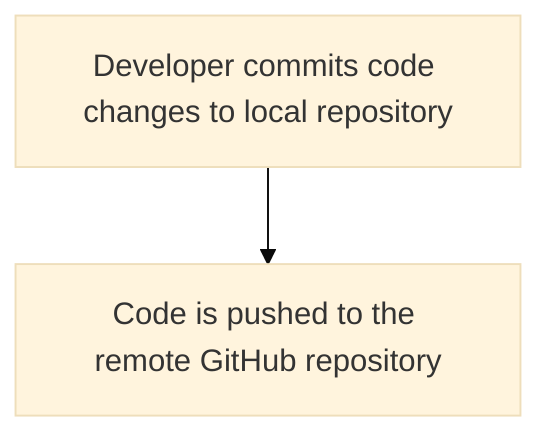

**Voice: Active, imperative**

**✅ Good (Active):**

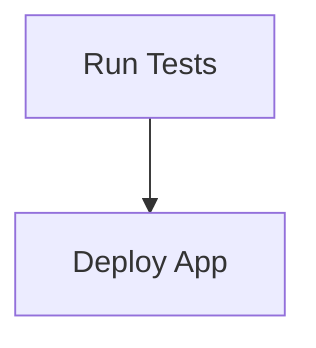

**❌ Passive:**

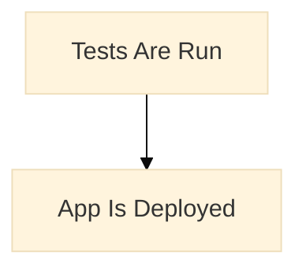

### Edge Labels

**Length: 1-4 words**

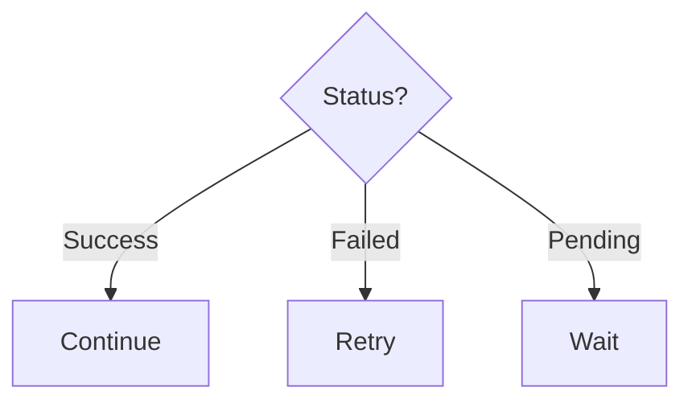

### Capitalization

**Use sentence case for labels:**

**✅ Good:**

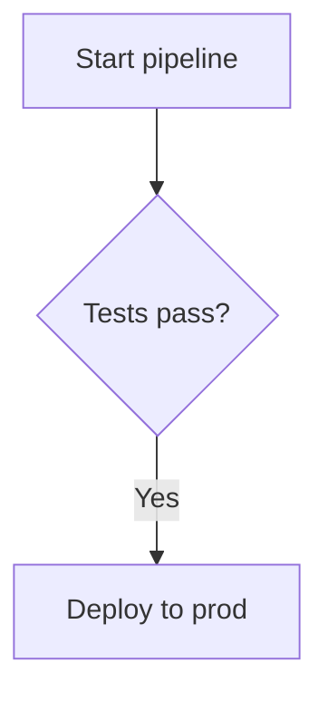

**❌ Title Case:**

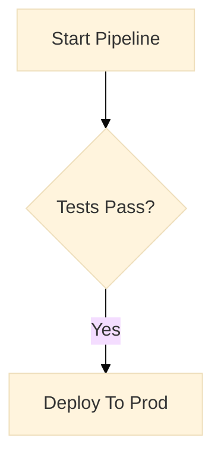

---

## Subgraph Usage

**Use subgraphs to group related nodes:**

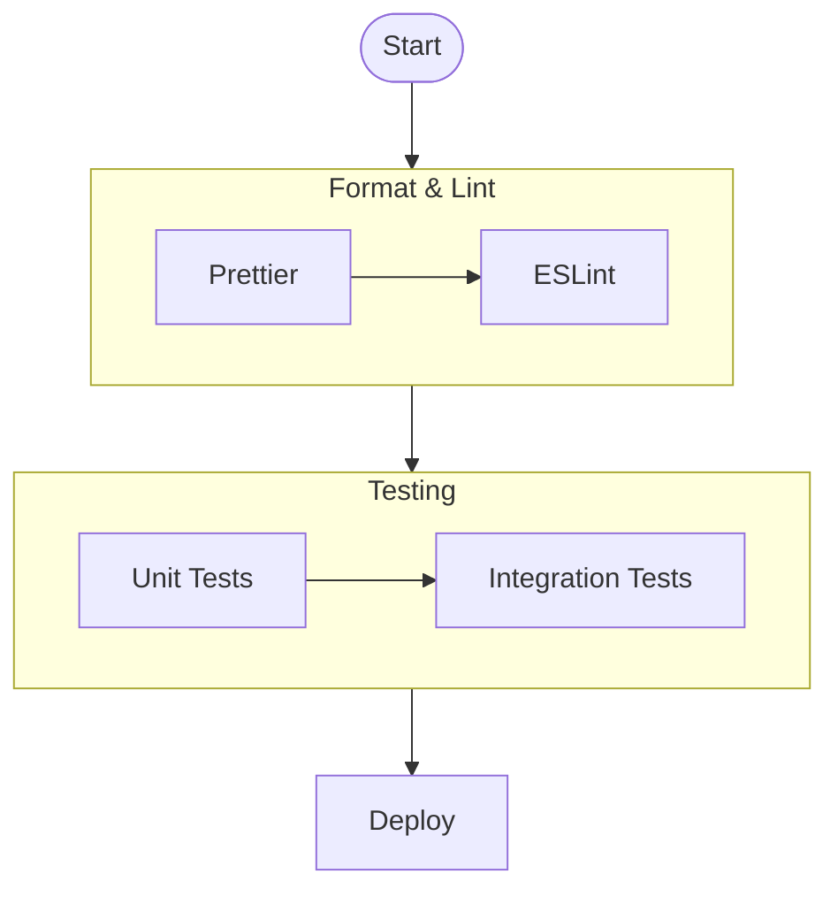

### Subgraph Rules

1. **Descriptive titles**: Use quotes for titles with spaces: `["Format & Lint"]`
2. **2-4 nodes per subgraph**: Don't overgroup
3. **Consistent grouping**: Group by stage, domain, or responsibility
4. **No nested subgraphs**: Keep flat for clarity

---

## Flow Direction

**Choose ONE direction per diagram:**

- `TB` (Top to Bottom) — Default, best for processes
- `LR` (Left to Right) — Good for timelines, stages
- `BT` (Bottom to Top) — Rare, use for bottom-up flows
- `RL` (Right to Left) — Avoid unless cultural requirement

**Be consistent across related diagrams.**

**✅ Top to Bottom (Process Flow):**

```mermaid
flowchart TB
    accTitle: Sequential Process
    accDescr: Top to bottom flow for sequential process steps

    start --> middle --> end_node
```

**✅ Left to Right (Timeline):**

```mermaid
flowchart LR
    accTitle: Project Timeline
    accDescr: Left to right timeline showing project phases

    jan[January] --> feb[February] --> mar[March]
```

---

## Common Diagram Types

### 1. Process Flow

**Best for:** Sequential steps, workflows

```mermaid
flowchart TB
    accTitle: Deployment Process
    accDescr: Sequential steps for deploying application from code commit to production

    commit([Commit]) --> build[Build]
    build --> test[Test]
    test --> deploy[Deploy]
    deploy --> verify[Verify]
    verify --> done([Complete])
```

### 2. Decision Tree

**Best for:** Troubleshooting, diagnostics

```mermaid
flowchart TB
    accTitle: Error Diagnosis
    accDescr: Decision tree for diagnosing common CI errors and identifying appropriate solutions

    error{Error Type?}
    error -->|Build| build_fix[Fix Build Script]
    error -->|Test| test_fix[Fix Failing Tests]
    error -->|Lint| lint_fix[Fix Code Style]
```

### 3. State Diagram

**Best for:** Status transitions, lifecycle

```mermaid
flowchart LR
    accTitle: PR Lifecycle States
    accDescr: State transitions for a pull request from draft creation through merge or closure

    draft[(Draft)] --> open[(Open)]
    open --> review[(In Review)]
    review --> approved[(Approved)]
    approved --> merged([Merged])
    review --> changes[(Changes Requested)]
    changes --> open
```

### 4. Comparison Diagram

**Best for:** Before/after, A vs B

```mermaid
flowchart TB
    accTitle: Workflow Comparison
    accDescr: Compares traditional local linting workflow with automated CI-based linting approach

    subgraph traditional ["Traditional"]
        t1[Edit] --> t2[Lint Locally] --> t3[Commit]
    end

    subgraph automated ["Automated CI"]
        a1[Edit] --> a2[Commit] --> a3[CI Lints]
    end
```

---

## Templates

### Basic Flowchart Template

```mermaid
flowchart TB
    accTitle: Your Title Here
    accDescr: Explain what this diagram shows and its purpose in one or two sentences

    start([Start]) --> step1[First Step]
    step1 --> decision{Check Something?}
    decision -->|Yes| step2[Action A]
    decision -->|No| step3[Action B]
    step2 --> end_success([Success])
    step3 --> end_success
```

### Decision Tree Template

```mermaid
flowchart TB
    accTitle: Decision Tree Title
    accDescr: Describe the decision process and possible outcomes

    root{Main Question?}
    root -->|Option 1| branch1{Sub-question 1?}
    root -->|Option 2| branch2{Sub-question 2?}
    branch1 -->|Yes| result1[Outcome A]
    branch1 -->|No| result2[Outcome B]
    branch2 -->|Yes| result3[Outcome C]
    branch2 -->|No| result4[Outcome D]
```

### Multi-Stage Process Template

```mermaid
flowchart TB
    accTitle: Multi-Stage Process
    accDescr: Describe the stages and their relationships in this multi-phase workflow

    start([Start])

    subgraph stage1 ["Stage 1: Preparation"]
        s1_step1[Setup] --> s1_step2[Validate]
    end

    subgraph stage2 ["Stage 2: Execution"]
        s2_step1[Process] --> s2_step2[Transform]
    end

    subgraph stage3 ["Stage 3: Finalization"]
        s3_step1[Verify] --> s3_step2[Complete]
    end

    start --> stage1
    stage1 --> stage2
    stage2 --> stage3
    stage3 --> end_node([End])
```

---

## Quality Checklist

**Before committing a diagram, verify:**

- [ ] **Accessibility:** Has `accTitle` and `accDescr`
- [ ] **Theme:** No custom `fill` or `stroke` colors
- [ ] **Complexity:** 10 or fewer nodes
- [ ] **Decisions:** 3 or fewer decision points
- [ ] **Node IDs:** Semantic snake_case IDs
- [ ] **Labels:** 3-6 words, active voice, sentence case
- [ ] **Edge labels:** 1-4 words maximum
- [ ] **Shapes:** Consistent shape usage for similar concepts
- [ ] **Flow direction:** Single direction (TB or LR)
- [ ] **Renders:** Test in both light and dark mode on GitHub

---

## Testing Your Diagrams

### 1. GitHub Light/Dark Mode

**Test both modes:**

1. View your PR/file on GitHub
2. Toggle theme: Profile → Appearance → Theme
3. Verify diagram is readable in both modes

### 2. Local Preview

**VS Code:**

1. Install "Markdown Preview Mermaid Support" extension
2. Open Markdown file
3. `Cmd/Ctrl + Shift + V` to preview

### 3. Accessibility

**Screen reader test:**

1. Use browser screen reader (macOS VoiceOver, NVDA, JAWS)
2. Navigate to diagram
3. Verify `accTitle` and `accDescr` are read correctly

---

## Common Mistakes

### ❌ Mistake: Over-styling

**Problem:** Custom colors break in dark mode

```mermaid
%%{init: {'theme':'base'}}%%
flowchart TB
    A[Node 1]
    B[Node 2]
    style A fill:#ff0000,stroke:#333,stroke-width:4px
    style B fill:#00ff00,stroke:#333,stroke-width:4px
```

**✅ Fix:** Remove all styling, use shapes

```mermaid
flowchart TB
    accTitle: Status Nodes
    accDescr: Using shapes instead of colors to distinguish node types

    error_node{Error Node}
    success_node([Success Node])
    error_node -->|Fixed| success_node
```

### ❌ Mistake: Generic IDs

**Problem:** No semantic meaning

```mermaid
%%{init: {'theme':'base'}}%%
flowchart TB
    A --> B --> C --> D
```

**✅ Fix:** Use descriptive IDs

```mermaid
flowchart TB
    accTitle: Request Flow
    accDescr: API request flow from receipt to response

    receive_request --> validate_data --> process_data --> send_response
```

### ❌ Mistake: Too Complex

**Problem:** 15+ nodes overwhelming

**✅ Fix:** Split into focused diagrams

**Diagram 1: Input Processing**

```mermaid
flowchart TB
    accTitle: Input Processing
    accDescr: First phase handling input validation and processing

    receive --> validate --> process --> output
```

**Diagram 2: Output Generation**

```mermaid
flowchart TB
    accTitle: Output Generation
    accDescr: Second phase handling formatting and delivery

    format --> send --> complete
```

### ❌ Mistake: Missing Accessibility

**Problem:** Not screen-reader friendly

```mermaid
%%{init: {'theme':'base'}}%%
flowchart TB
    start --> end_node
```

**✅ Fix:** Add accessibility metadata

```mermaid
flowchart TB
    accTitle: Simple Process Flow
    accDescr: Basic two-step process from start to completion

    start([Start]) --> end_node([Complete])
```

---

## Resources

- **Official Mermaid Docs:** [mermaid.js.org](https://mermaid.js.org/)
- **Accessibility Guide:** [Mermaid Accessibility](https://mermaid.js.org/config/accessibility.html)
- **Theme Configuration:** [Mermaid Theming](https://mermaid.js.org/config/theming.html)
- **GitHub Mermaid Support:** [GitHub Docs](https://github.blog/2022-02-14-include-diagrams-markdown-files-mermaid/)

---

## Version History

- **2026-01-18:** Initial style guide creation
  - Established core principles
  - Defined accessibility requirements
  - Created templates and examples
  - Added quality checklist
  - Fixed Mermaid syntax for GitHub compatibility

---

**Maintainer:** @borealBytes  
**Status:** Active  
**Applies to:** All Mermaid diagrams in startup-blueprint repository
