# CI/CD Workflow Architecture

> **Simplified, phase-based orchestration with environment validation**

## 📊 Architecture Overview

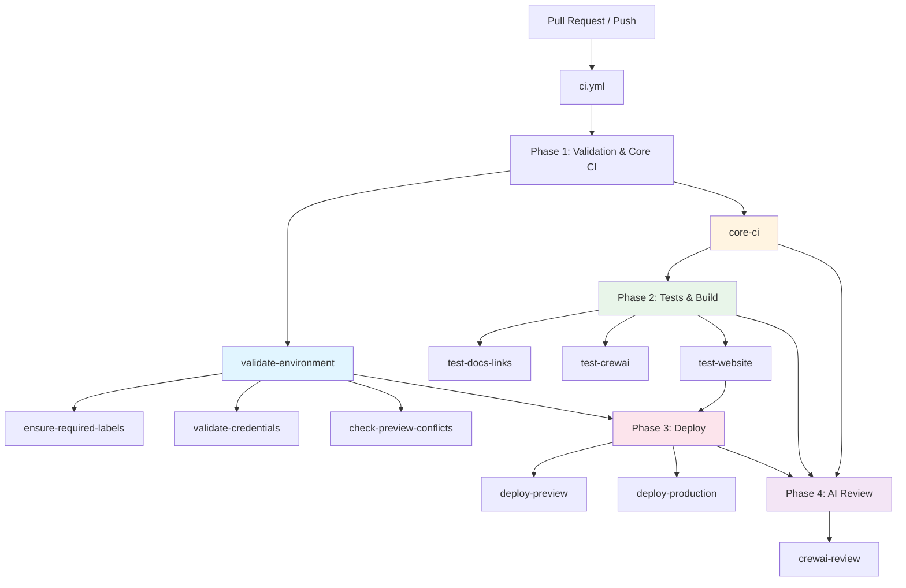

## 🔄 Workflow Phases

### Phase 1: Validation & Core CI (Parallel)

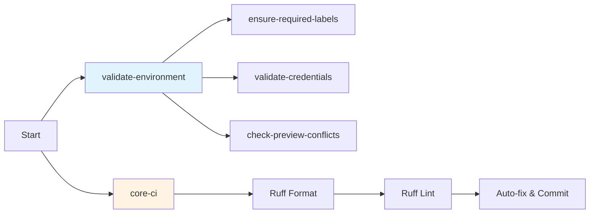

**validate-environment** (3 parallel jobs):
- `ensure-required-labels` - Creates deployment labels if missing
- `validate-credentials` - Validates Cloudflare, Google, OpenRouter secrets
- `check-preview-conflicts` - Warns if multiple PRs have preview label

**core-ci**:
- Format checking with Ruff
- Linting Python code
- Auto-fixes and commits if needed
- Outputs `final-commit-sha` for downstream jobs

### Phase 2: Tests & Build (Conditional)

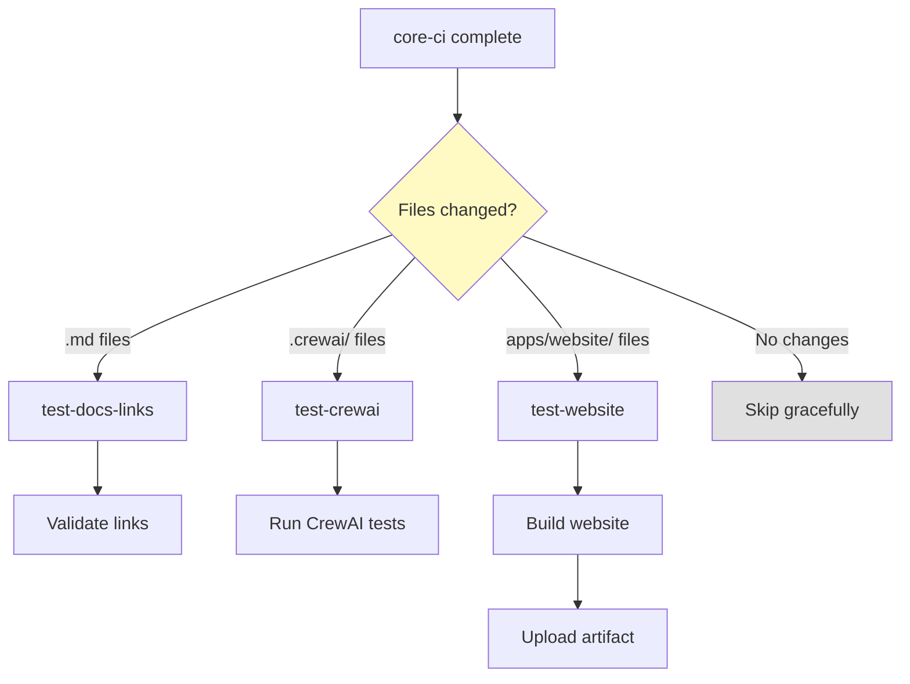

Each test workflow:
- Detects its own relevant file changes
- Skips gracefully if no changes detected
- Posts summary to Actions output

### Phase 3: Deploy (Conditional)

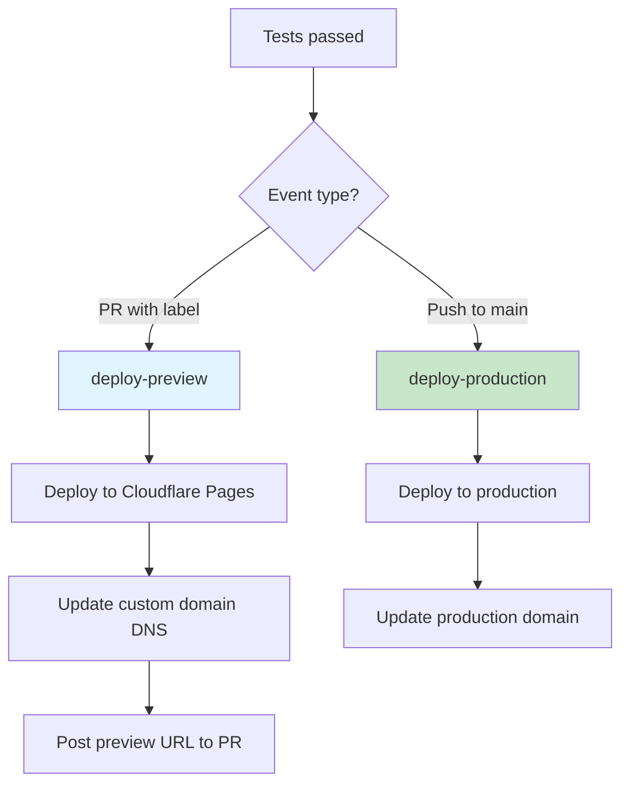

**deploy-preview** (PRs only):
- Requires `Deploy: Website Preview` label
- Deploys to custom domain: `preview-startup-blueprint.SuperiorByteWorks.com`
- Posts deployment URL as PR comment

**deploy-production** (main branch only):
- Automatic on push to main
- Deploys to production domain
- No manual approval required

### Phase 4: AI Review (After all phases)

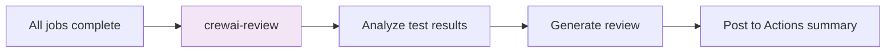

**crewai-review**:
- Runs after all other jobs
- Analyzes test results and code changes
- Posts AI-generated review to GitHub Actions summary

## 📁 File Structure

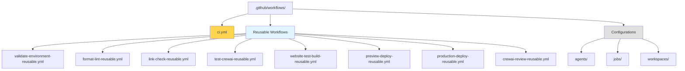

### Key Files

| File | Purpose | Phase |
|------|---------|-------|
| `ci.yml` | **Main orchestrator** - Single entry point | All |
| `validate-environment-reusable.yml` | Validates environment setup | 1 |
| `format-lint-reusable.yml` | Code quality checks | 1 |
| `link-check-reusable.yml` | Documentation link validation | 2 |
| `test-crewai-reusable.yml` | CrewAI testing | 2 |
| `website-test-build-reusable.yml` | Website build & test | 2 |
| `preview-deploy-reusable.yml` | Preview deployments | 3 |
| `production-deploy-reusable.yml` | Production deployments | 3 |
| `crewai-review-reusable.yml` | AI code review | 4 |

## 🚀 Usage

### For Pull Requests

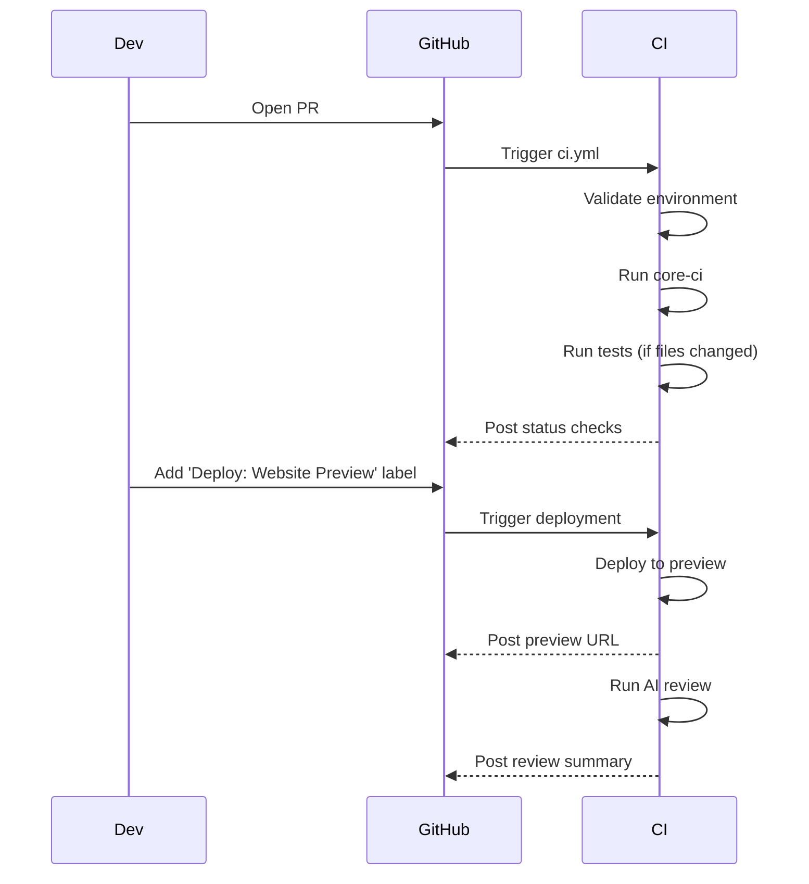

**Standard PR workflow:**
1. Open PR → Triggers validation & tests
2. Tests run only for changed files
3. Add `Deploy: Website Preview` label to deploy
4. Preview URL posted as comment
5. AI review runs after all jobs

### For Production Deploys

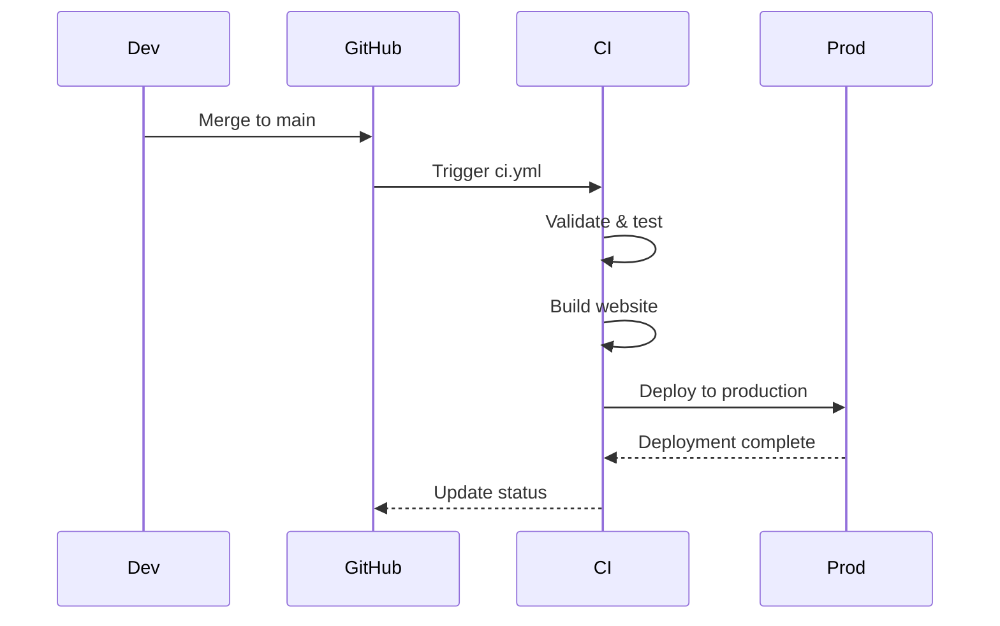

**Production workflow:**
1. Merge PR to main
2. CI validates and tests
3. Builds production artifacts
4. Deploys to production domain
5. No manual approval needed

## ➕ Adding a New Workspace

### Example: Adding API Testing

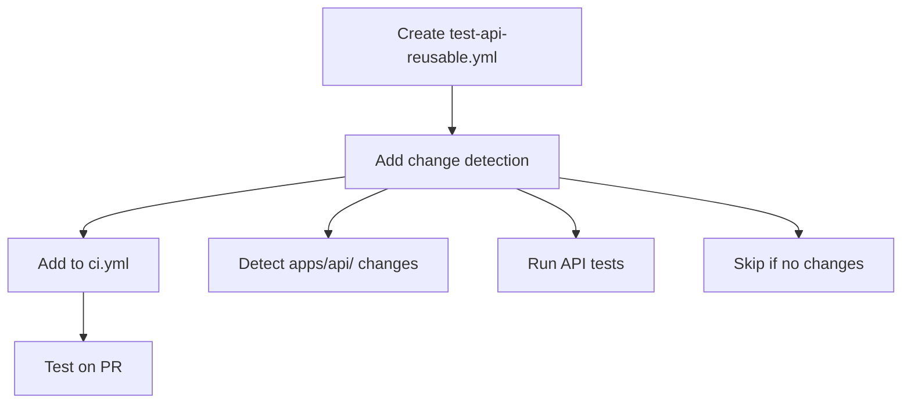

**Step 1:** Create `.github/workflows/test-api-reusable.yml`

```yaml
name: Test API

on:
  workflow_call:
    inputs:
      commit_sha:
        required: false
        type: string

permissions:
  contents: read
  pull-requests: write

jobs:
  test:
    runs-on: ubuntu-latest
    
    steps:
      - name: Checkout
        uses: actions/checkout@v4
        with:
          ref: ${{ inputs.commit_sha || github.sha }}
          fetch-depth: 0

      - name: Detect API changes
        id: check
        run: |
          if [ "${{ github.event_name }}" == "pull_request" ]; then
            BASE="${{ github.event.pull_request.base.sha }}"
            HEAD="${{ github.event.pull_request.head.sha }}"
          else
            BASE="${{ github.event.before }}"
            HEAD="${{ github.sha }}"
          fi
          
          CHANGED=$(git diff --name-only $BASE $HEAD | grep '^apps/api/' || true)
          
          if [ -z "$CHANGED" ]; then
            echo "should_run=false" >> $GITHUB_OUTPUT
          else
            echo "should_run=true" >> $GITHUB_OUTPUT
          fi

      - name: Run API tests
        if: steps.check.outputs.should_run == 'true'
        working-directory: apps/api
        run: |
          npm ci
          npm test

      - name: Skipped summary
        if: steps.check.outputs.should_run == 'false'
        run: |
          echo "## 🔌 API Tests" >> $GITHUB_STEP_SUMMARY
          echo "⏭️ Skipped - No API files changed" >> $GITHUB_STEP_SUMMARY
```

**Step 2:** Add to `ci.yml`

```yaml
test-api:
  name: Test API
  needs: [core-ci]
  if: |
    always() &&
    (needs.core-ci.result == 'success' || needs.core-ci.result == 'failure')
  uses: ./.github/workflows/test-api-reusable.yml
  with:
    commit_sha: ${{ needs.core-ci.outputs.final-commit-sha }}
  secrets: inherit
```

**Done!** API tests now:
- ✅ Run only when `apps/api/` changes
- ✅ Skip gracefully with summary
- ✅ Integrate with existing CI pipeline

## 🛠️ Troubleshooting

### Issue: Tests didn't run

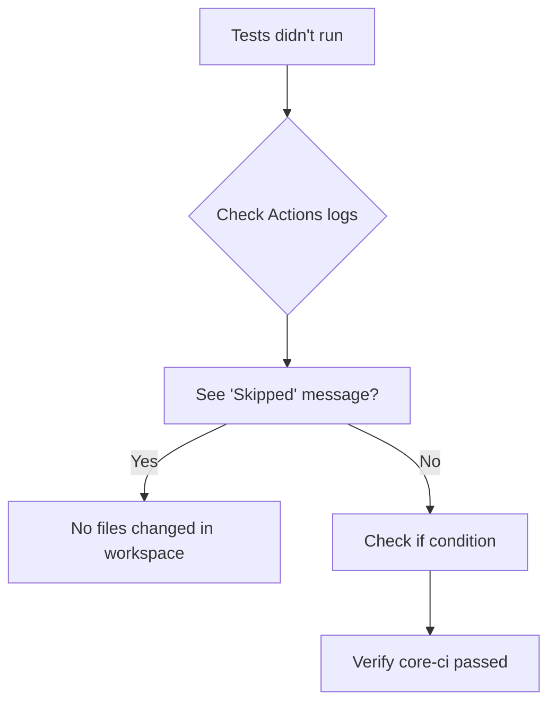

**Debug checklist:**
- ✅ Did you change files in the workspace path?
- ✅ Is `fetch-depth: 0` set in checkout?
- ✅ Did `core-ci` complete (success or failure)?
- ✅ Check Actions summary for skip message

### Issue: Preview deployment didn't trigger

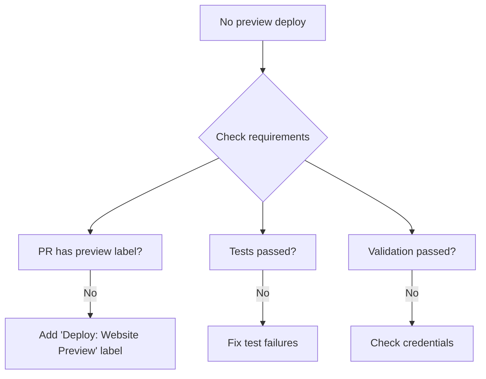

**Requirements:**
1. ✅ PR has `Deploy: Website Preview` label
2. ✅ `test-website` job passed
3. ✅ `validate-environment` job passed

### Issue: Multiple PRs with preview label

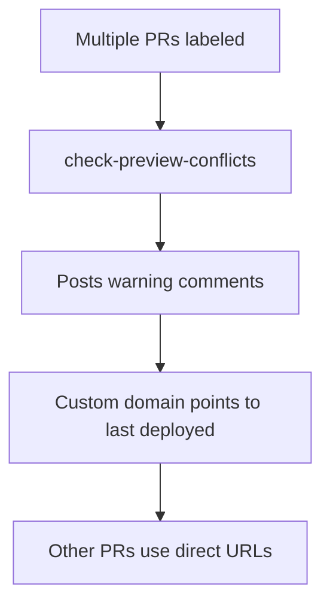

**What happens:**
- ⚠️ Warning comment posted on all labeled PRs
- 🌐 Custom domain points to most recent deployment
- 🔗 Other PRs still accessible via direct Cloudflare URLs

**Resolution:**
- Remove label from all but one PR
- Keep label on PR you want at custom domain

## 📋 Best Practices

### 1. Self-Contained Change Detection

Each reusable workflow detects its own changes:

```yaml
# Good ✅
- name: Check if X changed
  id: check
  run: |
    CHANGED=$(git diff $BASE $HEAD --name-only | grep '^workspace/' || true)
    echo "should_run=${CHANGED:+true}${CHANGED:-false}" >> $GITHUB_OUTPUT

- name: Do work
  if: steps.check.outputs.should_run == 'true'
  run: ...
```

### 2. Always Use Correct Commit SHA

Pass the SHA from `core-ci` to ensure consistency:

```yaml
test-workspace:
  needs: [core-ci]
  uses: ./.github/workflows/test-workspace-reusable.yml
  with:
    commit_sha: ${{ needs.core-ci.outputs.final-commit-sha }}  # ✅
```

### 3. Handle Failures Gracefully

Always allow subsequent jobs to run:

```yaml
if: |
  always() &&
  (needs.core-ci.result == 'success' || needs.core-ci.result == 'failure')
```

### 4. Use Parallel Jobs When Possible

```yaml
# Phase 1: These run in parallel
validate-environment:  # No dependencies
core-ci:               # No dependencies

# Phase 2: These run in parallel after Phase 1
test-docs:     needs: [core-ci]
test-crewai:   needs: [core-ci]
test-website:  needs: [core-ci]
```

## 🔗 Related Documentation

- [GitHub Actions: Reusable Workflows](https://docs.github.com/en/actions/using-workflows/reusing-workflows)
- [GitHub Actions: Conditional Execution](https://docs.github.com/en/actions/using-workflows/workflow-syntax-for-github-actions#jobsjob_idif)
- [Cloudflare Pages Deployment](https://developers.cloudflare.com/pages/)

## 📊 Workflow Status

| Workflow | Status | Phase | Notes |
|----------|--------|-------|-------|
| validate-environment | ✅ Active | 1 | 3 parallel jobs |
| core-ci | ✅ Active | 1 | Format & lint |
| test-docs-links | ✅ Active | 2 | Self-detecting |
| test-crewai | ✅ Active | 2 | Self-detecting |
| test-website | ✅ Active | 2 | Self-detecting |
| deploy-preview | ✅ Active | 3 | Label-triggered |
| deploy-production | ✅ Active | 3 | Main branch only |
| crewai-review | ✅ Active | 4 | AI-powered |

---

**Last Updated:** 2026-01-24  
**Architecture:** Phase-based with parallel validation  
**Entry Point:** `.github/workflows/ci.yml`  
**Questions?** Open an issue or check the [troubleshooting guide](#-troubleshooting)
