# GitHub Actions Workflows

## Orchestrated CI Pipeline

This directory contains a **modular, orchestrated CI workflow** that runs comprehensive checks before allowing AI-powered code review.

---

## 📁 Workflow Files

### 1. **`ci.yml`** - Main Orchestrator
**Purpose:** Entry point that coordinates the entire CI pipeline  
**Triggers:** Every pull request  
**What it does:**
- Runs Core CI first (format, lint, type check, link check)
- Only runs CrewAI review if Core CI succeeds
- Skips AI review for:
  - Bot PRs (`dependabot[bot]`, `renovate[bot]`)
  - Draft PRs

```yaml
on:
  pull_request:

jobs:
  core-ci:
    uses: ./.github/workflows/core-ci-reusable.yml
  
  crewai-review:
    needs: [core-ci]
    if: needs.core-ci.result == 'success' && !draft && !bot
    uses: ./.github/workflows/crewai-review-reusable.yml
```

---

### 2. **`core-ci-reusable.yml`** - Format, Lint, Test
**Purpose:** Comprehensive code quality checks  
**What it does:**

**Formatting:**
- ✨ Prettier (JS/TS/JSON/MD/YAML/CSS)
- 🐍 Black (Python)
- 🔀 isort (Python imports)
- 🗄️ SQLFluff (SQL - PostgreSQL/DuckDB)
- 🎨 stylelint (CSS/SCSS)
- 📝 markdownlint
- 🦴 gofmt (Go)

**Linting:**
- 🔍 ESLint (JS/TS)
- 🐍 flake8 (Python)
- 📄 yamllint (YAML)
- 🐚 shellcheck (Bash)
- 🦴 golangci-lint (Go)
- 💬 commitlint (Conventional Commits)

**Type Checking:**
- 🔷 TypeScript compiler (tsc --noEmit)

**Link Validation:**
- 🔗 lychee (Markdown link checker with cache)

**Auto-fix & Commit:**
- If formatting/linting issues found, auto-commits fixes
- Outputs final commit SHA for next steps
- Prevents workflow files from being modified

---

### 3. **`crewai-review-reusable.yml`** - AI Code Review
**Purpose:** Multi-model AI code review using CrewAI agents  
**What it does:**
- Reviews the exact commit after Core CI (uses SHA from Core CI output)
- Runs multiple specialized AI agents:
  - Code quality review
  - Security vulnerability scan
  - Architecture analysis
- Posts review as PR comment
- Uploads logs as artifacts

**Requirements:**
- `OPENROUTER_API_KEY` secret must be set
- `.crewai/` directory with review agents
- Only runs if Core CI passes ✅

---

## 🔄 Execution Flow

```mermaid
graph TD
    A[PR Created/Updated] --> B[CI Orchestrator]
    B --> C[Core CI: Format & Lint]
    C -->|✅ Success| D[Core CI: Link Check]
    C -->|❌ Failed| E[Stop - Fix Issues]
    D -->|✅ Success| F{Check Conditions}
    D -->|❌ Failed| E
    F -->|Bot PR?| G[Skip CrewAI]
    F -->|Draft PR?| G
    F -->|✅ Ready| H[CrewAI Review]
    H --> I[Post Review Comment]
    I --> J[Done]
    G --> J
```



---

## 🔐 Secrets Management

### Automatic Secrets (No Configuration Needed)
- `GITHUB_TOKEN` - Auto-provided by GitHub Actions
  - Used for: Checkout, PR comments, API access
  - **Cannot** be explicitly declared in `workflow_call` secrets

### Required Secrets (Must Configure)
- `OPENROUTER_API_KEY` - Required for CrewAI review
  - Add in: Repository Settings → Secrets → Actions
  - Get from: https://openrouter.ai/

---

## 🎯 Why This Architecture?

### ✅ Benefits

1. **No Wasted Resources**
   - CrewAI doesn't run if code doesn't pass basic checks
   - Saves API costs and compute time

2. **Single Workflow Run**
   - Shows as one "CI" workflow in GitHub UI
   - Clean, professional appearance

3. **Modular & Maintainable**
   - Three files instead of one monolith
   - Easy to modify individual steps
   - Reusable workflows for future projects

4. **Clear Dependencies**
   - `needs: [core-ci]` makes execution order explicit
   - Conditional logic prevents unwanted runs

5. **Smart Skipping**
   - Doesn't waste AI review on bot PRs
   - Doesn't review drafts (saves reviews for ready PRs)

---

## 🚀 Usage

### For Developers
**Just open a PR!** The workflow runs automatically.

### What to Expect
1. Core CI runs (1-3 minutes)
   - Auto-commits format/lint fixes if needed
2. Link check validates docs (30 seconds)
3. CrewAI review analyzes code (2-5 minutes)
4. Review posted as PR comment

### If CI Fails
- Check the "Core CI" job logs
- Fix the issues locally
- Push your changes
- Workflow re-runs automatically

### If CrewAI Review Fails
- Check the "CrewAI Code Review" job logs
- Review logs available as downloadable artifacts
- Does not block PR merge (informational only)

---

## 🔧 Troubleshooting

### Workflow Not Running?
1. Check PR is not a draft
2. Verify workflow files are on the base branch
3. Check branch protection rules

### CrewAI Review Skipped?
- ✅ Expected if Core CI failed
- ✅ Expected if PR is draft
- ✅ Expected if opened by bot

### Format/Lint Auto-Commit Loop?
- Check `.gitignore` excludes generated files
- Verify formatters are deterministic
- Review "Unstage workflow files" safeguard step

---

## 📚 References

- [GitHub Actions: Reusing Workflows](https://docs.github.com/en/actions/using-workflows/reusing-workflows)
- [Conventional Commits](https://www.conventionalcommits.org/)
- [CrewAI Documentation](https://docs.crewai.com/)
- [OpenRouter API](https://openrouter.ai/docs)

---

**Last Updated:** 2026-01-18  
**Architecture Version:** 1.0  
**Status:** ✅ Production Ready
