# GitHub Actions Workflows

## Architecture: Orchestrator Pattern

Our CI uses a **reusable workflow orchestrator pattern** to maintain modularity while ensuring CrewAI review only runs after core CI succeeds.

### Workflow Files

```
.github/workflows/
├── ci.yml                        # 🎯 Orchestrator (entry point)
├── core-ci-reusable.yml          # 📋 Core CI (format, lint, link check)
└── crewai-review-reusable.yml    # 🤖 AI code review
```

---

## How It Works

### 1. **ci.yml** (Orchestrator)

**Triggers:** `pull_request`

**Jobs:**

```yaml
jobs:
  core-ci:
    uses: ./.github/workflows/core-ci-reusable.yml

  crewai-review:
    needs: [core-ci]
    if: needs.core-ci.result == 'success'
    uses: ./.github/workflows/crewai-review-reusable.yml
```

**What it does:**
- Calls `core-ci-reusable.yml` first
- Only calls `crewai-review-reusable.yml` if core CI succeeds
- Passes secrets and inputs to child workflows

---

### 2. **core-ci-reusable.yml**

**Reusable workflow** (`on: workflow_call`)

**Jobs:**
- `format-and-lint`: Run formatters and linters (Prettier, ESLint, Black, etc.)
- `link-check`: Validate Markdown links with Lychee

**What it does:**
- Formats and lints all code (JS/TS, Python, SQL, Go, Markdown, etc.)
- Auto-commits fixes if needed
- Checks documentation links
- **Fails fast** if any check fails (stops before CrewAI runs)

---

### 3. **crewai-review-reusable.yml**

**Reusable workflow** (`on: workflow_call`)

**Jobs:**
- `crewai-review`: AI-powered code review using CrewAI

**What it does:**
- Reviews code quality, security, architecture
- Posts findings as PR comments
- Only runs if core CI passed (resource optimization)

**Skipped when:**
- Core CI failed
- PR is a draft
- PR author is a bot (dependabot, renovate)

---

## Execution Flow

```mermaid
graph TD
    A[Pull Request Created/Updated] --> B{ci.yml Orchestrator}
    B --> C[core-ci-reusable.yml]
    C --> D{Core CI Success?}
    D -->|✅ Yes| E[crewai-review-reusable.yml]
    D -->|❌ No| F[Stop - Don't Run CrewAI]
    E --> G[CrewAI Reviews Code]
    G --> H[Post Findings to PR]
    F --> I[Fix Issues & Push Again]
    I --> A
```



---

## Benefits

### ✅ **Resource Efficiency**
- CrewAI never runs if lint/format/link checks fail
- Saves API costs and compute time
- Fast feedback on basic issues

### ✅ **Modularity**
- Each workflow file has a single responsibility
- Easy to test and maintain individually
- Can reuse workflows in other contexts

### ✅ **Single Workflow Run**
- Appears as one "CI" workflow in GitHub UI
- Clear job dependencies visible in Actions tab
- All steps in one place for audit trail

### ✅ **Clear Dependency Chain**
- `needs: [core-ci]` makes execution order explicit
- `if: needs.core-ci.result == 'success'` prevents wasted work
- Human-readable workflow structure

---

## Customization

### Skip CrewAI for Specific PRs

Add label-based conditions to `ci.yml`:

```yaml
crewai-review:
  needs: [core-ci]
  if: |
    needs.core-ci.result == 'success' &&
    !contains(github.event.pull_request.labels.*.name, 'skip-ai-review')
```

### Add More Reusable Workflows

Create new workflow files:

```yaml
# .github/workflows/security-scan-reusable.yml
name: Security Scan (Reusable)
on:
  workflow_call:

jobs:
  security:
    # ... Snyk, Trivy, etc.
```

Then call from orchestrator:

```yaml
# ci.yml
jobs:
  core-ci:
    uses: ./.github/workflows/core-ci-reusable.yml

  security-scan:
    needs: [core-ci]
    if: needs.core-ci.result == 'success'
    uses: ./.github/workflows/security-scan-reusable.yml

  crewai-review:
    needs: [security-scan]
    if: needs.security-scan.result == 'success'
    uses: ./.github/workflows/crewai-review-reusable.yml
```

---

## Troubleshooting

### CrewAI Never Runs

**Check:**
1. Did core CI pass? (Look at `core-ci` job result)
2. Is the PR a draft? (CrewAI skips drafts)
3. Is the author a bot? (CrewAI skips bot PRs)
4. Is `OPENROUTER_API_KEY` secret set?

### Core CI Fails on Valid Code

**Check:**
1. Are linters/formatters configured correctly?
2. Run locally: `pnpm lint`, `pnpm format`
3. Check workflow logs for specific tool failures

### Workflow Files Not Found

**Error:** `workflow_call: ./.github/workflows/xxx.yml not found`

**Fix:** Ensure all workflow files are committed to the same branch

---

## Migration from Old Structure

**Before:**
```
.github/workflows/
├── ci.yml              # All CI steps (1000+ lines)
└── crewai-review.yml   # Separate workflow (runs independently)
```

**After:**
```
.github/workflows/
├── ci.yml                        # Orchestrator (30 lines)
├── core-ci-reusable.yml          # Core CI logic (600 lines)
└── crewai-review-reusable.yml    # CrewAI logic (80 lines)
```

**Key Changes:**
- CrewAI now runs as part of CI (not separately)
- CrewAI only runs if core CI passes (conditional execution)
- Workflow logic split into maintainable files
- Single workflow run in GitHub UI (not two separate runs)

---

## Further Reading

- [GitHub Actions: Reusing Workflows](https://docs.github.com/en/actions/using-workflows/reusing-workflows)
- [GitHub Actions: Workflow Syntax](https://docs.github.com/en/actions/using-workflows/workflow-syntax-for-github-actions)
- [CrewAI Documentation](https://docs.crewai.com/)

---

**Last Updated:** 2026-01-18  
**Structure Version:** 2.0 (Orchestrator Pattern)
