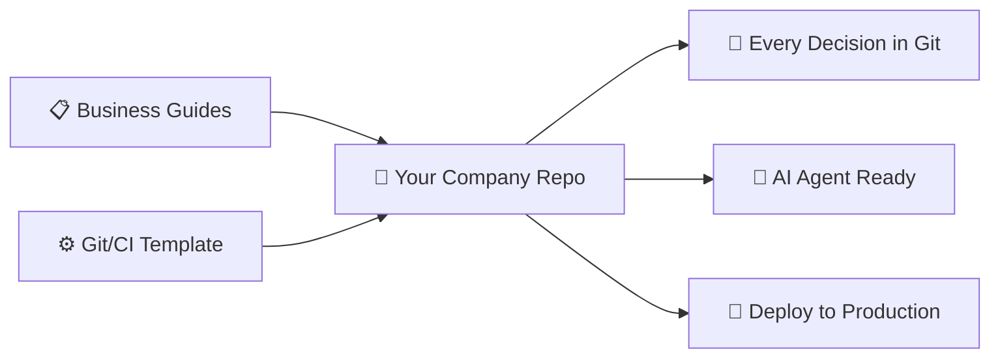
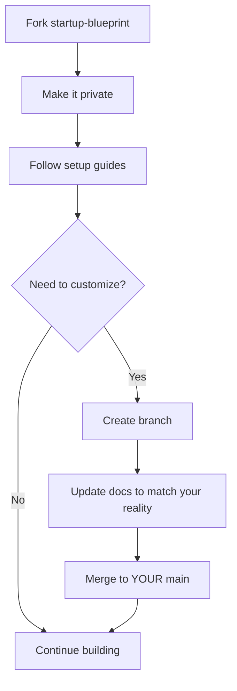
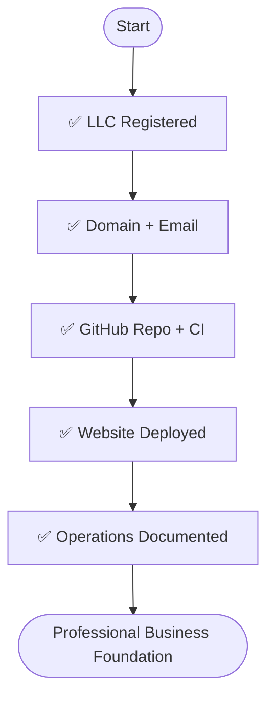

# Startup Blueprint 🚀

**A complete startup operating system: business setup guides + production-grade Git/CI foundation in one monorepo.**

From "I'm starting a company" to "my website is deployed and CI is green"—this repo is your business source of truth from day one.

> **Who this is for:** Solo founders, co-founders, and small teams who want professional infrastructure without rebuilding as you scale. Perfect for working with AI agents (Perplexity MCP, Cursor, Claude) that need structured context.

---

## 🎯 What Makes This Different

Most startup guides are vague advice. Most repo templates ignore the business side. This combines both:



### Three Core Ideas

1. **Everything in Git** — Business decisions, docs, code, configs. One source of truth, fully auditable.
2. **Agent-Friendly Workflow** — Structured for AI assistants via MCP (Perplexity), CLI (Cursor/Claude), or any Git-capable tool.
3. **Production-Ready CI** — Auto-format, lint, link-check on every commit. Merge confidence from day one.

---

## 🛠️ What's Included Today

### 📚 Startup Setup Guides

| Guide                                                                   | Duration  | What You'll Set Up                      |
| ----------------------------------------------------------------------- | --------- | --------------------------------------- |
| **[1. Legal Foundation](./docs/guides/01-legal-foundation.md)**         | 2-3 hours | LLC registration, EIN, business license |
| **[2. Domain & DNS](./docs/guides/02-domain-dns.md)**                   | 30 min    | Custom domain via Cloudflare            |
| **[3. Email Infrastructure](./docs/guides/03-email-infrastructure.md)** | 1 hour    | Professional email routing (free)       |
| **[4. Git & Repository](./docs/guides/04-git-repository.md)**           | 45 min    | GitHub repo, AI workflow setup          |
| **[5. Financial Tools](./docs/guides/05-financial-tools.md)**           | 1 hour    | Accounting, payments, tax planning      |
| **[6. Deployment & CI/CD](./docs/guides/06-deployment-cicd.md)**        | 1.5 hours | Cloudflare Pages deployment             |
| **[7. Operations Manual](./docs/guides/07-operations-manual.md)**       | 2 hours   | Repeatable processes & checklists       |

**Total setup time: ~8-10 hours**

### ⚙️ CI/CD Automation

**GitHub Actions workflow** that runs on every PR:

- ✅ **Auto-format** — Prettier, Black, SQLFluff, gofmt
- ✅ **Lint everything** — ESLint, flake8, markdownlint, stylelint, yamllint
- ✅ **Validate commits** — Conventional Commits format
- ✅ **Check links** — All Markdown links validated (race-condition safe)
- ✅ **Bot auto-fixes** — Commits fixes automatically, you just merge

**Languages supported:** JavaScript/TypeScript, Python, SQL, Go, CSS/SCSS, Markdown, YAML, Bash

**CI/CD Guide:** [`.github/CI_CD_GUIDE.md`](./.github/CI_CD_GUIDE.md)

### 🧰 Repo Quality Tooling

Pre-configured for professional code quality:

```
Root configs:
├── .prettierrc.json       # Code formatting
├── .eslintrc.json         # JS/TS linting
├── .markdownlint.json     # Docs linting
├── .stylelintrc.json      # CSS linting
├── .sqlfluff              # SQL formatting
├── commitlint.config.js   # Commit validation
└── .lycheeignore          # Link check exclusions
```

---

## 🔄 How to Use This Repo

### For Your Own Business (Private Fork)



**Steps:**

1. **Fork this repo** → Make it **private** (your business source of truth)
2. **Follow the guides** in `docs/guides/` to set up your business
3. **When you customize:**
   - Create a branch: `git checkout -b docs/update-for-florida-llc`
   - Update the guides to match what you actually did
   - Merge to `main` in your private fork
4. **Build your business** — Add code, docs, decisions to the monorepo

### Contributing Improvements (Public PR)

### 5. **Low Cost, High ROI**

Most tools are free or extremely low cost (free Gmail, GitHub, Perplexity Spaces; domain registrar cost-only pricing from Cloudflare). Your primary recurring expense is your domain (about ~$10.50/year at Cloudflare's cost-based pricing).

**Steps:**

The ROI comes from saved time, avoided mistakes, and a professional foundation that doesn't need to be rebuilt later.

---

## 🚀 Quick Start

### Option 1: Jump to Action (Fastest)

```
1. Read: docs/guides/QUICKSTART.md (30 min)
2. Do: Guides 1-3 (legal, domain, email)
3. Come back to rest as you scale
```

### Option 2: Structured Setup (Recommended)

```
1. Start: Guide #1 (Legal Foundation)
2. Work through each guide in order
3. Use checklists to validate completion
4. Reference CI_CD_GUIDE.md for automation
```

### Option 3: Full Immersion

```
1. Read this entire README
2. Skim all guides (understand big picture)
3. Work through methodically
4. Customize as you go
```

---

## 🎯 Success Criteria



After completing this blueprint:

- ✅ Registered LLC with active EIN
- ✅ Custom domain (`yourcompany.com`)
- ✅ Professional email (`founder@yourcompany.com`)
- ✅ GitHub repo with working CI/CD
- ✅ Website deployed and live
- ✅ 2FA on all critical accounts
- ✅ Documented processes for scale
- ✅ AI agent can read your repo structure

---

## 🔮 Coming Soon

**High-level planned features:**

- 📦 **Monorepo scaffolding** — `apps/`, `packages/`, `scripts/` structure with examples
- 📋 **Product templates** — PRD/TDD structure for capturing product intent
- 🚀 **Deployment templates** — Cloudflare Workers/Pages starter setups
- 🧪 **Test automation** — Once example apps exist, add test runners to CI
- 📊 **Analytics setup** — Privacy-friendly analytics integration guide

---

## 💡 Core Principles

### 1. **Professionalism First** 💼

Look like a 100-person company from day one. Custom domain, proper legal structure, professional tools.

### 2. **Scalability** 📈

Add team members without rebuilding. Start solo, scale to 5+ with same processes.

### 3. **Automation** 🤖

Repetitive tasks are automated. Deployment is automatic. Quality checks are automatic.

### 4. **Security & Compliance** 🔒

2FA everywhere. Secrets in environment variables. GDPR-ready from start.

### 5. **Low Cost, High ROI** 💰

Most tools are free. Primary cost: domain (~$10/year). Time saved is worth thousands.

---

## 🛠️ Tech Stack Decisions

To reduce decision fatigue, we made opinionated choices:

| What            | Choice           | Why                                 |
| --------------- | ---------------- | ----------------------------------- |
| **Legal**       | LLC              | Liability protection + simple taxes |
| **Domain**      | Cloudflare       | Free email routing + DNS + DDoS     |
| **Email**       | Gmail + routing  | Free, reliable, AI-friendly labels  |
| **Repo**        | GitHub           | Industry standard + free CI/CD      |
| **CI/CD**       | GitHub Actions   | Native, free, powerful              |
| **Deploy**      | Cloudflare Pages | Free, fast, global CDN              |
| **AI Workflow** | Perplexity + MCP | Git-native, transparent agent       |

**Prefer different tools?** Fork and adapt. The processes are tool-agnostic.

---

## 🤖 AI Agent Workflow


**Why this works:**

- Agent reads your entire repo structure
- Understands your business context from docs
- Creates PRs you review before merge
- CI validates quality automatically
- You stay in control, agent stays productive

---

## 📚 Documentation Structure

Every guide includes:

- 📝 **Executive Summary** — 2-minute overview
- 🎯 **Why This Matters** — Context and ROI
- 📋 **Step-by-Step** — Detailed walkthrough
- ✅ **Checklists** — Validation you did it right
- 🔗 **Dependencies** — What comes before/after
- 🛠️ **Troubleshooting** — Common issues solved
- 📄 **Templates** — Copy-paste ready configs

---

## 🙋 FAQ

**Q: How long does this take?**  
A: 8-10 hours total. You can do guides 1-3 in a focused day.

**Q: Do I need to follow this exactly?**  
A: No. Use as a template. Adapt to your needs.

**Q: Can I use this solo?**  
A: Yes. Entire blueprint assumes solo founder or tiny team.

**Q: What if I'm outside the US?**  
A: Adapt the legal guide. Everything else works globally.

**Q: What if I want different tools?**  
A: Go for it. Processes are tool-agnostic.

**Q: Will this work with my preferred AI assistant?**  
A: Yes. Works with Perplexity (MCP), Cursor, Claude (via CLI), or any Git-capable tool.

---

## 🤝 Contributing

This is a living project. Improvements welcome:

1. Fork repo
2. Create branch: `git checkout -b improve/better-workflow`
3. Make changes
4. Submit PR with clear description
5. Help other founders

**What we're looking for:**

- Better automation patterns
- Additional language support
- Improved guides
- Bug fixes
- More templates

---

## 📋 License

**MIT License** — Use freely, modify as needed, no attribution required.

Provided as-is for educational purposes. Always verify with professionals (lawyers, accountants) for your situation.

---

## 📞 Support

- 💬 **Questions?** Open a [GitHub Discussion](https://github.com/borealBytes/startup-blueprint/discussions)
- 🐛 **Found a bug?** File a [GitHub Issue](https://github.com/borealBytes/startup-blueprint/issues)
- 🎉 **Have an improvement?** Submit a [Pull Request](https://github.com/borealBytes/startup-blueprint/pulls)

---

## 🎓 What's Next?

Once you complete the blueprint:

1. **📈 Scale** — Document new processes as you grow
2. **👥 Team** — Add members using your Git workflow
3. **🔧 Automate** — Expand CI/CD with tests and builds
4. **🔌 Integrate** — Connect tools (CRM, analytics, payments)

---

**Ready to start?** → [Go to Quickstart](./docs/QUICKSTART.md) or [Jump to Guide #1](./docs/01-legal-foundation.md)
