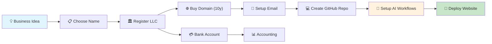

# Startup Blueprint 🚀

**Start your AI-native business for $150 or less. Everything from choosing your business name to deploying your website—automated, documented, and ready for scale.**

The complete guide to launching a modern, AI-enabled company: LLC registration, professional email, automated deployments, free AI code reviews, and a monorepo structure that puts your entire business in one place.

> **This is the new way to start a business.** Your entire company—legal docs, infrastructure config, code, operations—lives in one private GitHub repo with AI agents helping you build and maintain it.

---

## 💰 Total Startup Cost: ~$150 or Less

| Item | Cost | One-time or Recurring |
|------|------|----------------------|
| **LLC Filing** | ~$50-100 (varies by state) | One-time |
| **Domain (10 years)** | ~$10.50/year × 10 = $105 | Prepaid (recommended) |
| **EIN** | $0 (IRS) | One-time |
| **Everything Else** | **$0** | Free forever |

**All free services you'll use:**
- ✅ **GitHub** - Private repos, CI/CD, unlimited
- ✅ **Cloudflare** - DNS, email routing, Pages hosting, Workers, DDoS protection
- ✅ **Gmail** - Business email with custom domain forwarding
- ✅ **Perplexity AI** - AI development partner with GitHub integration  
- ✅ **OpenRouter** - AI API gateway (free tier models)
- ✅ **CrewAI** - Multi-agent code review system
- ✅ **GitHub Actions** - Automated testing, linting, deployments

**Why prepay 10 years?** Forgetting to renew once and paying domain recovery fees ($100-$300) or losing your brand forever costs way more than prepaying ~$105. Lock in your domain for a decade.

**Total monthly recurring cost after setup: $0**

---

## 🤖 AI-Native from Day One

This isn't just a guide—it's a **blueprint for operating an AI-enabled company from the start**:

### Free AI Code Reviews on Every PR
- **3 specialized AI agents** review every pull request:
  - 📚 **Code Quality Reviewer** - Style, readability, tests, documentation
  - 🔒 **Security & Performance Analyst** - Vulnerabilities, SQL injection, N+1 queries, resource leaks
  - 🏛️ **Architecture Analyst** - Design patterns, coupling, maintainability, related files analysis
- **Cost:** $0/month with free tier models (grok-beta, gemini-flash-1.5)
- **Time:** 2-5 minutes per review
- **Value:** Catch bugs and security issues before they hit production

### Agentic Development with Perplexity AI
- **AI development partner** with full access to your codebase
- Write specs → get PRs with working code
- All changes tracked in Git with complete audit trail
- Works via MCP (Model Context Protocol) for seamless integration

### Your Entire Business in One Monorepo
```
your-business/
├── docs/              # Business operations, guides, legal templates
├── workspaces/
│   ├── website/      # Public marketing site
│   ├── api/          # Backend services
│   └── internal/     # Internal tools
├── .crewai/          # AI code review agents
├── scripts/          # Cloudflare, automation scripts  
├── legal/            # Contracts, licenses, compliance
└── .github/          # CI/CD workflows, issue templates
```

**Why monorepo?**
- ✅ **Single source of truth** - Everything in one place, easy to search
- ✅ **Atomic changes** - Update API + docs + website in one commit
- ✅ **AI-friendly** - Agents see full context, better code generation
- ✅ **Team onboarding** - New hires clone one repo, not 10
- ✅ **Version control everything** - Legal docs, operations, not just code

---

## 🎯 From Idea to Live Website



**Timeline:** 10-12 hours spread over 1-2 weeks

**End result:**
- ✅ Legal business entity (LLC) with federal tax ID (EIN)
- ✅ Professional domain and email (`founder@yourbusiness.com`)
- ✅ Private GitHub repo with complete infrastructure
- ✅ Automated deployments on every merge to main
- ✅ Free AI code reviews catching bugs before production
- ✅ Bank account and accounting ready for revenue
- ✅ Operations manual for team growth
- ✅ **Total cost: ~$150 or less**

---

## 📚 Complete Guide Structure

| Guide | Duration | What You'll Build |
|-------|----------|------------------|
| **[1. Legal Foundation](./docs/guides/01-legal-foundation.md)** | 2-3 hours | LLC registration, business naming, EIN from IRS |
| **[2. Domain & DNS](./docs/guides/02-domain-dns.md)** | 30 min | Custom domain via Cloudflare (10-year prepay recommended) |
| **[3. Email Infrastructure](./docs/guides/03-email-infrastructure.md)** | 1 hour | Professional email routing through Cloudflare + Gmail (free) |
| **[4. Git & AI Workflows](./docs/guides/04-git-repository.md)** | 45 min | GitHub repo, Perplexity AI setup, monorepo structure |
| **[5. Financial Tools](./docs/guides/05-financial-tools.md)** | 1 hour | Business bank (Fidelity), accounting (Wave/Stripe), tax planning |
| **[6. AI Code Review System](./docs/guides/06-ai-code-review.md)** | 1 hour | CrewAI multi-agent review setup, OpenRouter configuration |
| **[7. Deployment & CI/CD](./docs/guides/07-deployment-cicd.md)** | 1.5 hours | Cloudflare Pages deployment, preview environments, auto-deploy |
| **[8. Operations Manual](./docs/guides/08-operations-manual.md)** | 2 hours | Repeatable processes, team onboarding, documentation standards |

**Total setup time: ~10-12 hours**

---

## 🚀 Quick Start

### Option 1: I Want Speed (30 minutes)
```
1. Read Quickstart: docs/guides/QUICKSTART.md
2. Follow the checklist
3. Circle back to detailed guides as you scale
```

### Option 2: Do It Right (Recommended)
```
1. Work through all 8 guides in order (10-12 hours)
2. Use checklists to validate each step
3. Your business foundation will be rock-solid
```

### Option 3: Fork and Explore
```
1. Fork this repo (make it private)
2. Explore the .crewai/ and .github/ directories
3. Adapt the structure for your business
```

---

## 🎯 Core Principles

### 1. **AI-Native Operations** 🤖
AI agents are first-class team members from day one. They review code, catch bugs, suggest improvements, and help you ship faster. This isn't "AI as a tool"—it's AI as a teammate.

### 2. **Eliminate Decision Paralysis** 🧠
We made the hard decisions for you: LLC structure, Cloudflare domain, Gmail email routing, GitHub repo, Perplexity AI, CrewAI reviews, Cloudflare Pages hosting. Have analysis paralysis? Just follow the blueprint.

### 3. **Monorepo = Single Source of Truth** 📖
Your entire business in one private GitHub repo. Legal docs, operations manuals, infrastructure config, application code—everything. Easy to search, easy to audit, easy for AI to understand full context.

### 4. **Free First, Scale Later** 💵
Every service has a generous free tier. Pay ~$150 to start (mostly government fees), then $0/month until you scale past free limits. When you hit limits, it means you're succeeding.

### 5. **Professional from Day One** 👔
Custom domain email (`founder@yourbusiness.com`), automated deployments, AI code reviews, proper LLC structure. Look like a 100-person company even when it's just you.

### 6. **Automation Over Manual Work** ⚙️
Deployment? Automated. Email forwarding? Automated. Code reviews? Automated. DNS configuration? Automated via API. Spend your time building product, not babysitting infrastructure.

---

## 🚀 The Modern Startup Stack

### AI & Development
- **Perplexity AI** - AI coding partner with GitHub MCP integration (free tier)
- **CrewAI** - 3 AI agents reviewing every PR for code quality, security, architecture
- **OpenRouter** - Unified API for free tier AI models (grok-beta, gemini-flash)

### Infrastructure (All Free Tier)
- **Cloudflare** - Domain DNS, email routing, Pages hosting, Workers, DDoS protection
- **GitHub** - Private repos, Actions CI/CD (2,000 minutes/month free)
- **Gmail** - Professional email with custom domain forwarding

### Financial
- **Fidelity** - Business checking account (recommended, no fees)
- **Wave** - Free accounting software
- **Stripe** - Payment processing (only pay per transaction)

**Why this stack?**
- ✅ Everything has generous free tier
- ✅ Industry-standard, best-in-class tools
- ✅ Easy to set up (guides for everything)
- ✅ Scales with you (upgrade only when needed)

---

## 💡 Key Decisions Made for You

| Decision | Recommendation | Why | Cost |
|----------|---|---|---|
| **Legal Structure** | LLC | Limited liability + pass-through taxation + simple | ~$50-100 |
| **Domain** | Cloudflare | Email routing + DNS + cost-only pricing + DDoS | $10.50/year |
| **Email** | Gmail + Cloudflare routing | Free, reliable, professional, AI label filtering | $0 |
| **Code Repo** | GitHub | Industry standard + free CI/CD + MCP support | $0 |
| **AI Development** | Perplexity AI | Native GitHub integration via MCP | $0 (free tier) |
| **AI Code Review** | CrewAI + OpenRouter | Multi-agent system, free tier models | $0 |
| **Hosting** | Cloudflare Pages/Workers | Fast, auto-scaling, global CDN, DDoS protection | $0 |
| **CI/CD** | GitHub Actions | Native integration, 2,000 min/month free | $0 |
| **Accounting** | Wave (free) or Stripe | Simple, automated, bank sync | $0 |

**Total recurring cost: $0/month** (until you scale past free tiers)

---

## 🏗️ Why Monorepo?

### Traditional Setup (❌ Old Way)
```
- company-website (GitHub repo #1)
- company-api (GitHub repo #2)
- company-mobile-app (GitHub repo #3)
- company-docs (Google Docs scattered)
- legal-docs (Dropbox folder)
- operations-manual (Notion pages)
- infrastructure-configs (Some dev's laptop)
```

**Problems:**
- ❌ Info scattered across 7+ places
- ❌ Can't search everything at once
- ❌ No version control on docs
- ❌ AI agents can't see full context
- ❌ Onboarding new team = send 10 links

### Monorepo Setup (✅ New Way)
```
your-business/  (one private GitHub repo)
├── docs/
│   ├── guides/       # How we do things
│   └── operations/   # Runbooks, processes
├── legal/           # Contracts, licenses, compliance
├── workspaces/
│   ├── website/     # Marketing site
│   ├── api/         # Backend
│   └── mobile/      # Mobile app
├── scripts/         # Automation, deployment
├── .crewai/         # AI review agents
└── .github/         # CI/CD workflows
```

**Benefits:**
- ✅ **One search** finds everything (GitHub search or `grep`)
- ✅ **Version control** on all docs (track who changed what when)
- ✅ **Atomic changes** (update API + docs + website in one commit)
- ✅ **Full context for AI** (agents see complete business picture)
- ✅ **Easy onboarding** ("Clone this one repo, you're done")
- ✅ **Simplified CI/CD** (one pipeline, multiple workspaces)

---

## 🎓 Who This Is For

### ✅ Perfect For:
- **Solo founders** starting from zero
- **Small teams** (2-5 people) launching new companies
- **Technical founders** who want infrastructure done right from day one
- **Anyone with decision paralysis** ("what LLC state?" "what email provider?")
- **Builders who want AI-native operations** without paying for enterprise tools

### ❌ Not For:
- Large enterprises (100+ employees) with existing infrastructure
- Non-tech businesses with zero online presence
- People allergic to Git/GitHub
- Those who prefer manual processes over automation

---

## ✅ Success Checklist

After completing this blueprint, you'll have:

**Legal & Financial:**
- ✅ Registered LLC with active federal tax ID (EIN)
- ✅ Business bank account (recommended: Fidelity Cash Management)
- ✅ Basic accounting setup (Wave or Stripe)

**Infrastructure:**
- ✅ Custom domain (`yourbusiness.com`) prepaid for 10 years
- ✅ Professional email (`founder@yourbusiness.com`)
- ✅ Private GitHub repo with monorepo structure
- ✅ Automated CI/CD pipeline (format, lint, test, deploy)
- ✅ Website deployed and live on Cloudflare Pages
- ✅ Preview environments for every PR

**AI & Automation:**
- ✅ Perplexity AI connected to your GitHub repo
- ✅ CrewAI reviewing every pull request automatically
- ✅ OpenRouter configured with free tier models
- ✅ Automated deployments on every merge to main

**Operations:**
- ✅ Documented processes for common tasks
- ✅ 2FA enabled on all critical accounts
- ✅ Backup and recovery procedures documented
- ✅ Team onboarding guide (ready for your first hire)

---

## 🚀 Start Building Now

### Step 1: Choose Your Path
- **Fast track:** [30-minute Quickstart](./docs/guides/QUICKSTART.md)
- **Thorough:** [Guide #1: Legal Foundation](./docs/guides/01-legal-foundation.md)
- **Code-first:** Fork this repo and explore

### Step 2: Set Aside Time
- **Minimum:** 4-6 hours (legal + domain + email = basic foundation)
- **Recommended:** 10-12 hours (complete blueprint)
- **Ideal:** Spread over 1-2 weeks (avoid burnout)

### Step 3: Gather Requirements
- Credit/debit card for LLC filing (~$50-100) and domain (~$105 for 10 years)
- 3-5 business name ideas (check availability first)
- Your GitHub account (free)
- 1-2 hours of uninterrupted focus time per guide

### Step 4: Execute
Follow the guides. Check off the lists. Ask in GitHub Discussions if stuck.

---

## 🌟 What Makes This Different?

### vs Traditional Business Guides
- ✅ **AI-native:** Treats AI agents as team members, not afterthoughts
- ✅ **Monorepo structure:** Single source of truth for entire company
- ✅ **Transparent costs:** $150 to start, $0/month to operate
- ✅ **Fully automated:** CI/CD, reviews, deployments all automatic
- ✅ **Modern 2025 stack:** Best practices from day one

### vs Other GitHub Templates
- ✅ **Complete:** Legal → Domain → Email → Code → Deploy → Operations
- ✅ **Opinionated:** We made hard decisions so you don't have to
- ✅ **Production-ready:** Not just toy examples
- ✅ **Actively maintained:** Used in real businesses, updated regularly

### vs Hiring a Consultant
- ✅ **Cost:** $150 vs $5,000-$20,000
- ✅ **Timeline:** 1-2 weeks vs 1-3 months  
- ✅ **Ownership:** You understand every piece
- ✅ **Flexibility:** Adapt and modify as you grow

---

## 🤝 Contributing

This blueprint improves as more founders use it:

1. **Found a better tool?** Open a discussion
2. **Discovered a bug?** File an issue
3. **Have an improvement?** Submit a PR
4. **Used this successfully?** Share your story!

**What we're looking for:**
- Better automation workflows
- Additional integrations (Stripe, analytics, etc.)
- Improved documentation
- Cost optimizations
- New workspace templates

---

## 🙋 Frequently Asked Questions

**Q: Do I really need AI code reviews as a solo founder?**  
A: Yes! Catches bugs, security vulnerabilities, and code smells before production. It's like having a senior engineer review your code for $0/month.

**Q: I'm not technical. Can I still use this?**  
A: Guides 1-5 require no coding. Guides 6-8 are technical but have step-by-step screenshots. Consider partnering with a technical co-founder or using Perplexity AI to help.

**Q: Does this work outside the US?**  
A: Yes! Adjust Guide #1 (Legal Foundation) for your country. Everything else (domain, email, GitHub, AI) is global.

**Q: What about data privacy? Is my business safe?**  
A: Your GitHub repo is private. Only team members you invite can see it. AI agents only see code you explicitly share. Use GitHub Secrets for credentials (never commit them).

**Q: When will this need updates?**  
A: Core principles (monorepo, AI-native, automation) are timeless. Specific tools may evolve, but the blueprint is actively maintained. Star/watch the repo for updates.

**Q: Can I really run a business for $0/month?**  
A: Yes, until you scale past free tiers:
  - GitHub: 2,000 CI minutes/month free
  - Cloudflare Pages: 500,000 requests/month free
  - Gmail: Unlimited email
  - AI models: Free tier on OpenRouter
  
You'll start paying when you outgrow these—which means you're successful!

**Q: What if I want to use different tools (not Cloudflare, not Gmail, etc.)?**  
A: The processes are tool-agnostic. Swap in your preferred providers. The monorepo structure and CI/CD patterns still apply.

---

## 📞 Support & Community

- 💬 **Questions:** [GitHub Discussions](https://github.com/borealBytes/startup-blueprint/discussions) (coming soon)
- 🐛 **Issues:** [GitHub Issues](https://github.com/borealBytes/startup-blueprint/issues)
- 🔧 **Improvements:** [Pull Requests](https://github.com/borealBytes/startup-blueprint/pulls)
- 🌐 **Website:** [https://preview-startup-blueprint.SuperiorByteWorks.com](https://preview-startup-blueprint.SuperiorByteWorks.com)

---

## 📋 License

**MIT License** — Use freely, modify as needed, no attribution required.

This work is educational. Always verify with professionals (lawyers, accountants, etc.) for your specific situation.

---

## 🎯 Your Next Steps

**Ready to start your AI-native business for $150 or less?**

### Begin Here:
1. 🚀 **[Quickstart Guide](./docs/guides/QUICKSTART.md)** — 30-minute overview
2. 🏛️ **[Legal Foundation](./docs/guides/01-legal-foundation.md)** — Register LLC (2-3 hours)
3. 🌐 **[Domain & DNS](./docs/guides/02-domain-dns.md)** — Get your domain (30 min)

### Or Explore:
- 📖 **[All 8 Guides](./docs/guides/)** — Complete blueprint
- 🤖 **[AI Code Review Setup](./docs/guides/06-ai-code-review.md)** — CrewAI system
- 💰 **[Detailed Cost Breakdown](./docs/COSTS.md)** — Every dollar explained
- 🛠️ **[CI/CD Guide](./.github/CI_CD_GUIDE.md)** — Automation deep-dive

---

**Built by founders, for founders. Start your AI-native business today. 🚀**

**Questions?** Open a [GitHub Discussion](https://github.com/borealBytes/startup-blueprint/discussions) • **Found a bug?** [File an issue](https://github.com/borealBytes/startup-blueprint/issues) • **Want to contribute?** [Submit a PR](https://github.com/borealBytes/startup-blueprint/pulls)