# Startup Blueprint 🚀   

**A free, comprehensive guide to starting and operating a business from day one.**

This repository contains everything you need to establish your business legally, technically, and operationally. No fluff—just actionable, repeatable processes you can implement immediately.  

> **Who this is for:** Solo entrepreneurs, co-founders, and small business operators who want a professional, scalable foundation from the start.

---

## 🎯 What You'll Get

```mermaid
graph LR
    A["1️⃣ LEGAL"] --> B["2️⃣ DOMAIN"] --> C["3️⃣ EMAIL"] --> D["4️⃣ GIT"] --> E["5️⃣ DEPLOY"]
    A -- LLC Registration --- A1["State filing"]
    B -- Custom domain --- B1["Cloudflare"]
    C -- Professional email --- C1["Gmail + forwarding"]
    D -- Version control --- D1["Git + Perplexity"]
    E -- Auto CI/CD --- E1["Cloudflare Pages"]

    style A fill:#e1f5ff
    style B fill:#f3e5f5
    style C fill:#fff3e0
    style D fill:#e8f5e9
    style E fill:#fce4ec
```



---

## 📚 Guide Structure

| Guide                                                                   | Duration  | What You'll Set Up                                  |
| ----------------------------------------------------------------------- | --------- | --------------------------------------------------- |
| **[1. Legal Foundation](./docs/guides/01-legal-foundation.md)**         | 2-3 hours | LLC registration, business license, naming          |
| **[2. Domain & DNS](./docs/guides/02-domain-dns.md)**                   | 30 min    | Custom domain via Cloudflare, professional branding |
| **[3. Email Infrastructure](./docs/guides/03-email-infrastructure.md)** | 1 hour    | Professional email routing, multi-user setup        |
| **[4. Git & Repository](./docs/guides/04-git-repository.md)**           | 45 min    | GitHub repo, Perplexity Spaces, AI workflow         |
| **[5. Financial Tools](./docs/guides/05-financial-tools.md)**           | 1 hour    | Accounting, tax planning, payment processing        |
| **[6. Deployment & CI/CD](./docs/guides/06-deployment-cicd.md)**        | 1.5 hours | Automated deployment, website hosting               |
| **[7. Operations Manual](./docs/guides/07-operations-manual.md)**       | 2 hours   | Repeatable processes, checklists, handoff docs      |

**Total setup time: ~8-10 hours**

---

## 🗂️ Quick Navigation   

### For the Impatient

Start here if you want the **fastest path to a working business**:

1. [Quick Start Checklist](./docs/guides/QUICKSTART.md) — 30-minute overview
2. Follow guides 1-3 for the essentials
3. Come back to 4-7 as you scale

### For the Thorough

Work through all guides in order. Each builds on the previous.

### By Role

- **Founder/CEO**: Start with [Legal Foundation](./docs/guides/01-legal-foundation.md) and [Domain & DNS](./docs/guides/02-domain-dns.md)
- **CTO/Technical Lead**: Focus on [Git & Repository](./docs/guides/04-git-repository.md) and [Deployment & CI/CD](./docs/guides/06-deployment-cicd.md)
- **Solo Founder**: Do all of it (you're wearing all the hats)
- **Operations Person**: Prioritize [Email Infrastructure](./docs/guides/03-email-infrastructure.md) and [Operations Manual](./docs/guides/07-operations-manual.md)

---

## 🎯 Core Principles

This guide is built on five principles:

### 1. **Professionalism First**

Your business infrastructure should look like a 100-person company from day one. Custom domain email, proper legal structure, professional communication channels.

### 2. **Scalability**

Everything is designed to grow without rework. Add team members without rebuilding infrastructure. Start solo, scale to 5+ people with the same processes.

### 3. **Automation**

Repetitive tasks are automated. Deployment is automatic. Email forwarding is automatic. Communication is structured to minimize back-and-forth.

### 4. **Security & Compliance**

FAQ on everything. Recovery codes backed up. Secrets management in place. GDPR-ready from the start.

### 5. **Low Cost, High ROI**

Most tools are free or extremely low cost (free Gmail, GitHub, Perplexity Spaces; domain registrar cost-only pricing from Cloudflare). Your primary recurring expense is your domain (about ~$10.50/year at Cloudflare's cost-based pricing).

> **Strategy:** Buy 10 years of domain registration up front (~$140). Forgetting to renew once and paying recovery premiums (or losing the domain) is more expensive than prepaying.

The ROI comes from saved time, avoided mistakes, and a professional foundation that doesn't need to be rebuilt later.

---

## 💡 Key Decisions Made for You

To reduce decision fatigue, this guide makes specific recommendations:

| Decision             | Recommendation             | Why                                                          |
| -------------------- | -------------------------- | ------------------------------------------------------------ |
| **Legal Structure**  | LLC                        | Limited liability + simplicity + pass-through taxation       |
| **Domain Registrar** | Cloudflare                 | Integrated email routing + DNS + cost-only pricing           |
| **Email Service**    | Gmail + Cloudflare routing | Reliable, free, and supports plus-addressing                 |
| **Code Repository**  | GitHub                     | Industry standard + native CI/CD + free private repos        |
| **AI Workflow**      | Perplexity Spaces          | Version-controlled instructions + transparent agent behavior |
| **Hosting**          | Cloudflare Pages + Workers | Fast + cheap + auto-scaling + DDoS protection                |
| **Accounting**       | Wave (free) or Stripe      | Simple + automated + integrates with payments                |

If you prefer different tools, adapt the guides—they're repeatable processes, not tool prescriptions.

---

## 🔗 Dependencies & Sequencing


**Critical path**: Legal → Domain → Email → Git → Deploy (this is your "go-live" sequence)

---

## 📊 Success Criteria

After completing this blueprint, you'll have:

- ✅ Registered LLC with active EIN
- ✅ Custom domain (`BUSINESS-NAME.com`)
- ✅ Professional email (`founder@BUSINESS-NAME.com`)
- ✅ GitHub repository with CI/CD pipeline
- ✅ Website deployed and live
- ✅ Gmail filters and labels for triage
- ✅ Documented processes for onboarding
- ✅ Backup and recovery procedures in place
- ✅ 2FA enabled on all critical accounts
- ✅ Tax EIN and basic accounting ready

---

## 🚀 Getting Started

### Option 1: Jump to the Action (Fastest)

```
1. Read the Quickstart: ./docs/guides/QUICKSTART.md
2. Follow the checklist
3. Come back to detailed guides as needed
```

### Option 2: Structured Learning (Recommended)

```
1. Start with Guide #1: Legal Foundation
2. Work through each guide in order
3. Use checklists to validate your work
4. Reference the operations manual for ongoing tasks
```

### Option 3: Deep Dive (Comprehensive)

```
1. Read this entire README
2. Skim all guides to understand the complete picture
3. Then work through each guide methodically
```

---

## 📖 For Each Guide

Every guide includes:

- **Executive Summary** — 2-minute overview
- **Why This Matters** — Context and benefits
- **Step-by-Step Instructions** — Detailed walkthrough with screenshots where possible
- **Checklists** — Validation that you completed it correctly
- **Dependencies** — What needs to happen before/after
- **Troubleshooting** — Common issues and solutions
- **Templates** — Copy-paste-ready policies, contracts, and configs

---

## 🤝 Contributing

This is a living guide. If you've improved something or found a better way:

1. Fork this repo
2. Create a feature branch: `git checkout -b improve/better-way`
3. Make your changes (update the relevant guide)
4. Submit a PR with description of improvements
5. Reference any tools, processes, or lessons learned

---

## 📋 License

This work is provided as-is for educational and reference purposes. While we aim for accuracy, always verify with current resources and consult professionals (lawyers, accountants) for your specific situation.

**MIT License** — Use freely, modify as needed, no attribution required.

---

## 🙋 FAQ

**Q: How long does this take?**
A: 8-10 hours total, spread over a week or two. You can do steps 1-3 in a day if you're focused.

**Q: Do I need to follow this exactly?**
A: No. Use it as a template. The key is having _some_ structure from day one rather than nothing.

**Q: Can I do this solo?**
A: Yes. The entire blueprint assumes a solo founder or very small team.

**Q: What if I'm in a different country?**
A: The US LLC + Cloudflare + GitHub model works globally. Adjust the "Legal Foundation" guide for your jurisdiction.

**Q: What if I want different tools?**
A: Go for it. The processes are tool-agnostic; adapt them to what you use.

**Q: Is this just for tech companies?**
A: No. Apply the legal, email, and operational parts to any business. Skip the deployment guide if you don't have a website.

---

## 📞 Support

- **Have a question?** Open a GitHub discussion
- **Found an issue?** File a GitHub issue with details
- **Have an improvement?** Submit a PR

---

## 🎓 What's Next?

Once you finish the blueprint:

1. **Growth**: Use your operations manual to document new processes as you scale
2. **Team**: Add team members; use your Git-based workflow for transparency
3. **Automation**: Expand your CI/CD to run tests, builds, and deployments
4. **Integration**: Connect accounting, CRM, and customer communication tools

---

**Ready to start?** → [Go to Quickstart](./docs/guides/QUICKSTART.md) or [Jump to Guide #1](./docs/guides/01-legal-foundation.md)
