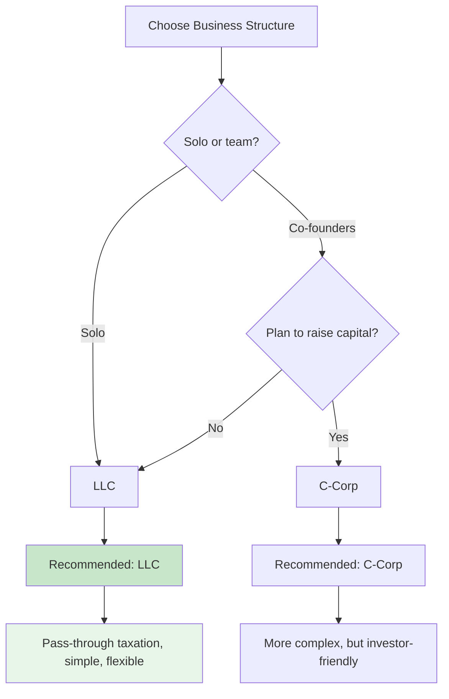

# 1. Legal Foundation ⚜️

**Executive Summary**: Register your business as an LLC, get your EIN, and establish legal compliance. Time: 2-3 hours. Cost: state filing fee + domain.

---

## Why This Matters

### Liability Protection
Your LLC separates your personal assets from business liabilities. If BUSINESS NAME gets sued, your personal bank account is protected.

### Tax Efficiency
LLCs offer pass-through taxation (no double taxation) and flexibility. You pay taxes on personal return.

### Professionalism
Banks, investors, and partners take you more seriously with a registered entity.

### Compliance
Certain activities require a registered business (licensing, contracts, hiring).

---

## Decision: Which Business Structure?

**This guide recommends: LLC (or PLLC if required)**

Why?
- Simple to set up
- Automatic liability protection
- Pass-through taxation (no double tax)
- Flexible for adding members later
- Can later convert to C-Corp if needed

> ⚠️ **Professional LLCs (PLLCs)**: If you’re in a regulated, licensed profession (e.g., doctor, lawyer, architect, engineer, certain construction trades), your state may require a **PLLC** instead of a standard LLC. Always check your state’s rules for your specific license type before filing.

---

## Step 1: Finalize Your Business Name

### Requirements

Most states require:
- Must end in "LLC", "L.L.C.", or the PLLC equivalent where required
- Cannot be identical to existing registered businesses
- Cannot contain prohibited words (usually "bank", "insurance", etc.)

### Availability Check

1. Go to your state's business registry:
   - **Michigan** (LLC/PLLC): [LARA Business Entity Search](https://cofs.lara.state.mi.us/SearchApi/Search/Search)
   - **Florida** (LLC/PLLC): [Sunbiz (Division of Corporations)](https://search.sunbiz.org/Inquiry/CorporationSearch/ByName)
   - **California**: [Secretary of State](https://bpd.sos.ca.gov/)
   - **New York**: [Department of State](https://www.dos.ny.gov/business-services/)
   - **Other**: Google `[YOUR STATE] LLC registration online`

2. Search existing businesses
3. If name is available, proceed. If taken, try variations.

### Naming Strategy

✅ **Good names**:
- `AlertShield, LLC`
- `PeakCapital, LLC`
- `StreamSync, LLC`

❌ **Avoid**:
- Too trendy (dates quickly)
- Impossible to spell
- Generic (won't stand out)
- Too narrow (limits expansion)

---

## Step 2: Register Your LLC (or PLLC)

### Filing Articles of Organization

**What to prepare**:
- Entity type (LLC or PLLC, depending on your profession and state rules)
- BUSINESS NAME (from Step 1)
- Principal address (your address)
- Registered agent (you, or a service)
- Member(s) (you, for solo)
- Manager(s) (you, for solo)
- Professional license information if filing PLLC (license number, issuing board, etc.)

**How to file** (general pattern):

1. Go to your state's business registration website
2. Select "Form LLC" or "Articles of Organization" (or PLLC equivalent)
3. Complete the form:
   - **Name**: `BUSINESS NAME, LLC` or `BUSINESS NAME, PLLC` as required
   - **Address**: Your physical address
   - **Registered Agent**: You (or a registered agent service)
   - **Members**: You
   - **Managers**: You
   - **Duration**: Perpetual (or "as allowed by law")
   - **Professional purpose / license**: If PLLC, state the professional service and license details exactly as your state requires

4. Upload or mail the form
5. Pay filing fee ($50–$150 depending on state)
6. Receive confirmation and Certificate of Organization

### State-Specific Notes (Examples)

- **Michigan (LARA)**
  - Online filing via LARA is straightforward for LLCs and PLLCs
  - Pay fee online, get confirmation and entity ID

- **Florida (Sunbiz)**
  - Use [Sunbiz](https://dos.myflorida.com/sunbiz/) to file LLC or PLLC
  - Florida requires clear indication of professional service for PLLCs
  - Annual report due each year to keep the entity active

> 📝 These examples are only patterns. Always read the current instructions on your state’s filing site to confirm entity type (LLC vs PLLC), wording, and fee schedule.

### Timeline

- Online filing: 1-3 days
- Mail filing: 1-2 weeks

**Recommended**: File online for speed.

---

## Step 3: Get Your EIN

### What is an EIN?

Employer Identification Number—your business's tax ID. Similar to a SSN but for the LLC/PLLC.

**Why you need it**:
- Open business bank account
- Hire employees
- File business taxes
- Official business documents

### How to Get It (Free!)

1. Go to [IRS.gov EIN page](https://www.irs.gov/ein)
2. Click "Apply for an EIN Online"
3. Answer questions:
   - Business name: `BUSINESS NAME, LLC` or `BUSINESS NAME, PLLC`
   - Address: Same as LLC/PLLC
   - Type of entity: LLC
   - Reason: Started new business
   - Expected payroll: "No employees" (for now)

4. Submit
5. Receive EIN immediately (you'll see it on screen)
6. **SAVE IT** — you'll need this for everything

### Timeline

**Instant** (online application)

Alternatives if online doesn't work:
- Phone: 1-800-829-4933
- Fax to IRS
- Mail Form SS-4

---

## Step 4: Register for State Taxes

### Sales Tax (if applicable)

**Do you need it?**
- Selling physical products: YES
- Selling services only: Usually NO (but check your state)
- Selling services in multiple states: Check each state

**How to register**:
1. Go to your state's Department of Revenue
2. Register for sales tax permit
3. You'll get a sales tax ID
4. Collect and remit sales tax on transactions

### Income Tax

Most states require registration if you're doing business in-state. Usually done when you file your first annual return.

---

## Step 5: Business Bank Account

### Why Separate?

Keeping business and personal finances separate:
- Simplifies taxes (IRS loves this)
- Proves liability protection
- Easier accounting

### Opening an Account

**What you'll need**:
- Articles of Organization (from Step 2)
- EIN Letter (from Step 3)
- Your ID
- Initial deposit ($0–$100 depending on bank)

**Recommended banks** (low fees, online):
- **Mercury**: Startup-friendly, no minimum balance
- **Brex**: Great if you'll use business credit
- **Chase**: Good local option if you have existing account
- **Your local bank**: Simple and familiar

**Process**:
1. Choose bank
2. Apply online or visit branch
3. Provide documents above
4. Get account number and routing number
5. Set up transfers from personal account

---

## Step 6: Operating Agreement (Recommended)

### What is it?

Document that outlines how your LLC/PLLC operates—internal rules for yourself (or co-members if team).

**Required?** Varies by state, but highly recommended.

### What to Include

For solo founder:
- Operating procedures
- Member rights
- Profit/loss distribution (100% to you)
- Meeting requirements (none, since solo)
- Amendment procedures

### Template

Download from your state's SBA office or use a template. For solo LLC/PLLC, this is usually a simple 1–2 page document.

**Pro tip**: Keep this on file but don't overthink it for a solo founder.

---

## Step 7: Ongoing Compliance

### Annual Filings

Most states require annual reports:
- **Cost**: $0–$150/year depending on state/entity type
- **Deadline**: Usually anniversary of incorporation or a fixed date (e.g., Florida uses a fixed window)
- **What**: Confirm registered agent, address, members
- **How**: File with state (online or mail)

### Record Keeping

Maintain:
- Articles of Organization
- Operating Agreement
- EIN Letter
- Annual reports
- Bank statements
- Business expenses

### Taxes

**Federal**:
- File Schedule C on personal 1040 (pass-through)
- Estimated quarterly payments if income >$400
- Due: April 15 each year

**State**:
- File state income tax return
- Varies by state

**Payroll** (if you hire employees):
- File quarterly 941 forms
- Deposit payroll taxes

---

## Checklist: Legal Foundation Complete ✅

- [ ] Business name finalized and checked for availability
- [ ] LLC or PLLC registered with state (have certificate)
- [ ] EIN obtained (saved securely)
- [ ] Business bank account opened
- [ ] Sales tax registered (if applicable)
- [ ] Operating agreement on file
- [ ] Annual renewal date calendared
- [ ] Important documents backed up (cloud + local)

---

## Dependencies

**Before this**: None (start here)

**After this**: You can move to [Domain & DNS](./02-domain-dns.md)

---

## Estimated Total Time: 2-3 hours

- Name availability check: 15 min
- LLC/PLLC filing: 30 min
- EIN application: 10 min
- Bank account: 30 min
- State taxes: 30 min
- Waiting for confirmations: 1 hour

---

## Resources

- **IRS EIN**: https://www.irs.gov/ein
- **Michigan LARA (LLC/PLLC)**: https://www.michigan.gov/lara
- **Florida Sunbiz (LLC/PLLC)**: https://dos.myflorida.com/sunbiz/
- **State Business Registries**: Google `[STATE] LLC PLLC registration`
- **SBA Guide**: https://www.sba.gov/business-guide/launch/choose-business-structure
- **NerdWallet LLC Guide**: https://www.nerdwallet.com/article/small-business/start-an-llc

---

## Next Steps

1. ✅ Complete this guide
2. ➡️ Move to [Guide 2: Domain & DNS](./02-domain-dns.md)
