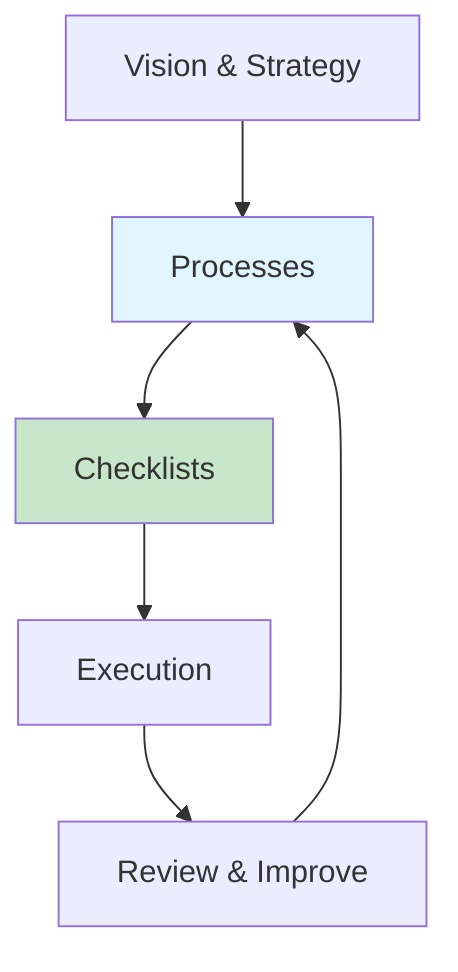

# 7. Operations Manual 📘

**Executive Summary**: Define the recurring tasks, checklists, and processes that keep BUSINESS NAME running smoothly. Time: 2 hours.

---

## Why This Matters

### Consistency

You don’t want to reinvent the wheel every time you:

- Onboard a client
- Launch a feature
- Run monthly reviews

### Delegation

Processes make it possible to delegate to team members or contractors.

### Reliability

Clear procedures reduce mistakes and firefighting.

---

## Architecture



---

## Step 1: Create Operations Folder

In your repo:

```text
docs/
  operations/
    daily-ops.md
    weekly-ops.md
    monthly-ops.md
    incident-response.md
    onboarding-clients.md
    offboarding-clients.md
```

---

## Step 2: Daily Operations Checklist

Create `docs/operations/daily-ops.md`:

```markdown
# Daily Operations Checklist ✅

- [ ] Check support inbox (support@BUSINESS-NAME.com)
- [ ] Reply to all urgent customer emails
- [ ] Review payment notifications (Stripe/PayPal)
- [ ] Scan error logs (if any monitoring in place)
- [ ] Check CI pipeline status (GitHub Actions)
- [ ] Review today’s calendar
```

---

## Step 3: Weekly Operations Checklist

Create `docs/operations/weekly-ops.md`:

```markdown
# Weekly Operations Checklist 📅

- [ ] Review revenue and expenses
- [ ] Categorize new transactions in accounting tool
- [ ] Review open issues in GitHub
- [ ] Prioritize top 3 tasks for next week
- [ ] Check domain, SSL, and email health
- [ ] Update operations docs if processes changed
```

---

## Step 4: Monthly Review Checklist

Create `docs/operations/monthly-ops.md`:

```markdown
# Monthly Review Checklist 📊

## Financial

- [ ] Export P&L from accounting tool
- [ ] Compare revenue vs prior month
- [ ] Review top 10 expenses
- [ ] Confirm tax savings account balance

## Operations

- [ ] Review customer feedback
- [ ] Identify recurring issues
- [ ] Update FAQs and docs accordingly

## Strategy

- [ ] Review current goals
- [ ] Set goals for next month
```

---

## Step 5: Client Onboarding Process

Create `docs/operations/onboarding-clients.md`:

```markdown
# Client Onboarding Process 🤝

1. **Intro Call**
   - Confirm scope, budget, and timeline
   - Take notes in CRM or notes system

2. **Proposal & Agreement**
   - Send proposal
   - Get written approval or signed agreement

3. **Payment**
   - Send payment link or invoice
   - Confirm payment received

4. **Kickoff**
   - Schedule kickoff meeting
   - Share expectations and communication channels
```

---

## Step 6: Incident Response

Create `docs/operations/incident-response.md`:

```markdown
# Incident Response Plan 🚨

## When Something Breaks

1. **Triage**
   - Identify severity: low / medium / high
   - If high, pause other work

2. **Communicate**
   - Notify affected customers (if applicable)
   - State issue and expected resolution ETA

3. **Fix**
   - Identify root cause
   - Apply minimal fix
   - Test in staging (if available)
   - Deploy to production

4. **Review**
   - Document cause and fix
   - Update runbooks or automation
   - Add tests to prevent recurrence
```

---

## Step 7: Update Process as You Learn

Your operations manual is a living document.

### When to Update

- After incidents
- After adding new services
- After hiring team members
- After major changes in tools

### How to Update

1. Edit the relevant doc in `docs/operations/`
2. Commit changes with message `docs: update operations manual`
3. If using Perplexity, mention the change so it knows the new process

---

## Checklist: Operations Manual Complete ✅

- [ ] `docs/operations/` folder created
- [ ] Daily operations checklist defined
- [ ] Weekly operations checklist defined
- [ ] Monthly review checklist defined
- [ ] Client onboarding documented
- [ ] Incident response plan documented
- [ ] Process for updating docs is clear

---

## Dependencies

**Before this**: All prior guides recommended, but you can start documenting operations anytime.

**After this**: Use the operations manual daily and iterate.

---

## Estimated Total Time: 2 hours

- Creating base docs: 60 min
- Customizing to your business: 60 min

---

## Next Steps

1. ✅ Complete this guide
2. ➡️ Use it weekly, and update as your business grows
