# BUSINESS_NAME Agentic Development Space

> Complete guide to AI-assisted development with transparent workflows, human guardrails, and operational awareness.

## Overview

This folder contains all files needed for agents to work on BUSINESS_NAME projects:

- **10 core files** - Agent-facing instructions, boundaries, workflows, and procedures
- **1 comprehensive source** - `agentic_coding.md` (defines agent capabilities and workflow)
- **1 entry point** - `instructions.md` (start here)
- **100% discoverable** - All files in one clean folder
- **Production-ready** - Based on architecture decisions (see `agentic_coding.md`)

---

## 🔄 Agent Interaction Architecture

### How Perplexity Agents Interact With This Framework

```mermaid
flowchart TD
    A["🚀 Perplexity Space<br/>User creates task"] --> B["📖 STEP 1: Agent loads<br/>instructions.md"]
    B -->|Entry point| C["🔒 STEP 2: Load CRITICAL FILES<br/>(Always required)"]
    C -->|autonomy_boundaries.md| D["What can I do?"]
    C -->|workflow_guide.md| E["What's my process?"]
    C -->|agentic_coding.md| F["Complete agent specs"]
    D --> G["📋 STEP 3: Load TASK-SPECIFIC FILES<br/>(On demand based on work type)"]
    E --> G
    F --> G
    G -->|Writing code| H["📚 contribute_standards.md<br/>custom-instructions.md"]
    G -->|Complex work| I["🚨 operational_readiness.md"]
    G -->|Context management| J["💾 context_budget_guide.md"]
    G -->|Error handling| K["📚 agent_error_recovery.md"]
    H --> L["⚡ EXECUTE: 14-Step Workflow"]
    I --> L
    J --> L
    K --> L
    L --> M["Steps 1-4: Planning & Design"]
    M --> N{"Step 5:<br/>🚨 Design Checkpoint<br/>HUMAN APPROVAL"}
    N -->|Approved| O["Steps 6-8: Implementation"]
    N -->|Changes needed| P["Request changes<br/>Loop back to design"]
    P --> M
    O --> Q{"Step 9:<br/>🚨 Code Review<br/>HUMAN APPROVAL"}
    Q -->|Approved| R["Step 10: 🚨 Ready Approval<br/>HUMAN EXPLICIT OK"]
    Q -->|Changes needed| S["Request changes<br/>Loop back to implementation"]
    S --> O
    R --> T["Steps 11-14: Merge & Cleanup"]
    T --> U["✅ Complete"]

    style N fill:#ff6b6b,color:#fff
    style Q fill:#ff6b6b,color:#fff
    style R fill:#ff6b6b,color:#fff
    style A fill:#ffd700,color:#000
    style C fill:#4ecdc4,color:#fff
    style G fill:#45b7d1,color:#fff
```



### Space Upload Strategy


---

## Quick Navigation

### 🎯 Start Here (Everyone Reads These)

1. **[instructions.md](instructions.md)** (entry point)
   - Lists all files to read before starting
   - Simple TL;DR rules

2. **[agentic_coding.md](agentic_coding.md)** (COMPREHENSIVE)
   - **CRITICAL**: What agents CAN, MUST, and NEVER do
   - Complete 14-step workflow with examples
   - Escalation rules and decision boundaries
   - PR workflow and status management

3. **[autonomy_boundaries.md](autonomy_boundaries.md)**
   - Detailed agent capability matrix
   - Escalation rules and authority
   - Responsibility & accountability

4. **[workflow_guide.md](workflow_guide.md)**
   - 14-step transparent workflow with detailed steps
   - 3 human checkpoints (design, code, status)
   - Decision points and escalation procedures

### 📋 Task-Specific Files

5. **[contribute_standards.md](contribute_standards.md)**
   - Code standards, testing, documentation
   - Conventional Commits format
   - PR templates and best practices

6. **[custom-instructions.md](custom-instructions.md)**
   - BUSINESS_NAME-specific rules
   - Architecture, workspace decisions
   - Monorepo structure and conventions

### 🚨 Operational Files (Read for Complex Work)

7. **[operational_readiness.md](operational_readiness.md)**
   - System limits and constraints
   - Context budget, API rates, database limits
   - Cost awareness and session management

8. **[context_budget_guide.md](context_budget_guide.md)**
   - Token management strategies
   - When to create new threads
   - Context-aware task planning

### 🔧 Error & Help Files

9. **[agent_error_recovery.md](agent_error_recovery.md)**
   - What to do if things break
   - 9 error categories with recovery steps
   - When to escalate vs. self-recover

10. **[file_organization.md](file_organization.md)**
    - Where files live (repo vs. Space)
    - Which version to use (source of truth)
    - Sync strategy and priorities

---

## The 14-Step Workflow

From **[agentic_coding.md](agentic_coding.md)**:

```
1. Agent reads instructions.md + agentic_coding.md
2. Agent reads autonomy_boundaries.md
3. Agent understands task
4. Agent creates branch with design document

5. └─ 🚨 CHECKPOINT 1: Design Review (HUMAN)
         ↓ [Approved? Continue : Request changes]

6. Agent writes code & tests
7. Agent commits with Conventional Commits
8. Agent creates/updates PR with progress checklist

9. └─ 🚨 CHECKPOINT 2: Code Review (HUMAN)
         ↓ [Approved? Continue : Request changes]

10. └─ 🚨 CHECKPOINT 3: Status Approval (HUMAN EXPLICIT)
          ↓ [Confirms "Ready for Review"]

11. GitHub Actions run (format, lint, test, build)
12. Human merges PR
13. ✅ Done
```

**Key principle**: 3 explicit human checkpoints ensure quality without blocking agent autonomy.

---

## File Organization

**All files live in this repo:**  
Path: `docs/agentic/`

**Source of truth:**

- The repo is authoritative
- Space uploads are a convenience copy
- If Space and repo differ, follow the repo

**For decision records:**

- ADR files live in `docs/agentic/adr/`
- See `agentic_coding.md` for decision rationale

---

## Status & Versioning

**Last updated**: 2026-01-24  
**Structure version**: 2.0 (reorganized with comprehensive specs)  
**Files**: 10 core files (1 comprehensive source + 9 reference)  
**Status**: Production-ready ✅

---

## Quick Questions Answered

**Q: Where do I start?**  
A: Read `instructions.md`, then `agentic_coding.md`, then `workflow_guide.md`.

**Q: What can I do autonomously?**  
A: See `agentic_coding.md` "Agent CAN Autonomously Do" section + `autonomy_boundaries.md` for full list.

**Q: What do I need to ask about?**  
A: See `agentic_coding.md` "Agent MUST Escalate" section for when to ask.

**Q: What should I never do?**  
A: See `agentic_coding.md` "Agent NEVER Does" section (merge, deploy, access secrets, etc.).

**Q: What if I hit an error?**  
A: See `agent_error_recovery.md` (9 categories with recovery steps).

**Q: How do I manage context?**  
A: See `context_budget_guide.md` (token management strategies).

**Q: Where are the files really?**  
A: `docs/agentic/` in the repo. See `file_organization.md` for Space upload guidance.

**Q: How does the workflow actually work?**  
A: See `agentic_coding.md` "Transparent Workflow" section with step-by-step example.

---

## Next Steps

1. Read `instructions.md`
2. Read `agentic_coding.md` (comprehensive spec)
3. Read `workflow_guide.md` (detailed steps)
4. Tell me your task
5. I'll tell you which other files to read
6. Start working

---

**This is a living document.** As we learn more about what works, we'll update these files. All changes tracked in git commits.
