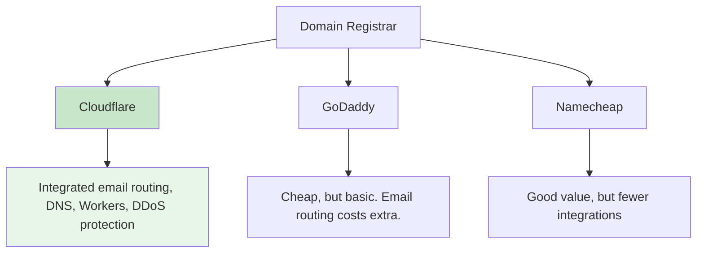

# 2. Domain & DNS 🌐

**Executive Summary**: Register your custom domain via Cloudflare and configure DNS. Time: 30 min. Cost: ~$10/year.

---

## Why This Matters

### Professionalism
`founder@BUSINESS-NAME.com` looks infinitely more professional than `founder@gmail.com`.

### Brand Ownership
Your domain is an asset. It's yours to keep, move, or sell.

### Email Routing
Cloudflare integrates email forwarding, eliminating the need for separate email hosting.

### Future Flexibility
Your domain can host websites, email, APIs, everything. It's the foundation.

---

## Cloudflare vs Alternatives

**Recommendation: Cloudflare** — Integrated, powerful, cost-effective.

---

## Step 1: Choose Your Domain

### Domain Name Strategy

✅ **Good domains**:
- Short (1-2 words)
- Easy to spell
- Relevant to business
- Room to grow
- Examples: `alertshield.com`, `peakcapital.com`, `streamsync.com`

❌ **Avoid**:
- Hyphenated (`peak-capital.com`)
- Numbers (`peak2capital.com`)
- Trendy slang (dates quickly)
- Too specific (limits pivoting)

### Check Availability

1. Go to [Cloudflare Registrar](https://www.cloudflare.com/products/registrar/)
2. Search for `BUSINESSNAME.com`
3. See price and availability

### Choose Your TLD

Most common (in order of preference):
- `.com` (best, but might be taken)
- `.co` (professional alternative)
- `.io` (tech companies)
- `.dev` (developers)
- `.me` (personal brands)

---

## Step 2: Register Domain at Cloudflare

### Purchase

1. Go to [Cloudflare Registrar](https://www.cloudflare.com/products/registrar/)
2. Sign in with your Cloudflare account (create if needed)
3. Search for your domain
4. Add to cart
5. **Important**: Register for 10 years at once
   - More stable
   - Lock in current price
   - Reduces annual management
6. Checkout
7. Confirm purchase

### Cost

Cloudflare charges registrar cost only (no markup):
- `.com`: ~$8.85/year (pro-rated for 10 years = ~$88.50 upfront)
- `.co`: ~$29/year
- `.dev`: ~$15/year

---

## Step 3: Verify Domain Ownership

### What Happens

Cloudflare automatically sets up nameservers for your domain. You might need to confirm with your registrar (if different), but Cloudflare handles this for you.

### Verification

1. In Cloudflare dashboard, go to your domain
2. Check "Nameservers" tab
3. Confirm they're set to Cloudflare's nameservers (should be automatic)
4. Wait 24-48 hours for DNS propagation

### Validate Propagation

Check status at [DNS Propagation Checker](https://dnschecker.org):
1. Enter your domain
2. Select "NS" record type
3. Wait for green checks
4. When all green, DNS is live

---

## Step 4: Configure DNS Records

### DNS Basics

DNS records tell the internet where your domain points:

| Record Type | Purpose | Example |
|---|---|---|
| **A** | Points to website IP | `example.com` → `1.2.3.4` |
| **CNAME** | Points to another domain | `www.example.com` → `example.com` |
| **MX** | Email routing | `example.com` → `mx.cloudflare.net` |
| **TXT** | Verification, SPF, DKIM | Verification codes |

### Essential DNS Records

**For Cloudflare Email Routing** (next step):
- MX records: Auto-configured
- TXT records: Auto-configured
- No manual setup needed

**For Website** (if applicable):
- A record pointing to your host
- Or CNAME to Cloudflare Pages

### Cloudflare DNS Dashboard

1. Go to your domain in Cloudflare
2. Go to "DNS" tab
3. View existing records (should be minimal)
4. Add records as needed for website

---

## Step 5: Verify Email Routing Setup

### Enable Email Routing

1. In Cloudflare, go to your domain
2. Go to "Email Routing" tab
3. Click "Enable Email Routing"
4. Cloudflare will show you required DNS records
5. Apply them (usually automatic)

### Create Custom Addresses

This is covered in [Guide 3: Email Infrastructure](./03-email-infrastructure.md)

For now, just confirm Email Routing is enabled.

---

## Step 6: Security & Privacy

### DNSSEC

**What**: Cryptographic protection for your DNS records.

**Recommended**: Enable

**How**:
1. Cloudflare dashboard → your domain
2. "DNS" tab → "DNSSEC"
3. Click "Enable DNSSEC"

### Registrant Privacy (WHOIS Privacy)

**What**: Hides your personal information from public WHOIS database.

**Recommended**: Enable

**How** (usually default):
1. Cloudflare dashboard → domain settings
2. "Registrant Information"
3. Toggle privacy on

Your business address will be public, but personal phone number won't be.

---

## Step 7: SSL Certificate

### What is SSL?

Encryption protocol. Visitors see the padlock icon.

### Cloudflare Default

Cloudflare automatically provides a FREE SSL certificate. No action needed.

**Important**: Always enable "Always Use HTTPS" to force secure connections.

---

## Checklist: Domain & DNS Complete ✅

- [ ] Domain registered via Cloudflare
- [ ] 10-year registration purchased
- [ ] Nameservers pointing to Cloudflare
- [ ] DNS propagation complete (checked with propagation checker)
- [ ] Email Routing enabled in Cloudflare
- [ ] DNSSEC enabled
- [ ] WHOIS privacy enabled
- [ ] SSL certificate auto-configured
- [ ] Domain renewal reminder set (9 years from now)

---

## Dependencies

**Before this**: [Guide 1: Legal Foundation](./01-legal-foundation.md) (optional but recommended)

**After this**: [Guide 3: Email Infrastructure](./03-email-infrastructure.md)

---

## Estimated Total Time: 30 minutes

- Domain research: 5 min
- Registration: 10 min
- DNS setup: 5 min
- Email routing enable: 5 min
- Verification: 5 min

---

## Resources

- **Cloudflare Registrar**: https://www.cloudflare.com/products/registrar/
- **DNS Propagation Checker**: https://dnschecker.org
- **DNS Basics**: https://www.cloudflare.com/learning/dns/what-is-dns/

---

## Next Steps

1. ✅ Complete this guide
2. ➡️ Move to [Guide 3: Email Infrastructure](./03-email-infrastructure.md)