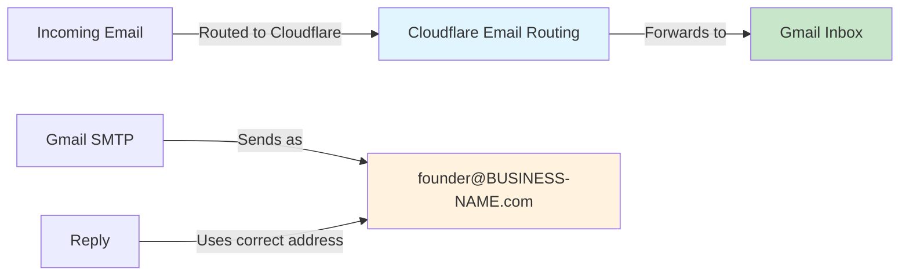

# 3. Email Infrastructure 📬

**Executive Summary**: Set up professional email forwarding with Cloudflare, then configure Gmail to send from your domain. Time: 1 hour. Cost: Free.

---

## Why This Matters

### Professionalism
`founder@BUSINESS-NAME.com` looks professional. `founder@gmail.com` doesn't scale.

### Email Credibility
Recipients trust domain email more than personal Gmail.

### Multi-User Ready
Add team members' emails without complex infrastructure.

### Cost Effective
No email hosting needed—just forwarding + Gmail.

---

## Architecture



---

## Prerequisites

- [ ] Domain registered and DNS live (from [Guide 2](./02-domain-dns.md))
- [ ] Gmail account created (business Gmail, not personal)
- [ ] 2FA enabled on Gmail account
- [ ] Access to Cloudflare dashboard

---

## Step 1: Enable Cloudflare Email Routing

### In Cloudflare Dashboard

1. Go to **Email Routing** in your domain settings
2. Click **Enable Email Routing**
3. Cloudflare will show required DNS records (usually pre-filled)
4. **Apply** the DNS records
5. Confirm Email Routing shows as enabled

### What Happens

Cloudflare automatically configures:
- MX records (incoming mail routing)
- TXT records (verification)
- DKIM/SPF records (authentication)

**No manual DNS setup needed.**

---

## Step 2: Security Setup (Do This First!)

### Enable 2-Step Verification on Gmail

1. Go to [myaccount.google.com/security](https://myaccount.google.com/security)
2. Select "2-Step Verification"
3. Choose authenticator app (NOT SMS)
   - Recommended: Google Authenticator, Authy, or 1Password
4. Scan QR code
5. Save recovery codes in secure vault
6. Confirm

### Why Not SMS?
SMS is vulnerable to SIM swapping. Authenticator apps are more secure.

---

## Step 3: Create Email Routing Rules

### Custom Addresses

Create public-facing email addresses that forward to your Gmail.

**Why use plus-addressing?**
Gmail allows `youremail+tag@gmail.com`. Cloudflare forwards to these addresses, and Gmail filters can automatically label/organize them.

### Setup Routing Rules

**Example mapping** (customize for your needs):

| Public Address | Forwards To | Purpose |
|---|---|---|
| `founder@BUSINESS-NAME.com` | `yourname+founder@gmail.com` | Founder inquiries |
| `hello@BUSINESS-NAME.com` | `yourname+hello@gmail.com` | General inquiries |
| `support@BUSINESS-NAME.com` | `yourname+support@gmail.com` | Customer support |
| `info@BUSINESS-NAME.com` | `yourname+info@gmail.com` | Information requests |

### In Cloudflare

1. Email Routing → Routing rules
2. **Custom addresses** section
3. Click **Create address**
4. Enter address (e.g., `founder@BUSINESS-NAME.com`)
5. Set destination to plus-tagged Gmail address
6. Save
7. Repeat for each address

### Test Forwarding

1. Send test email from personal address to `founder@BUSINESS-NAME.com`
2. Check that it lands in Gmail inbox
3. Verify it was tagged with plus address (`yourname+founder@gmail.com`)

---

## Step 4: Gmail Labels & Filters

### Create Labels

Organize incoming emails by routing address.

1. Gmail → Settings → Labels
2. **Create new label** for each address:
   - `/founder` (emails to `founder@...`)
   - `/hello` (emails to `hello@...`)
   - `/support` (emails to `support@...`)

### Create Filters

Automatic labeling based on recipient address.

1. Gmail → Settings → Filters and Blocked Addresses
2. **Create new filter**
3. **To**: `yourname+founder@gmail.com`
4. **Then apply label**: `/founder`
5. Create
6. Repeat for each address

### Why This Works

Cloudflare forwards to the plus-tag, Gmail filters detect the plus-tag, labels apply automatically.

---

## Step 5: Configure "Send Mail As"

### What is "Send Mail As"?

Let Gmail send emails that appear to come from `founder@BUSINESS-NAME.com` instead of your personal Gmail address.

### Create App Passwords

**Why**: Gmail requires an app-specific password for SMTP access (more secure than your main password).

1. Go to [myaccount.google.com/apppasswords](https://myaccount.google.com/apppasswords)
2. Select "Mail" and "Windows Computer" (or your device)
3. Click **Generate**
4. Gmail shows 16-digit password with spaces: `xxxx xxxx xxxx xxxx`
5. **Copy and remove all spaces**: `xxxxxxxxxxxxxxxx`
6. **Save securely** in password manager (you won't see it again)
7. Create a separate app password for each "Send as" address

### Configure "Send Mail As" in Gmail

1. Gmail → Settings → Accounts and Import
2. **Send mail as**: Click "Add another email address"
3. Enter:
   - **Name**: Your display name (e.g., "Founder Name")
   - **Email address**: `founder@BUSINESS-NAME.com`
   - **Uncheck** "Treat as an alias" (important!)
4. Click **Next Step**
5. Enter SMTP settings:

```
SMTP Server: smtp.gmail.com
Port: 587
Username: yourname@gmail.com (your actual Gmail)
Password: [16-digit app password, no spaces]
Secured connection: TLS (checked)
```

6. Click **Add Account**
7. Gmail sends verification email to `founder@BUSINESS-NAME.com`
8. Since Cloudflare forwards it to your inbox, click the verification link
9. Confirm

### Set as Default (Optional)

1. Back in Settings → Accounts and Import
2. Under "Send mail as", find your new address
3. Click **Make default** (optional)
4. Under "When replying to a message", select **Reply from the same address the message was sent to**

### Repeat for Each Address

Repeat steps above for each public address you want to send from:
- `founder@BUSINESS-NAME.com`
- `hello@BUSINESS-NAME.com`
- etc.

Each needs its own app password and SMTP configuration.

---

## Step 6: Validation Tests

### Email Forwarding

- [ ] Send test to `founder@BUSINESS-NAME.com` → arrives in Gmail
- [ ] Email shows recipient as `yourname+founder@gmail.com`
- [ ] Label `/founder` applies automatically
- [ ] Repeat for other addresses

### Sending from Custom Address

- [ ] Compose email in Gmail
- [ ] Click **From** dropdown
- [ ] Select `founder@BUSINESS-NAME.com`
- [ ] Send to external email address
- [ ] Recipient sees email from `founder@BUSINESS-NAME.com` (not your personal Gmail)
- [ ] Recipient can reply to the custom address
- [ ] Your reply uses the same address

### Full Workflow

1. Receive email at `founder@BUSINESS-NAME.com`
2. Gmail forwards to `yourname+founder@gmail.com`
3. Label `/founder` applies
4. You reply from Gmail, selecting `founder@BUSINESS-NAME.com` as "From"
5. Recipient sees professional domain email

---

## Security Checklist

- [ ] 2FA enabled on Gmail account
- [ ] Recovery codes saved and backed up
- [ ] App passwords created and stored securely
- [ ] Never share app passwords
- [ ] Revoke old app passwords if compromised
- [ ] Quarterly: verify 2FA and recovery codes still work

---

## Checklist: Email Infrastructure Complete ✅

- [ ] Cloudflare Email Routing enabled
- [ ] Gmail 2FA enabled with recovery codes
- [ ] Email routing rules created for all public addresses
- [ ] Gmail labels created for organization
- [ ] Gmail filters created for auto-labeling
- [ ] App passwords created and saved
- [ ] "Send mail as" configured for all addresses
- [ ] All forwarding tests passed
- [ ] All sending tests passed

---

## Dependencies

**Before this**: [Guide 2: Domain & DNS](./02-domain-dns.md)

**After this**: [Guide 4: Git & Repository](./04-git-repository.md)

---

## Estimated Total Time: 1 hour

- Email Routing setup: 10 min
- Gmail 2FA: 10 min
- Routing rules: 15 min
- Gmail labels/filters: 10 min
- App passwords & SMTP: 10 min
- Testing: 5 min

---

## Troubleshooting

### Emails not forwarding
- Check Cloudflare Email Routing is enabled
- Verify DNS records are live (use DNS propagation checker)
- Wait 24 hours for DNS to fully propagate
- Check spam folder in Gmail

### "Send as" not working
- Confirm app password has no spaces
- Verify SMTP settings match exactly
- Check "Uncheck treat as alias" was done
- Try generating a new app password

### Filter not auto-applying label
- Verify the plus-tag in "To" field matches the filter
- Check label exists
- Re-save the filter

---

## Next Steps

1. ✅ Complete this guide
2. ➡️ Move to [Guide 4: Git & Repository](./04-git-repository.md)