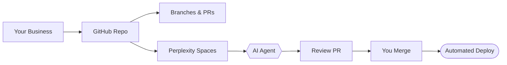

# 4. Git & Repository 📒

**Executive Summary**: Set up GitHub repository and Perplexity Spaces for AI-assisted workflow. Time: 45 min. Cost: Free.

---

## Why This Matters

### Version Control

Track all changes to code, docs, and configuration. Always able to revert if something breaks.

### Transparency

Everything is documented in Git. Easy onboarding for team members.

### AI Workflow

Perplexity Spaces connects to Git, allowing AI agents to:

- Read your repo structure
- Understand your business processes
- Create PRs with proposed changes
- Stay in sync with your codebase

### Business Operations

Your GitHub repo becomes your source of truth for:

- Website code
- Documentation
- Business processes
- Policies and checklists
- Configuration

---

## Architecture



---

## Step 1: Create GitHub Account

### Sign Up

1. Go to [GitHub.com](https://github.com)
2. Click "Sign up"
3. Email: Use your business Gmail (from [Guide 3](./03-email-infrastructure.md))
4. Password: Strong, unique, stored in password manager
5. Verify email

### Security First

1. Go to Settings → Security
2. Enable "Two-factor authentication"
3. Choose authenticator app (NOT SMS)
4. Scan QR code
5. Save recovery codes
6. Confirm

---

## Step 2: Create Private Repository

### Setup

1. Click **New** (top left)
2. **Repository name**: `BUSINESS-NAME` or `BUSINESS-NAME.com`
3. **Description**: "BUSINESS-NAME | Docs, code, operations"
4. **Private**: Yes
5. **Initialize with README**: Yes
6. Click **Create repository**

### Structure

```
BUSINESS-NAME/
├─ README.md              # Overview of business
├─ .gitignore            # Files to exclude from Git
├─ docs/                 # Documentation
│  ├─ operations.md       # Daily operations
│  ├─ policies.md         # Company policies
│  ├─ processes.md        # Repeatable processes
│  └─ checklists/         # Task checklists
├─ website/              # Website code
├─ data/                 # Business data (non-sensitive)
├─ scripts/              # Automation scripts
└─ .github/              # CI/CD workflows
   └─ workflows/          # GitHub Actions
```

---

## Step 3: Configure .gitignore

### What is .gitignore?

Tells Git which files to ignore (don't commit). Essential for secrets and build artifacts.

### Create File

1. In your repo, click **Add file** → **Create new file**
2. Name: `.gitignore`
3. Content:

```
# Environment variables
.env
.env.local
.env.*.local

# Dependencies
node_modules/
venv/
__pycache__/

# Build artifacts
dist/
build/
*.egg-info/

# IDE
.vscode/
.idea/
*.swp
*.swo
*~
.DS_Store

# Secrets
.secrets/
*.pem
*.key

# Logs
*.log
logs/

# OS
Thumbs.db
.DS_Store
```

4. Click **Commit changes**

### Important Files to Never Commit

- API keys
- Passwords
- Database credentials
- Private certificates
- Personal financial info

**Always use environment variables** for secrets, not hardcoded in code.

---

## Step 4: Add Core Documentation

### README.md

Your repo's homepage. Should explain:

- What the business does
- Key processes
- Links to important docs

### Operations.md

Daily/weekly/monthly tasks:

- How to handle customer inquiries
- How to process payments
- How to update the website
- Escalation procedures

### Policies.md

Business policies:

- Privacy policy
- Refund policy
- Data retention
- Code of conduct (if team)

### Checklists/

Repeatable checklists:

- Monthly review checklist
- Quarterly planning checklist
- Launch day checklist
- Incident response checklist

---

## Step 5: Branching Strategy

### Branch Naming

Use descriptive names:

```
feat/          Feature branches
fix/           Bug fixes
docs/          Documentation updates
chore/         Maintenance tasks
refactor/      Code refactoring
```

### Example

```
feat/customer-dashboard
fix/email-forwarding-bug
docs/operations-manual
chore/update-dependencies
```

### Main Branch Protection

Protect `main` branch to prevent accidental pushes:

1. Settings → Branches
2. **Branch protection rules** → **Add rule**
3. **Pattern**: `main`
4. Check:
   - Require pull request reviews
   - Dismiss stale PR approvals
   - Require status checks (if using CI/CD)
5. Save

---

## Step 6: Set Up Perplexity Spaces

### What is Perplexity Spaces?

AI-powered collaboration tool that:

- Connects to your GitHub repo
- Reads your codebase and documentation
- Executes tasks (create branches, write code, make PRs)
- Stays transparent and auditable

### Create Space

1. Go to [Perplexity.ai](https://perplexity.ai) and sign in
2. Click **Spaces** in sidebar
3. Click **Create Space**
4. Name: `BUSINESS-NAME`
5. Description: Your business description
6. Create

### Connect GitHub

1. In Space settings, go to **Integrations**
2. Click **Connect GitHub**
3. Authorize Perplexity to access your repository
4. Select your private repo
5. Confirm

### Add Instructions

Spaces need instructions on how to work with your repo.

1. In Space settings, go to **Space Instructions**
2. Add:

```markdown
# BUSINESS-NAME Agent Instructions

## Repository

- Private repository: BUSINESS-NAME
- Default branch: main
- Protected: main requires PRs before merge

## Code Style

- Use camelCase for variables
- Comment complex logic
- Run tests before PR

## Commit Format

Use Conventional Commits:

- feat: new feature
- fix: bug fix
- docs: documentation
- chore: maintenance

Example: "feat: add customer dashboard"

## PR Process

1. Create feature branch
2. Make changes
3. Write tests
4. Create PR with description
5. Wait for human review
6. Address feedback
7. Human merges

## Important

- NEVER merge your own PRs
- ALWAYS wait for human approval
- Keep commits atomic (one idea per commit)
- Write descriptive commit messages
```

3. Save

---

## Step 7: Basic Git Commands

### Clone Repository (local)

```bash
git clone https://github.com/YOUR-USERNAME/BUSINESS-NAME.git
cd BUSINESS-NAME
```

### Create Feature Branch

```bash
git checkout -b feat/your-feature-name
```

### Make Changes

```bash
# Edit files...
git status                    # See what changed
git add .                     # Stage changes
git commit -m "feat: description"  # Commit
```

### Push and Create PR

```bash
git push origin feat/your-feature-name
# Then go to GitHub and create PR
```

### Merge PR (after review)

```bash
# In GitHub UI, click "Merge pull request"
# Then delete branch
```

---

## Checklist: Git & Repository Complete ✅

- [ ] GitHub account created with 2FA enabled
- [ ] Private repository created
- [ ] `.gitignore` committed
- [ ] Initial documentation added (README, operations, policies)
- [ ] Branching strategy defined and documented
- [ ] Main branch protection enabled
- [ ] Perplexity Space created
- [ ] GitHub connected to Space
- [ ] Space instructions added
- [ ] Local clone working and tested

---

## Dependencies

**Before this**: [Guide 3: Email Infrastructure](./03-email-infrastructure.md)

**After this**: [Guide 5: Financial Tools](./05-financial-tools.md) or [Guide 6: Deployment & CI/CD](./06-deployment-cicd.md)

---

## Estimated Total Time: 45 minutes

- GitHub setup: 10 min
- Repository creation: 5 min
- .gitignore + docs: 10 min
- Perplexity Space setup: 15 min
- Testing and validation: 5 min

---

## Resources

- **GitHub Docs**: <https://docs.github.com>
- **Git Basics**: <https://git-scm.com/book>
- **Conventional Commits**: <https://www.conventionalcommits.org>
- **Perplexity Spaces**: <https://perplexity.ai>

---

## Next Steps

1. ✅ Complete this guide
2. ➡️ Move to [Guide 5: Financial Tools](./05-financial-tools.md) or [Guide 6: Deployment & CI/CD](./06-deployment-cicd.md)
