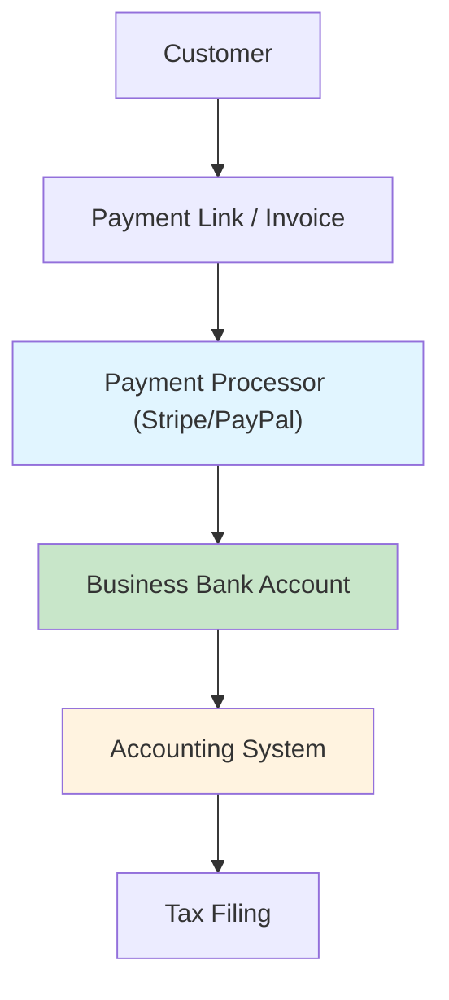

# 5. Financial Tools 💰

**Executive Summary**: Set up accounting, banking, and payments so BUSINESS NAME can send invoices, accept payments, and stay compliant. Time: 1-2 hours.

---

## Why This Matters

### Visibility

You need to know:

- How much you're earning
- How much you're spending
- How much you owe in taxes

### Compliance

Clean books = easier tax filing and fewer surprises.

### Professionalism

Clients expect proper invoices, receipts, and payment flows.

---

## Architecture

---

## Step 1: Choose Accounting Tool

### Recommended Options

| Tool                  | Cost         | Use Case                        |
| --------------------- | ------------ | ------------------------------- |
| **Wave**              | Free         | Solo founders, basic accounting |
| **QuickBooks Online** | $25-70/month | More complex businesses         |
| **Xero**              | $13-70/month | International-friendly          |

**Recommendation**: Start with **Wave** (free) unless you already use something else.

### Wave Setup (Example)

1. Go to [waveapps.com](https://www.waveapps.com)
2. Sign up with business email
3. Add BUSINESS NAME and basic details
4. Connect business bank account (from Guide 1)
5. Set up chart of accounts

---

## Step 2: Connect Bank & Payment Processor

### Bank Connection

1. In your accounting tool, find "Bank Connections"
2. Search your bank (e.g., Mercury, Chase)
3. Connect using secure OAuth
4. Import last 90 days of transactions

### Payment Processor

**Recommended**: Stripe

Why:

- Easy invoicing
- One-time and recurring payments
- Works globally

**Stripe Setup**:

1. Go to [stripe.com](https://stripe.com)
2. Create account with business email
3. Add business details (from legal docs)
4. Add bank account (routing + account numbers)
5. Verify identity (KYC)

---

## Step 3: Create Your First Products & Prices

### Stripe Products

1. In Stripe dashboard → Products
2. Create product:
   - Name: `Consulting Session (60 minutes)`
   - Description: One-on-one consulting
   - Price: $X (your rate)
3. Save

### Payment Link

1. In Stripe → Payment Links
2. Create new link
3. Select your product & quantity
4. Customize confirmation page
5. Save link

Now you have a URL to collect payments without writing code.

---

## Step 4: Invoicing

### When to Invoice vs Payment Links

- **Invoice**: Larger contracts, net terms (e.g., net 15)
- **Payment Link**: Individual sessions, up-front payment

### Invoice Setup (Wave Example)

1. Create new customer: Name, email
2. Create invoice:
   - Business info: BUSINESS NAME, address, EIN
   - Customer info: Name, email
   - Line items: Product/service, quantity, rate
   - Terms: Due on receipt or net 7/15/30
3. Send invoice (email or PDF)
4. Record payment when received (or use native payments integration)

---

## Step 5: Categorize Transactions

### Categories to Use

Create categories like:

- Income: Consulting, Product Sales, Other
- Expenses: Software, Hosting, Advertising, Travel, Meals

### Monthly Routine

1. Log into accounting tool
2. Categorize all uncategorized transactions
3. Mark invoices as paid
4. Reconcile bank balance

---

## Step 6: Taxes

### Federal

- Business income flows to your personal return (LLC, pass-through)
- Pay estimated quarterly taxes if you expect to owe >$1,000
- Keep 20-30% of income aside for taxes

### State

- Income tax: Based on your state
- Sales tax: If you sell taxable goods/services in your state

### When to Get an Accountant

- Multiple income streams
- Employees or contractors
- Crossing $50k+, $100k+ revenue

**Recommendation**: Hire an accountant before your first tax season.

---

## Checklist: Financial Tools Complete ✅

- [ ] Accounting tool set up
- [ ] Business bank account connected
- [ ] Stripe (or equivalent) account created
- [ ] Bank account linked to Stripe
- [ ] At least one product and payment link configured
- [ ] Invoicing flow tested
- [ ] Monthly categorization routine defined
- [ ] Tax savings percentage chosen

---

## Dependencies

**Before this**: [Guide 1: Legal Foundation](./01-legal-foundation.md) (for EIN & bank account)

**After this**: [Guide 7: Operations Manual](./07-operations-manual.md)

---

## Estimated Total Time: 1-2 hours

- Accounting setup: 30 min
- Banking connection: 15 min
- Stripe setup: 30 min
- First products & payment links: 15 min

---

## Next Steps

1. ✅ Complete this guide
2. ➡️ Move to [Guide 6: Deployment & CI/CD](./06-deployment-cicd.md) or [Guide 7: Operations Manual](./07-operations-manual.md)
