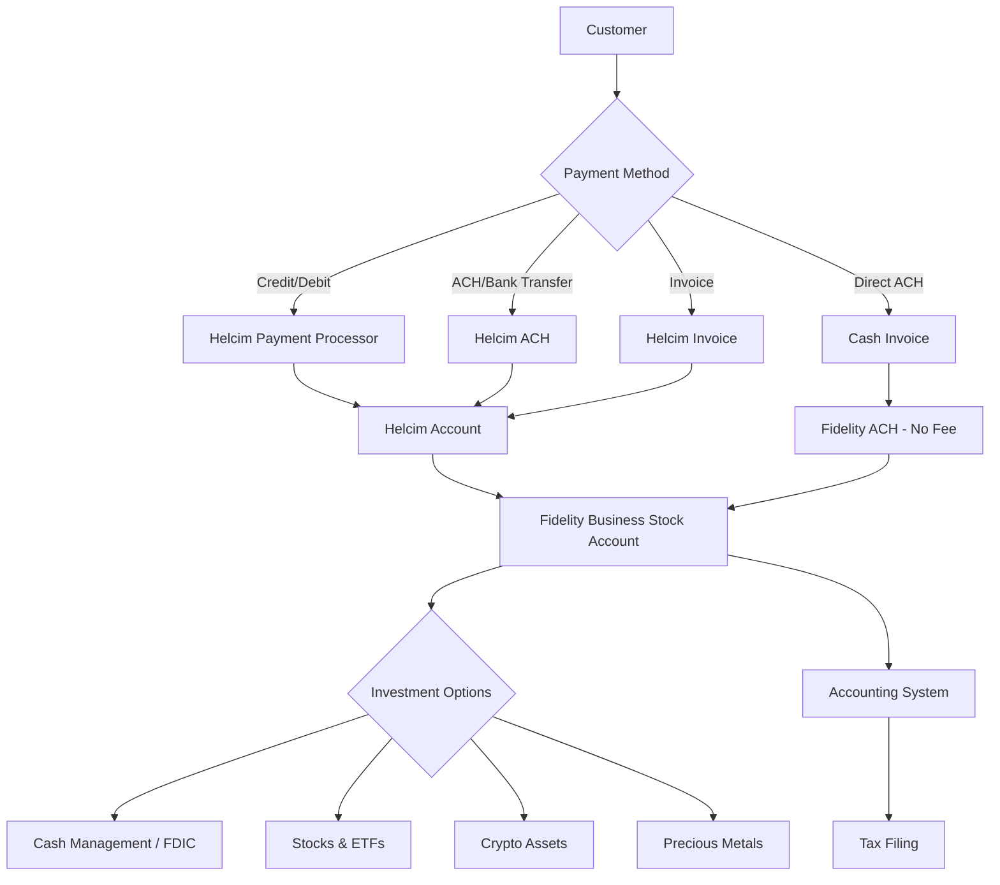

# 5. Financial Tools 💰

**Executive Summary**: Set up banking, payment processing, and accounting so BUSINESS NAME can manage funds, accept payments, and stay compliant. Time: 1-2 hours.

---

## Why This Matters

### Visibility

You need to know:

- How much you're earning
- How much you're spending
- How much you owe in taxes
- Where your money is invested

### Compliance

Clean books = easier tax filing and fewer surprises.

### Professionalism

Clients expect proper invoices, receipts, and payment flows.

### Growth

Your business funds can earn returns while staying liquid for operations.

---

## Architecture



---

## Step 1: Business Banking (Fidelity)

### Why Fidelity Business Stock Account?

**Recommended:** [Fidelity Business Stock Account](https://www.fidelity.com/small-business/overview)

#### Key Benefits

1. **All-in-one platform:** Banking + investments in one place
2. **No monthly fees:** Zero account maintenance charges
3. **Investment options:** Your business funds can earn returns
4. **FDIC-insured cash:** Sweep accounts for operating capital
5. **Institutional tools:** Real-time trading, research, portfolio analysis
6. **Tax integration:** Simplified year-end accounting

#### Investment Options Available

**1. Cash Management**

- FDIC-insured sweep accounts
- Competitive interest rates
- Operating capital earns returns automatically
- Instant liquidity for business operations

**2. Stocks & ETFs**

- Invest profits while building your business
- Index funds (S&P 500, total market)
- Sector-specific ETFs
- Individual stocks
- No commission on most trades

**3. Crypto & Digital Assets**

- Bitcoin, Ethereum, and more
- Diversify with digital assets
- Direct from business account
- Regulated custody

**4. Precious Metals**

- Gold, silver, platinum, palladium
- Hedge against inflation
- Physical and paper metal investments
- Portfolio diversification

### Fidelity Setup

1. Go to [Fidelity Small Business](https://www.fidelity.com/small-business/overview)
2. Select "Business Stock Account" or "Cash Management Account"
3. Provide business details:
   - Business name
   - EIN (from Guide 1)
   - Business address
   - Type of business (LLC, etc.)
4. Add authorized signers
5. Fund the account (initial deposit)
6. Set up ACH for receiving payments
7. Configure investment preferences (optional)

**Timeline:** 30-45 minutes online, 3-5 business days for approval

---

## Step 2: Payment Processing (Helcim)

### Why Helcim?

**Recommended:** [Helcim](https://www.helcim.com/)

Helcim offers transparent interchange-plus pricing with **$0/month fees**—significantly cheaper than typical processors.

#### Current Pricing (2026)

**In-Person Payments** 📱

- **Average:** 2.55% + 8¢ per transaction
- **PIN Debit:** As low as 2.16% + 8¢
- Card-present, chip, or contactless

**Online/Keyed Payments** 💻

- **Average:** 2.97% + 25¢ per transaction
- Card-not-present transactions
- E-commerce, phone orders, manual entry

**ACH/Bank Payments** 🏦

- **Rate:** 0.5% + 25¢ per transaction
- **Capped at $6** (for transactions under $25,000)
- **Direct to Fidelity:** No fee when using cash invoices

**Surcharging Option** ✨

- **You pay:** 0% for credit cards
- **Customer pays:** The processing fee
- Standard debit rates still apply
- Compliant with card network rules

#### What's Included (No Extra Charge)

- ✅ **$0/month account fee**
- ✅ **$0 setup fee**
- ✅ **Unlimited invoicing**
- ✅ **Recurring billing**
- ✅ **Virtual terminal**
- ✅ **Customer management**
- ✅ **Reporting & analytics**
- ✅ **Multiple payment methods**
- ✅ **PCI compliance tools**

### Helcim Setup

1. Go to [Helcim.com](https://www.helcim.com/)
2. Sign up with business email
3. Provide business details:
   - Business name
   - EIN
   - Business address
   - Industry/business type
4. Connect bank account:
   - Use your Fidelity business account
   - Routing and account numbers
   - Verify micro-deposits (1-2 business days)
5. Set up payment methods:
   - Credit/debit cards
   - ACH acceptance
   - Choose surcharging preferences (optional)
6. Configure invoicing templates
7. Test a $1 transaction

**Timeline:** 30-45 minutes setup, 1-2 days for bank verification

---

## Step 3: Invoicing & Payment Options

### Payment Flow Options

#### Option 1: Helcim Invoices (Standard)

**When to use:** General customers, credit card payments, online payments

**Process:**

1. Create invoice in Helcim
2. Add customer details and line items
3. Send via email
4. Customer pays via credit card or ACH
5. Funds go to Helcim, then to Fidelity
6. You pay standard Helcim rates

**Best for:** Customers who need payment flexibility, recurring billing

#### Option 2: Cash Invoices + Direct ACH

**When to use:** Cost-conscious customers, large transactions, B2B

**Process:**

1. Generate invoice (can use Helcim or external tool)
2. Include your Fidelity ACH details
3. Customer pays directly to Fidelity via bank transfer
4. You pay **0 processing fees** (direct bank transfer)
5. Helcim optional for tracking/reporting

**Best for:** Maximizing profit on large transactions, B2B clients with accounting departments

#### Option 3: Surcharging (0% Processing)

**When to use:** Retail, in-person, when customer expects to pay fees

**Process:**

1. Enable surcharging in Helcim settings
2. Customer pays with credit card
3. Processing fee added to total (customer pays it)
4. You pay **0% for credit cards**
5. Debit cards still charged standard rates

**Best for:** Retail environments, service businesses, when competitors also surcharge

### Invoice Template Example

```
BUSINESS NAME
Address | Email | Phone
EIN: XX-XXXXXXX

---

Invoice #: 2026-001
Date: January 24, 2026
Due: Net 15

Bill To:
Client Name
Client Address

Items:
- Consulting Services (10 hours @ $150/hr): $1,500.00
- Project Management: $500.00

Subtotal: $2,000.00
Tax (if applicable): $0.00
Total Due: $2,000.00

---

Payment Options:
1. Pay online: [Helcim Payment Link]
2. ACH/Bank Transfer:
   - Bank: Fidelity
   - Routing: [Your routing number]
   - Account: [Your account number]
   - Reference: Invoice 2026-001

Questions? Contact: billing@yourbusiness.com
```

---

## Step 4: Accounting System

### Recommended Options

| Tool                  | Cost         | Use Case                           |
| --------------------- | ------------ | ---------------------------------- |
| **Wave**              | Free         | Solo founders, basic accounting    |
| **QuickBooks Online** | $25-70/month | More complex businesses            |
| **Xero**              | $13-70/month | International-friendly             |
| **Helcim Built-In**   | Free         | Basic invoicing & transaction logs |

**Recommendation**: Start with **Wave** (free) or **Helcim's built-in features** unless you need advanced accounting.

### Accounting Setup (Wave Example)

1. Go to [waveapps.com](https://www.waveapps.com)
2. Sign up with business email
3. Add BUSINESS NAME and basic details
4. Connect Fidelity business account (secure OAuth)
5. Connect Helcim (if integration available)
6. Set up chart of accounts:
   - Revenue: Consulting, Products, Services
   - Expenses: Software, Hosting, Marketing, Travel
   - Assets: Cash, Investments (manually tracked)
7. Import last 90 days of transactions

---

## Step 5: Monthly Financial Routine

### Categorize Transactions (30 minutes/month)

1. Log into accounting tool
2. Review uncategorized transactions
3. Assign categories:
   - **Income:** Consulting, Product Sales, Interest/Dividends
   - **Expenses:** Software, Hosting, Advertising, Travel, Meals
4. Mark invoices as paid
5. Reconcile bank/investment balances

### Review Investment Performance (15 minutes/month)

1. Log into Fidelity
2. Review portfolio performance
3. Check cash management interest earned
4. Rebalance if needed (quarterly)
5. Document any trades for tax purposes

### Prepare Tax Estimates (Quarterly)

1. Calculate quarterly income
2. Set aside 25-30% for taxes
3. Pay estimated quarterly taxes (if >$1,000 expected tax)
4. Track deductible expenses

---

## Step 6: Tax Considerations

### Federal Taxes

- Business income flows to your personal return (LLC, pass-through)
- Pay estimated quarterly taxes if you expect to owe >$1,000
- Keep 25-30% of profits aside for taxes
- Investment gains taxed when realized (capital gains)

### State Taxes

- **Income tax:** Based on your state
- **Sales tax:** If you sell taxable goods/services
- **Franchise tax:** Some states (e.g., California, Texas)

### Investment Taxes

- **Short-term gains:** Taxed as ordinary income (<1 year holding)
- **Long-term gains:** Preferential rates (>1 year holding)
- **Dividends:** Qualified dividends taxed at lower rates
- **Crypto:** Taxed as property (capital gains)

### When to Hire an Accountant

- **Immediately:** If you're not comfortable with taxes
- **By $50K revenue:** Definitely get professional help
- **Multiple income streams:** Wages + business + investments
- **Employees or contractors:** Payroll taxes are complex
- **Significant investments:** Capital gains optimization

**Recommendation:** Hire a CPA before your first tax season. Cost: $500-2,000 depending on complexity.

---

## Cost Comparison: Traditional vs This Blueprint

### Traditional Payment Processing (Stripe)

**Monthly Volume: $10,000**

- Processing: 2.9% + 30¢ = ~$320/month
- Monthly fee: $0 (but limited features)
- Invoicing add-on: +$25/month (Stripe Invoicing)
- **Total:** ~$345/month = **$4,140/year**

### This Blueprint (Helcim + Fidelity)

**Monthly Volume: $10,000**

**Option 1: All Helcim Payments**

- Processing: 2.55% average + fees = ~$270/month
- Monthly fee: $0
- Invoicing: Free (unlimited)
- Banking: $0/month (Fidelity)
- **Total:** ~$270/month = **$3,240/year**
- **Savings:** $900/year

**Option 2: Mix Helcim + Direct ACH**

- 50% Helcim payments: ~$135/month
- 50% Direct ACH to Fidelity: $0 fees
- Monthly fees: $0
- Invoicing: Free
- Banking: $0/month
- **Total:** ~$135/month = **$1,620/year**
- **Savings:** $2,520/year

**Option 3: Surcharging Enabled**

- Credit card fees: $0 (customer pays)
- Debit/ACH: ~$50/month (only debit transactions)
- Monthly fees: $0
- **Total:** ~$50/month = **$600/year**
- **Savings:** $3,540/year

---

## Checklist: Financial Tools Complete ✅

### Banking

- [ ] Fidelity business stock account opened
- [ ] Account funded (initial deposit)
- [ ] Investment preferences configured
- [ ] ACH details documented for receiving payments
- [ ] Cash management / sweep account enabled

### Payment Processing

- [ ] Helcim account created
- [ ] Fidelity bank account linked to Helcim
- [ ] Payment methods configured (credit, debit, ACH)
- [ ] Surcharging preferences set (if applicable)
- [ ] At least one product/service added
- [ ] Test payment completed ($1 transaction)

### Invoicing

- [ ] Invoice template created
- [ ] Payment options documented (Helcim link + ACH details)
- [ ] First invoice sent
- [ ] Payment received and reconciled

### Accounting

- [ ] Accounting tool selected and set up
- [ ] Fidelity account connected
- [ ] Helcim transactions syncing
- [ ] Chart of accounts configured
- [ ] Monthly categorization routine defined

### Tax Preparation

- [ ] Tax savings percentage chosen (25-30%)
- [ ] Quarterly tax payment schedule set
- [ ] CPA/accountant identified (if needed)
- [ ] Expense tracking system in place

---

## Dependencies

**Before this**: [Guide 1: Legal Foundation](./01-legal-foundation.md) (for EIN & business entity)

**After this**: [Guide 6: Deployment & CI/CD](./06-deployment-cicd.md) or [Guide 7: Operations Manual](./07-operations-manual.md)

---

## Estimated Total Time: 1.5-2 hours

- Fidelity account setup: 45 min (plus 3-5 days approval)
- Helcim setup: 30 min (plus 1-2 days bank verification)
- Accounting system setup: 30 min
- First invoice and payment test: 15 min

---

## Next Steps

1. ✅ Complete this guide
2. ➡️ Move to [Guide 6: Deployment & CI/CD](./06-deployment-cicd.md)
3. ➡️ Or jump to [Guide 7: Operations Manual](./07-operations-manual.md)

---

## Additional Resources

- **Fidelity Small Business:** [https://www.fidelity.com/small-business/overview](https://www.fidelity.com/small-business/overview)
- **Helcim:** [https://www.helcim.com/](https://www.helcim.com/)
- **Helcim Pricing:** [https://www.helcim.com/pricing/](https://www.helcim.com/pricing/)
- **Wave Accounting:** [https://www.waveapps.com/](https://www.waveapps.com/)
- **IRS Estimated Taxes:** [https://www.irs.gov/businesses/small-businesses-self-employed/estimated-taxes](https://www.irs.gov/businesses/small-businesses-self-employed/estimated-taxes)
